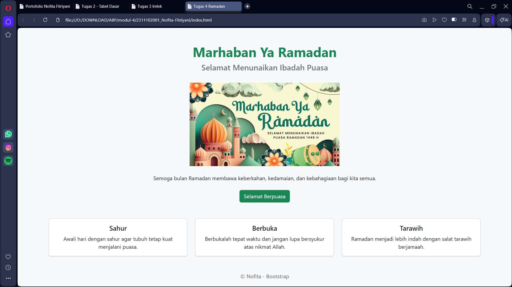

<h1 align="center">LAPORAN PRAKTIKUM</h1>
<h1 align="center">APLIKASI BERBASIS PLATFORM</h1>

<br>

<h2 align="center">MODUL 4</h2>
<h2 align="center">BOOTSTRAP</h2>

<br><br>

<p align="center">

</p>
<br><br><br>

<h2 align="center">Disusun Oleh :</h2>

<p align="center" style="font-size:28px;">
  <b>Nofita Fitriyani</b><br>
  <b>2311102001</b><br>
  <b>S1 IF-11-REG 01</b>
</p>
<br>
<h2 align="center">Dosen Pengampu :</h2>

<p align="center" style="font-size:28px;">
  <b>Dimas Fanny Hebrasianto Permadi, S.ST., M.Kom</b>
</p>
<br>
<h2 align="center">Asisten Praktikum :</h2>

<p align="center" style="font-size:28px;">
  <b>Apri Pandu Wicaksono</b><br>
  <b>Rangga Pradarrell Fathi</b>
</p>
<br>
<h1 align="center">LABORATORIUM HIGH PERFORMANCE</h1>
<h1 align="center">FAKULTAS INFORMATIKA</h1>
<h1 align="center">UNIVERSITAS TELKOM PURWOKERTO</h1>
<h1 align="center">TAHUN 2026</h1>

<hr>

### Dasar Teori
Bootstrap merupakan sebuah front-end framework gratis yang digunakan untuk membantu pengembangan antarmuka web agar menjadi lebih cepat dan lebih mudah. Framework ini dikembangkan oleh Mark Otto dan Jacob Thornton di Twitter dan pertama kali dirilis sebagai proyek open source pada bulan Agustus tahun 2011 melalui GitHub.

Bootstrap menyediakan berbagai komponen desain berbasis HTML dan CSS yang dapat digunakan untuk membangun tampilan halaman web dengan lebih efisien. Komponen tersebut antara lain meliputi tipografi, form, button, navigasi, modal, image carousel, layout grid, dan berbagai elemen antarmuka lainnya. Selain itu Bootstrap juga menyediakan plugin JavaScript opsional untuk menambahkan fitur interaktif pada halaman web.

Salah satu keunggulan utama Bootstrap adalah kemampuannya dalam membuat desain yang responsif. Desain responsif memungkinkan tampilan website menyesuaikan secara otomatis dengan berbagai ukuran layar perangkat, mulai dari smartphone, tablet, hingga desktop. Dengan demikian tampilan halaman web tetap rapi dan mudah digunakan di berbagai perangkat.

Bootstrap juga memiliki sistem grid yang sangat membantu dalam mengatur tata letak halaman. Sistem grid ini menggunakan konsep baris (row) dan kolom (column) sehingga memudahkan pengembang dalam menyusun elemen-elemen halaman secara terstruktur.

Bootstrap merupakan framework yang bersifat open source sehingga dapat digunakan secara bebas. Untuk menggunakan Bootstrap pada sebuah project web terdapat beberapa cara yang dapat dilakukan, antara lain:

a. Mengunduh Bootstrap melalui situs resmi `https://getbootstrap.com` kemudian menempatkan file CSS dan JavaScript Bootstrap ke dalam project web, selanjutnya dipanggil seperti External Style Sheet pada CSS.

b. Menggunakan Bootstrap CDN (Content Delivery Network). Dengan cara ini kita tidak perlu mengunduh file Bootstrap secara langsung karena file Bootstrap akan dipanggil dari server CDN melalui internet. Metode ini lebih praktis karena cukup menambahkan link Bootstrap pada bagian `<head>` dokumen HTML.

Pada praktikum ini Bootstrap digunakan melalui metode CDN sehingga halaman web dapat langsung menggunakan komponen Bootstrap tanpa perlu mengunduh file framework secara manual.

### Source Code
```
<!DOCTYPE html>
<html lang="id">
<head>
<meta charset="UTF-8">
<meta name="viewport" content="width=device-width, initial-scale=1.0">
<title>Tugas 4 Ramadan</title>

<link href="https://cdn.jsdelivr.net/npm/bootstrap@5.3.3/dist/css/bootstrap.min.css" rel="stylesheet">

</head>

<body class="bg-light">

<div class="container text-center mt-5">

<h1 class="text-success fw-bold">Marhaban Ya Ramadan</h1>
<h4 class="text-secondary">Selamat Menunaikan Ibadah Puasa</h4>


<p class="mt-4">
Semoga bulan Ramadan membawa keberkahan,
kedamaian, dan kebahagiaan bagi kita semua.
</p>

<a href="#" class="btn btn-success mt-2">Selamat Berpuasa</a>

</div>


<div class="container mt-5">

<div class="row text-center">

<div class="col-md-4">
<div class="card shadow-sm">
<div class="card-body">
<h5 class="card-title">Sahur</h5>
<p class="card-text">
Awali hari dengan sahur agar tubuh tetap kuat menjalani puasa.
</p>
</div>
</div>
</div>

<div class="col-md-4">
<div class="card shadow-sm">
<div class="card-body">
<h5 class="card-title">Berbuka</h5>
<p class="card-text">
Berbukalah tepat waktu dan jangan lupa bersyukur atas nikmat Allah.
</p>
</div>
</div>
</div>

<div class="col-md-4">
<div class="card shadow-sm">
<div class="card-body">
<h5 class="card-title">Tarawih</h5>
<p class="card-text">
Ramadan menjadi lebih indah dengan salat tarawih berjamaah.
</p>
</div>
</div>
</div>

</div>

</div>


<footer class="text-center mt-5 mb-3 text-muted">
<p>© Nofita - Bootstrap</p>
</footer>

</body>
</html>
```
### Output 


### Penjelasan Kode Program
Pada program ini digunakan framework Bootstrap untuk membantu membuat tampilan halaman web dengan lebih cepat dan rapi tanpa harus menulis CSS secara manual.

Bootstrap dipanggil melalui CDN pada bagian `<head>` menggunakan link Bootstrap CSS. Dengan menggunakan metode CDN ini, file Bootstrap tidak perlu diunduh terlebih dahulu karena akan langsung dipanggil dari server Bootstrap melalui internet.

Tag `<body class="bg-light">` digunakan untuk memberikan warna latar belakang halaman menggunakan class bawaan Bootstrap yaitu `bg-light`, sehingga halaman memiliki warna latar yang lebih terang.

Pada bagian `<div class="container text-center mt-5">` digunakan class `container` yang berfungsi untuk membungkus seluruh konten agar tampilan lebih rapi dan berada di tengah halaman. Class `text-center` digunakan untuk membuat semua teks berada di posisi tengah, sedangkan `mt-5` digunakan untuk memberikan jarak dari bagian atas halaman.

Tag `<h1 class="text-success fw-bold">` digunakan untuk menampilkan judul utama halaman yaitu "Marhaban Ya Ramadan". Class `text-success` memberikan warna hijau pada teks, sedangkan `fw-bold` digunakan untuk membuat teks menjadi lebih tebal.

Tag `<h4 class="text-secondary">` digunakan untuk menampilkan subjudul yaitu "Selamat Menunaikan Ibadah Puasa". Class `text-secondary` memberikan warna teks abu-abu agar terlihat lebih lembut dibandingkan judul utama.

Tag `` digunakan untuk menampilkan gambar bertema Ramadan. Class `img-fluid` membuat gambar menjadi responsif sehingga ukurannya dapat menyesuaikan dengan ukuran layar. Class `mt-4` digunakan untuk memberikan jarak antara gambar dengan elemen di atasnya.

Tag `<p class="mt-4">` digunakan untuk menampilkan paragraf ucapan Ramadan. Class `mt-4` digunakan untuk memberikan jarak antara teks dengan gambar sehingga tampilan halaman tidak terlalu rapat.

Tag `<a href="#" class="btn btn-success mt-2">` digunakan untuk membuat tombol dengan tulisan "Selamat Berpuasa". Class `btn` merupakan class dasar untuk tombol Bootstrap, sedangkan `btn-success` memberikan warna hijau pada tombol. Class `mt-2` memberikan sedikit jarak dari elemen di atasnya.

Pada bagian `<div class="container mt-5">` dibuat bagian baru yang berisi beberapa card informasi mengenai kegiatan di bulan Ramadan.

Tag `<div class="row text-center">` digunakan untuk membuat baris layout menggunakan sistem grid Bootstrap dan membuat seluruh teks di dalamnya berada di tengah.

Setiap card ditempatkan di dalam `<div class="col-md-4">` yang berarti pada layar ukuran medium ke atas akan ditampilkan tiga kolom sejajar. Di dalam kolom tersebut terdapat `<div class="card shadow-sm">` yang digunakan untuk membuat kotak konten dengan efek bayangan kecil.

Bagian `<div class="card-body">` digunakan untuk menampung isi dari card seperti judul dan teks. Tag `<h5 class="card-title">` digunakan untuk menampilkan judul card, sedangkan `<p class="card-text">` digunakan untuk menampilkan isi penjelasan.

Terakhir terdapat bagian `<footer class="text-center mt-5 mb-3 text-muted">` yang digunakan sebagai bagian penutup halaman. Class `text-center` membuat teks berada di tengah, `mt-5` memberikan jarak dari bagian atas, `mb-3` memberikan jarak dari bagian bawah, dan `text-muted` memberikan warna teks yang lebih lembut.

### Kesimpulan
Berdasarkan praktikum yang telah dilakukan, dapat disimpulkan bahwa Bootstrap merupakan framework yang sangat membantu dalam pembuatan tampilan halaman web secara cepat dan efisien. Dengan memanfaatkan berbagai class yang telah disediakan oleh Bootstrap, pengembang dapat membuat tampilan halaman yang rapi, responsif, dan menarik tanpa harus menulis CSS dari awal.

Pada tugas ini Bootstrap digunakan untuk membuat halaman bertema Ramadan yang berisi judul, gambar, tombol, serta beberapa card informasi mengenai kegiatan selama bulan Ramadan. Seluruh tampilan dibuat menggunakan class Bootstrap sehingga kode menjadi lebih sederhana dan mudah dipahami.