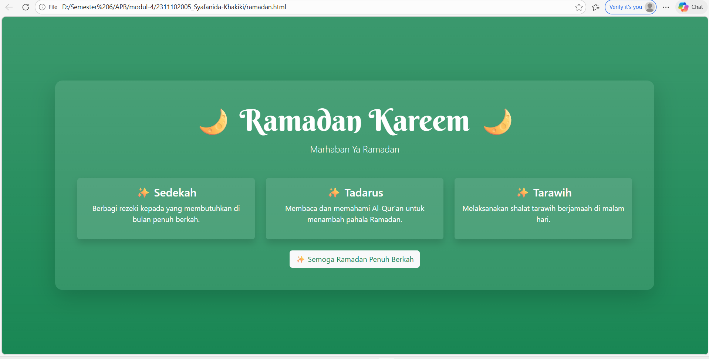

<div align="center">
  <br />
  <h1>LAPORAN PRAKTIKUM <br>APLIKASI BERBASIS PLATFORM</h1>
  <br />
  <h2>MODUL 4 <br></h2>
  <br />
  <br />
   
  <br />
  <br />
  <br />
  <h3>Disusun Oleh :</h3>
  <p>
    <strong>Syafanida Khakiki</strong><br>
    <strong>2311102005</strong><br>
    <strong>S1 IF-11-REG 01</strong>
  </p>
  <br />
  <h3>Dosen Pengampu :</h3>
  <p>
    <strong>Dimas Fanny Hebrasianto Permadi, S.ST., M.Kom</strong>
  </p>
  <br />
  <br />
    <h4>Asisten Praktikum :</h4>
    <strong> Apri Pandu Wicaksono </strong> <br>
    <strong>Rangga Pradarrell Fathi</strong>
  <br />
  <h2>LABORATORIUM HIGH PERFORMANCE
 <br>FAKULTAS INFORMATIKA <br>UNIVERSITAS TELKOM PURWOKERTO <br>2026</h2>
</div>


---

# 1. Dasar Teori
HTML (HyperText Markup Language) adalah bahasa markup yang digunakan untuk membuat struktur dasar halaman web. HTML digunakan untuk menampilkan berbagai elemen seperti teks, gambar, tabel, dan tautan pada sebuah website.

Bootstrap merupakan framework front-end yang digunakan untuk mempermudah pembuatan tampilan website yang responsif dan menarik. Bootstrap menyediakan berbagai komponen siap pakai seperti grid system, card, button, dan navbar yang dapat digunakan langsung melalui class pada HTML tanpa perlu banyak menulis CSS.

Bootstrap juga memiliki grid system yang memungkinkan tata letak halaman menjadi lebih rapi dan dapat menyesuaikan dengan berbagai ukuran layar.

Untuk memperindah tampilan teks pada halaman web dapat menggunakan layanan seperti Google Fonts. Pada halaman ini digunakan font Berkshire Swash yang memberikan tampilan dekoratif sehingga sesuai dengan nuansa tema Ramadan.

# 2. Kode Program


### Kode HTML (`ramadan.html`)

```html
<!DOCTYPE html>
<html lang="id">

<head>
    <meta charset="UTF-8">
    <title>Ramadan Kareem</title>

    <!-- Bootstrap -->
    <link href="https://cdn.jsdelivr.net/npm/bootstrap@5.3.2/dist/css/bootstrap.min.css" rel="stylesheet">

    <!-- Font Berkshire Swash -->
    <link href="https://fonts.googleapis.com/css2?family=Berkshire+Swash&display=swap" rel="stylesheet">

</head>

<body class="bg-success bg-gradient text-white">

    <div class="container vh-100 d-flex align-items-center justify-content-center">

        <div class="bg-light bg-opacity-10 p-5 rounded-4 shadow-lg text-center">

            <h1 class="display-3" style="font-family:'Berkshire Swash', cursive;">
                🌙 Ramadan Kareem 🌙
            </h1>

            <p class="lead">Marhaban Ya Ramadan</p>

            <div class="row mt-4 g-4">

                <div class="col-md-4">
                    <div class="card bg-light bg-opacity-10 text-white shadow border-0">
                        <div class="card-body">
                            <h4>✨ Sedekah</h4>
                            <p>Berbagi rezeki kepada yang membutuhkan di bulan penuh berkah.</p>
                        </div>
                    </div>
                </div>

                <div class="col-md-4">
                    <div class="card bg-light bg-opacity-10 text-white shadow border-0">
                        <div class="card-body">
                            <h4>✨ Tadarus</h4>
                            <p>Membaca dan memahami Al-Qur'an untuk menambah pahala Ramadan.</p>
                        </div>
                    </div>
                </div>

                <div class="col-md-4">
                    <div class="card bg-light bg-opacity-10 text-white shadow border-0">
                        <div class="card-body">
                            <h4>✨ Tarawih</h4>
                            <p>Melaksanakan shalat tarawih berjamaah di malam hari.</p>
                        </div>
                    </div>
                </div>

            </div>

            <button class="btn btn-light text-success mt-4">
                ✨ Semoga Ramadan Penuh Berkah
            </button>

        </div>

    </div>

</body>

</html>
---

# 3. Tampilan Hasil
Gambar berikut menunjukkan tampilan tabel di browser:


# 4. Penjelasan Kode
**Struktur Dasar HTML**
Pada bagian awal terdapat deklarasi <!DOCTYPE html> yang berfungsi untuk memberi tahu browser bahwa dokumen menggunakan HTML5. Tag <html>, <head>, dan <body> digunakan sebagai struktur utama halaman web.

**Menghubungkan Bootstrap**
Pada bagian <head> terdapat link CDN dari Bootstrap yang digunakan untuk mengambil library Bootstrap sehingga berbagai komponen dan class Bootstrap dapat digunakan dalam halaman.

**Menambahkan Font**
Kode juga menambahkan link dari Google Fonts untuk menggunakan font Berkshire Swash. Font ini digunakan pada judul agar tampilan lebih dekoratif dan sesuai dengan tema Ramadan.

**Pengaturan Warna Latar**
Pada tag <body> digunakan class Bootstrap seperti bg-success dan bg-gradient untuk memberikan warna latar hijau dengan efek gradasi yang identik dengan nuansa Ramadan.

**Container dan Layout**
Elemen <div class="container"> digunakan sebagai wadah utama konten agar tampilan lebih rapi dan berada di tengah halaman. Class d-flex, align-items-center, dan justify-content-center digunakan untuk memposisikan konten agar berada di tengah layar.

**Judul Halaman**
Tag <h1> digunakan untuk menampilkan judul “Ramadan Kareem”. Font judul menggunakan Berkshire Swash.

