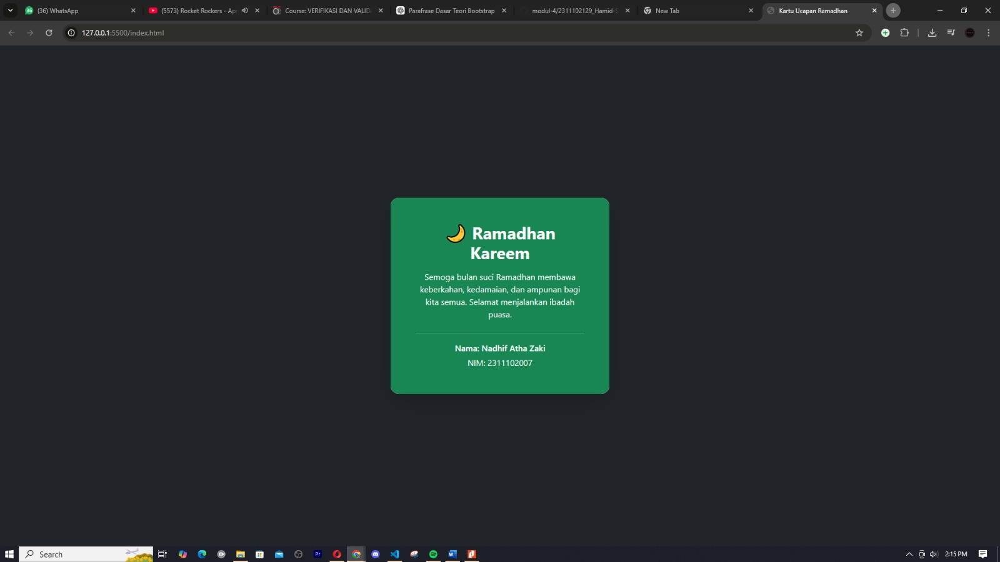

<div align="center">
  <br />
  <h1>LAPORAN PRAKTIKUM <br>APLIKASI BERBASIS PLATFORM</h1>
  <br />
  <h3>MODUL 4 <br> BOOTSTRAP</h3>
  <br />
  <br />
   
  <br />
  <br />
  <br />
  <br />
  <h3>Disusun Oleh :</h3>
  <p>
    <strong>Nadhif Atha Zaki</strong><br>
    <strong>2311102007</strong><br>
    <strong>S1 IF-11-01</strong>
  </p>
  <br />
  <h3>Dosen Pengampu :</h3>
  <p>
    <strong>Dimas Fanny Hebrasianto Permadi, S.ST., M.Kom</strong>
  </p>
  <br />
  <br />
    <h4>Asisten Praktikum :</h4>
    <strong> Apri Pandu Wicaksono </strong> <br>
    <strong>Rangga Pradarrell Fathi</strong>
  <br />
  <h3>LABORATORIUM HIGH PERFORMANCE
 <br>FAKULTAS INFORMATIKA <br>UNIVERSITAS TELKOM PURWOKERTO <br>2026</h3>
</div>

---

## 1. Dasar Teori

**Bootstrap** merupakan sebuah _framework front-end_ **open-source** yang sangat populer dan digunakan untuk mempercepat proses pembuatan antarmuka website maupun aplikasi web. Framework ini menyediakan berbagai template desain berbasis **HTML, CSS, dan JavaScript** yang siap digunakan untuk membangun berbagai elemen antarmuka seperti tipografi, formulir, tombol, navigasi, serta komponen UI lainnya.

Salah satu fitur utama Bootstrap adalah **sistem Grid Responsif**. Sistem ini memanfaatkan struktur **container**, **row**, dan **column** untuk mengatur tata letak halaman. Dengan sistem ini, tampilan website dapat menyesuaikan diri secara otomatis dengan berbagai ukuran layar perangkat, seperti komputer, tablet, maupun _smartphone_.

Beberapa keunggulan utama dari penggunaan Bootstrap antara lain:

1. **Efisiensi Waktu**  
   _Developer_ tidak perlu menulis kode CSS dasar dari awal, seperti pengaturan margin, penggunaan _flexbox_, desain _card_, dan lain-lain.

2. **Konsistensi Tampilan**  
   Bootstrap membantu memastikan tampilan antarmuka tetap konsisten ketika dibuka di berbagai jenis _browser_.

3. **Responsif Secara Default**  
   Sebagian besar komponen Bootstrap dirancang dengan pendekatan **mobile-first**, sehingga tampilan sudah responsif sejak awal pengembangan.

Bootstrap dapat digunakan secara **offline** dengan mengunduh _source file_ dari situs resminya, atau secara **online** melalui layanan **Content Delivery Network (CDN)**.

## 2. Penjelasan Kode HTML

Berikut merupakan implementasi kartu ucapan Ramadhan berbasis _Native Bootstrap 5_ murni dengan penggunaan berbagai _utilities class_ tanpa menyertakan dokumen CSS tambahan apa pun, beserta hasil eksekusinya.

### Kode HTML (`ramadan.html`)

```html
<!DOCTYPE html>
<html lang="id">
  <head>
    <meta charset="UTF-8" />
    <meta name="viewport" content="width=device-width, initial-scale=1" />

    <title>Kartu Ucapan Ramadhan</title>

    <!-- Bootstrap 5 CDN -->
    <link
      href="https://cdn.jsdelivr.net/npm/bootstrap@5.3.3/dist/css/bootstrap.min.css"
      rel="stylesheet"
    />
  </head>

  <body class="bg-dark">
    <div
      class="container d-flex vh-100 justify-content-center align-items-center"
    >
      <div
        class="card text-center shadow-lg rounded-4 border-0"
        style="max-width: 420px;"
      >
        <div class="card-body bg-success text-light rounded-4 p-5">
          <h2 class="fw-bold mb-3">🌙 Ramadhan Kareem</h2>

          <p class="mb-4">
            Semoga bulan suci Ramadhan membawa keberkahan, kedamaian, dan
            ampunan bagi kita semua. Selamat menjalankan ibadah puasa.
          </p>

          <hr class="border-light" />

          <p class="mb-1 fw-semibold">Nama: Nadhif Atha Zaki</p>

          <p class="mb-0">NIM: 2311102007</p>
        </div>
      </div>
    </div>
  </body>
</html>
```

### Hasil Tampilan (Screenshot)



### Penjelasan Code

- Pada bagian **head**, dilakukan pemanggilan _library_ **Bootstrap 5** melalui metode **Content Delivery Network (CDN)** menggunakan tag `<link>`. Library ini menyediakan berbagai komponen UI, sistem grid, serta _utility class_ yang digunakan untuk membangun tampilan tanpa perlu menambahkan file CSS tambahan.

- Pada tag **`<body>`**, digunakan class `bg-dark` untuk memberikan latar belakang halaman berwarna gelap. Hal ini bertujuan agar kartu ucapan yang berada di tengah halaman terlihat lebih menonjol secara visual.

- Pada elemen **`container`**, digunakan kombinasi _utility class_ `d-flex vh-100 justify-content-center align-items-center`.

  - `d-flex` mengaktifkan **Flexbox layout**.
  - `vh-100` membuat tinggi elemen menjadi **100% tinggi viewport**.
  - `justify-content-center` memposisikan konten ke **tengah secara horizontal**.
  - `align-items-center` memposisikan konten ke **tengah secara vertikal**.  
    Dengan kombinasi ini, kartu ucapan akan selalu berada tepat di tengah halaman.

- Pada elemen **`.card`**, digunakan komponen kartu bawaan Bootstrap untuk membentuk struktur utama kartu ucapan. Beberapa _utility class_ ditambahkan untuk meningkatkan tampilan visual, antara lain:

  - `text-center` untuk membuat seluruh teks rata tengah.
  - `shadow-lg` untuk memberikan efek bayangan yang lebih tegas pada kartu.
  - `rounded-4` untuk membuat sudut kartu lebih melengkung.
  - `border-0` untuk menghilangkan garis batas default pada kartu.

- Pada bagian **`.card-body`**, digunakan beberapa _utility class_ untuk mempercantik tampilan kartu, yaitu:

  - `bg-success` untuk memberikan warna latar belakang hijau.
  - `text-light` agar warna teks menjadi terang sehingga kontras dengan latar.
  - `rounded-4` untuk menjaga sudut dalam kartu tetap melengkung.
  - `p-5` untuk memberikan jarak **padding** yang cukup di dalam kartu agar isi tidak terlalu rapat.

- Pada elemen teks di dalam kartu, beberapa _utility class_ Bootstrap dimanfaatkan:

  - `fw-bold` untuk membuat judul tampil lebih tebal.
  - `mb-3` dan `mb-4` untuk mengatur **jarak antar elemen** menggunakan margin bawah.
  - `fw-semibold` untuk menegaskan teks pada bagian identitas.

- Elemen **`<hr>`** digunakan sebagai pemisah visual antara pesan ucapan Ramadhan dan informasi identitas pembuat kartu, dengan tambahan class `border-light` agar garis pemisah tetap terlihat jelas di atas latar belakang hijau.

Secara keseluruhan, seluruh desain kartu ucapan dibuat hanya dengan memanfaatkan **komponen dan _utility class_ Bootstrap 5**, tanpa menambahkan file CSS eksternal atau stylesheet khusus.

## Refrensi

- [Materi Modul 4](https://drive.google.com/file/d/1TW5Y0AdzkVk24ThPUf1OQNs2Mnw3XNO5/view?usp=sharing)
