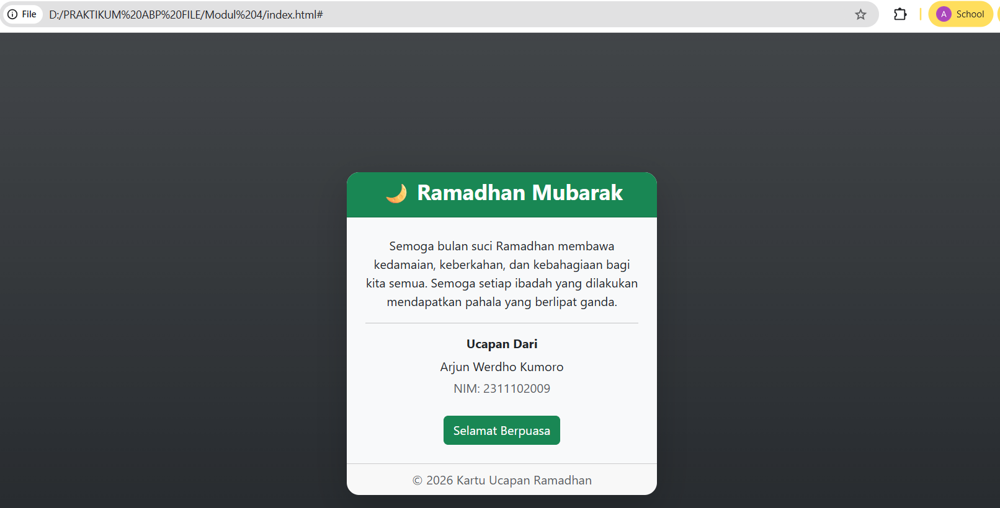

<div align="center">
  <br />
  <h1>LAPORAN PRAKTIKUM <br>APLIKASI BERBASIS PLATFORM</h1>
  <br />
  <h3>MODUL 4 <br> BOOSTRAP</h3>
  <br />
   
  <br /><br /><br />

  <h3>Disusun Oleh :</h3>
  <p>
    <strong>Arjun Werdho Kumoro</strong><br>
    <strong>2311102009</strong><br>
    <strong>IF-11-REG01</strong>
  </p>

  <br />

  <h3>Dosen Pengampu :</h3>
  <p>
    <strong>Dimas Fanny Hebrasianto Permadi, S.ST., M.Kom</strong>
  </p>

  <br />

  <h4>Asisten Praktikum :</h4>
  <strong>Apri Pandu Wicaksono</strong><br>
  <strong>Rangga Pradarrell Fathi</strong>

  <br /><br />

  <h3>
  LABORATORIUM HIGH PERFORMANCE <br>
  FAKULTAS INFORMATIKA <br>
  UNIVERSITAS TELKOM PURWOKERTO <br>
  2026
  </h3>
</div>

---

# DASAR TEORI

Bootstrap adalah framework front-end open-source yang populer untuk mempercepat pembuatan tampilan website atau aplikasi web. Framework ini menyediakan berbagai komponen siap pakai berbasis HTML, CSS, dan JavaScript seperti tipografi, tombol, formulir, navigasi, serta elemen antarmuka lainnya. Salah satu fitur utamanya adalah sistem Grid Responsif yang menggunakan struktur container, row, dan column untuk mengatur tata letak agar halaman dapat menyesuaikan berbagai ukuran layar perangkat, mulai dari komputer hingga smartphone. Penggunaan Bootstrap memberikan beberapa keunggulan seperti mempercepat proses pengembangan, menjaga konsistensi tampilan di berbagai browser, serta mendukung desain responsif dengan pendekatan mobile-first. Bootstrap juga dapat digunakan secara online melalui CDN maupun secara offline dengan mengunduh file sumbernya.

---

# UNGUIDED

## Code

```html
<!DOCTYPE html>
<html lang="id">
<head>
<meta charset="UTF-8">
<meta name="viewport" content="width=device-width, initial-scale=1">

<title>Kartu Ucapan Ramadhan</title>

<!-- Bootstrap  -->
<link href="https://cdn.jsdelivr.net/npm/bootstrap@5.3.3/dist/css/bootstrap.min.css" rel="stylesheet">

</head>

<body class="bg-dark bg-gradient">

<div class="container d-flex vh-100 justify-content-center align-items-center">

<div class="card shadow-lg border-0 rounded-4 text-center" style="width: 400px;">

<div class="card-header bg-success text-white rounded-top-4">
<h3 class="fw-bold">🌙 Ramadhan Mubarak</h3>
</div>

<div class="card-body bg-light p-4">

<p class="card-text">
Semoga bulan suci Ramadhan membawa
kedamaian, keberkahan, dan kebahagiaan
bagi kita semua. Semoga setiap ibadah
yang dilakukan mendapatkan pahala
yang berlipat ganda.
</p>

<hr>

<h6 class="fw-bold">Ucapan Dari</h6>

<p class="mb-1">Arjun Werdho Kumoro</p>
<p class="text-muted">NIM: 2311102009</p>

<a href="#" class="btn btn-success mt-2">Selamat Berpuasa</a>

</div>

<div class="card-footer text-muted">
© 2026 Kartu Ucapan Ramadhan
</div>

</div>

</div>

</body>
</html>
```
## Output

# Penjelasan
Kode HTML di atas digunakan untuk membuat sebuah halaman web sederhana yang menampilkan kartu ucapan Ramadhan dengan tampilan yang rapi menggunakan framework Bootstrap 5. Bootstrap merupakan framework CSS yang menyediakan berbagai komponen dan class siap pakai untuk membantu membuat tampilan website menjadi lebih menarik dan responsif tanpa harus menulis banyak kode CSS secara manual.

Pada bagian awal terdapat deklarasi `<!DOCTYPE html>` yang berfungsi untuk memberi tahu browser bahwa dokumen menggunakan standar HTML5. Tag `<html lang="id">` menunjukkan bahwa bahasa yang digunakan pada halaman web adalah bahasa Indonesia. Di dalam tag `<head>` terdapat beberapa elemen penting seperti `<meta charset="UTF-8">` yang berfungsi untuk mendukung berbagai karakter teks serta `<meta name="viewport">` yang digunakan agar tampilan halaman dapat menyesuaikan ukuran layar perangkat.

Selanjutnya terdapat pemanggilan Bootstrap 5 melalui CDN menggunakan tag `<link>` yang mengarah ke file CSS Bootstrap. Dengan menggunakan CDN, developer tidak perlu mengunduh file Bootstrap secara manual karena file tersebut diambil langsung dari server Bootstrap sehingga dapat langsung digunakan pada halaman web.

Pada bagian `<body>` digunakan class bg-dark bg-gradient untuk memberikan latar belakang berwarna gelap dengan efek gradasi. Kemudian terdapat elemen `<div class="container d-flex vh-100 justify-content-center align-items-center">` yang berfungsi untuk membuat konten berada di tengah halaman baik secara horizontal maupun vertikal. Class vh-100 membuat tinggi container sama dengan tinggi layar, sedangkan d-flex, justify-content-center, dan align-items-center digunakan untuk mengatur posisi elemen menggunakan sistem Flexbox.

Di dalam container terdapat komponen card dari Bootstrap yang digunakan sebagai wadah utama kartu ucapan. Card ini memiliki beberapa bagian yaitu card-header, card-body, dan card-footer. Bagian card-header digunakan untuk menampilkan judul utama yaitu “Ramadhan Mubarak”. Kemudian pada card-body terdapat teks ucapan Ramadhan serta informasi nama dan NIM pembuat halaman. Pada bagian ini juga ditambahkan tombol menggunakan class btn btn-success yang merupakan komponen tombol dari Bootstrap.

Terakhir, pada bagian card-footer ditampilkan informasi tambahan berupa tahun pembuatan kartu ucapan. Dengan menggunakan komponen Bootstrap seperti container, card, dan button, halaman web dapat dibuat dengan tampilan yang lebih rapi, modern, dan responsif tanpa harus membuat banyak kode CSS secara manual.