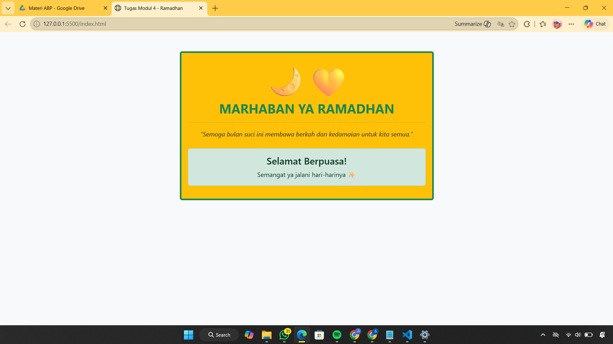

<div align="center">

# LAPORAN PRAKTIKUM
# APLIKASI BERBASIS PLATFORM


## MODUL 4
## BOOTSTRAP


**Disusun Oleh :**

**Sherine Naura Early Gunawan**

**2311102020**

**S1 IF-11-REG01**

**Dosen Pengampu :**

Dimas Fanny Hebrasianto Permadi, S.ST., M.Kom

**PROGRAM STUDI S1 INFORMATIKA**

**FAKULTAS INFORMATIKA**

**UNIVERSITAS TELKOM PURWOKERTO**

**2025/2026**

</div>

---

## 1. Dasar Teori

Bootstrap adalah framework CSS open-source yang paling populer untuk mengembangkan situs web yang responsif dan
mobile-first. Bootstrap menyediakan kumpulan komponen desain siap pakai seperti grid system, tombol, navigasi, hingga
tabel, sehingga pengembang tidak perlu menulis kode CSS dari nol. Keunggulan utamanya adalah sistem Grid yang
menggunakan flexbox untuk mengatur tata letak halaman agar tetap rapi di berbagai ukuran layar (HP, tablet, atau
laptop). Selain itu, Bootstrap menggunakan sistem utility classes yang memungkinkan kita mengubah tampilan elemen cukup
dengan menambahkan nama class tertentu langsung pada tag HTML.

---

## 2. Source Code

```html
<!DOCTYPE html>
<html lang="id">

<head>
    <title>Tugas Modul 4 - Ramadhan</title>
    <link href="https://cdn.jsdelivr.net/npm/bootstrap@5.3.0/dist/css/bootstrap.min.css" rel="stylesheet">
</head>

<body class="bg-light">

    <div class="container mt-5">
        <div class="row justify-content-center">
            <div class="col-md-6">

                <div class="card bg-warning border-success border-4">

                    <div class="card-body text-center">

                        <h2 class="text-success fw-bold">MARHABAN YA RAMADHAN</h2>

                        <hr class="border-success">

                        <p class="fst-italic text-dark">
                            "Semoga bulan suci ini membawa berkah dan kedamaian untuk kita semua."
                        </p>

                        <div class="alert alert-success mt-4">
                            <h4 class="alert-heading">Selamat Berpuasa!</h4>
                            <p class="mb-0">Semangat ya jalani hari-harinya</p>
                        </div>
                    </div>

                </div>

            </div>
        </div>
    </div>

    <script src="https://cdn.jsdelivr.net/npm/bootstrap@5.3.0/dist/js/bootstrap.bundle.min.js"></script>
</body>

</html>
```

### Penjelasan Kode
Kode di atas dibuat menggunakan Bootstrap 5 dengan memanfaatkan kombinasi komponen Card dan Alert. Bagian layout utama
menggunakan class container dan row justify-content-center agar kartu ucapan berada di tengah layar secara horizontal.
Kartu utama menggunakan class card bg-warning untuk memberikan latar belakang kuning yang cerah, serta dipertegas dengan
border-success border-4 untuk memberikan garis tepi hijau yang tebal.

---

## 3. Hasil

<div align="center">
    
</div>