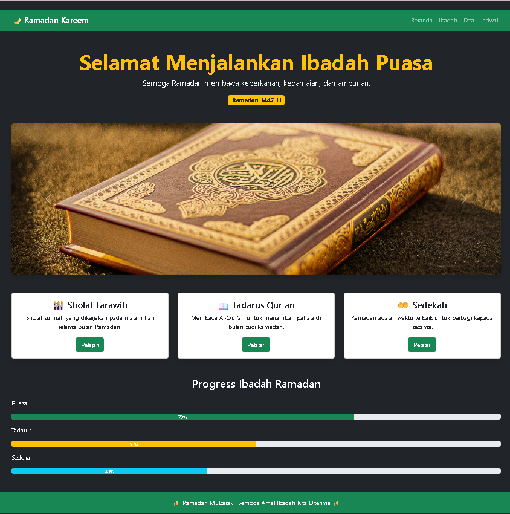

<div align="center">

# LAPORAN PRAKTIKUM
# APLIKASI BERBASIS PLATFORM

---

## MODUL 4
## HALAMAN RAMADAN DENGAN BOOTSTRAP

---


---

**Disusun Oleh :**

**TEGAR BANGKIT WIJAYA**

**2311102027**

**S1 IF-11-REG01**

---

**Dosen Pengampu :**

Dimas Fanny Hebrasianto Permadi, S.ST., M.Kom

---

**PROGRAM STUDI S1 INFORMATIKA**

**FAKULTAS INFORMATIKA**

**UNIVERSITAS TELKOM PURWOKERTO**

**2025/2026**

</div>

---

## 1. Dasar Teori

Bootstrap adalah framework front-end open-source yang dikembangkan oleh Twitter dan saat ini menjadi salah satu framework CSS paling populer di dunia. Bootstrap menyediakan koleksi komponen UI yang siap pakai sehingga mempercepat proses pengembangan tampilan website yang responsif dan konsisten di berbagai ukuran layar.

Bootstrap dapat digunakan dengan dua cara yaitu mengunduh file Bootstrap secara lokal atau menggunakan CDN (Content Delivery Network). Pada praktikum ini Bootstrap digunakan melalui CDN dengan menambahkan link CDN Bootstrap di bagian `<head>` HTML.

Beberapa komponen Bootstrap yang digunakan pada praktikum ini antara lain:

**Navbar** adalah komponen navigasi Bootstrap yang menyediakan menu di bagian atas halaman. Navbar Bootstrap secara otomatis menjadi responsif dengan tombol hamburger pada layar kecil menggunakan class `navbar-expand-lg` dan `navbar-toggler`.

**Carousel** adalah komponen slideshow Bootstrap yang menampilkan beberapa konten secara bergantian. Carousel menggunakan atribut `data-bs-ride="carousel"` untuk mengaktifkan auto-play dan tombol navigasi menggunakan `data-bs-slide="prev"` dan `data-bs-slide="next"`.

**Card** adalah komponen Bootstrap untuk menampilkan konten dalam kotak yang rapi dengan shadow dan border. Card terdiri dari `card`, `card-body`, dan berbagai class tambahan untuk mengatur tampilan.

**Progress Bar** adalah komponen Bootstrap untuk menampilkan indikator kemajuan. Progress bar menggunakan class `progress` sebagai container dan `progress-bar` sebagai isian dengan lebar yang diatur melalui properti `style="width:X%"`.

**Grid System** Bootstrap menggunakan sistem 12 kolom dengan class `row` dan `col-md-X` untuk mengatur layout secara responsif.

---

## 2. Penjelasan Kode

Berikut adalah implementasi halaman Ramadan menggunakan Bootstrap 5 dengan berbagai komponen interaktif.

### Kode HTML (index.html)
```html
<!-- 
    Nama  : Tegar Bangkit Wijaya
    NIM   : 2311102027
    Kelas : S1 IF-11-REG01
-->
<!DOCTYPE html>
<html lang="id">
<head>
<meta charset="UTF-8">
<meta name="viewport" content="width=device-width, initial-scale=1">
<title>Ramadan Mubarak</title>
<link href="https://cdn.jsdelivr.net/npm/bootstrap@5.3.2/dist/css/bootstrap.min.css" rel="stylesheet">
</head>
<body class="bg-dark text-light">

<nav class="navbar navbar-expand-lg navbar-dark bg-success">
  <div class="container">
    <a class="navbar-brand fw-bold" href="#">🌙 Ramadan Kareem</a>
    <button class="navbar-toggler" data-bs-toggle="collapse" data-bs-target="#menu">
      <span class="navbar-toggler-icon"></span>
    </button>
    <div class="collapse navbar-collapse" id="menu">
      <ul class="navbar-nav ms-auto">
        <li class="nav-item"><a class="nav-link" href="#">Beranda</a></li>
        <li class="nav-item"><a class="nav-link" href="#">Ibadah</a></li>
        <li class="nav-item"><a class="nav-link" href="#">Doa</a></li>
        <li class="nav-item"><a class="nav-link" href="#">Jadwal</a></li>
      </ul>
    </div>
  </div>
</nav>

<div class="container text-center py-5">
  <h1 class="display-4 fw-bold text-warning">Selamat Menjalankan Ibadah Puasa</h1>
  <p class="lead">Semoga Ramadan membawa keberkahan, kedamaian, dan ampunan.</p>
  <span class="badge bg-warning text-dark fs-6">Ramadan 1447 H</span>
</div>

<div class="container mb-5">
  <div id="ramadanCarousel" class="carousel slide" data-bs-ride="carousel">
    <div class="carousel-inner rounded shadow">
      <div class="carousel-item active">
        
      </div>
      <div class="carousel-item">
        
      </div>
      <div class="carousel-item">
        
      </div>
    </div>
    <button class="carousel-control-prev" data-bs-target="#ramadanCarousel" data-bs-slide="prev">
      <span class="carousel-control-prev-icon"></span>
    </button>
    <button class="carousel-control-next" data-bs-target="#ramadanCarousel" data-bs-slide="next">
      <span class="carousel-control-next-icon"></span>
    </button>
  </div>
</div>

<div class="container mb-5">
  <div class="row g-4">
    <div class="col-md-4">
      <div class="card text-dark shadow">
        <div class="card-body text-center">
          <h4>🕌 Sholat Tarawih</h4>
          <p>Sholat sunnah yang dikerjakan pada malam hari selama bulan Ramadan.</p>
          <button class="btn btn-success">Pelajari</button>
        </div>
      </div>
    </div>
    <div class="col-md-4">
      <div class="card text-dark shadow">
        <div class="card-body text-center">
          <h4>📖 Tadarus Qur'an</h4>
          <p>Membaca Al-Qur'an untuk menambah pahala di bulan suci Ramadan.</p>
          <button class="btn btn-success">Pelajari</button>
        </div>
      </div>
    </div>
    <div class="col-md-4">
      <div class="card text-dark shadow">
        <div class="card-body text-center">
          <h4>🤲 Sedekah</h4>
          <p>Ramadan adalah waktu terbaik untuk berbagi kepada sesama.</p>
          <button class="btn btn-success">Pelajari</button>
        </div>
      </div>
    </div>
  </div>
</div>

<div class="container mb-5">
  <h3 class="text-center mb-4">Progress Ibadah Ramadan</h3>
  <p>Puasa</p>
  <div class="progress mb-3">
    <div class="progress-bar bg-success" style="width:70%">70%</div>
  </div>
  <p>Tadarus</p>
  <div class="progress mb-3">
    <div class="progress-bar bg-warning" style="width:50%">50%</div>
  </div>
  <p>Sedekah</p>
  <div class="progress">
    <div class="progress-bar bg-info" style="width:40%">40%</div>
  </div>
</div>

<footer class="bg-success text-center py-3">
  <p class="mb-0">✨ Ramadan Mubarak | Semoga Amal Ibadah Kita Diterima ✨</p>
</footer>

<script src="https://cdn.jsdelivr.net/npm/bootstrap@5.3.2/dist/js/bootstrap.bundle.min.js"></script>
</body>
</html>
```

### Penjelasan Kode

Bootstrap di-import menggunakan CDN melalui tag `<link>` di bagian `<head>` sehingga tidak perlu mengunduh file Bootstrap secara manual.

Navbar menggunakan class `navbar-dark bg-success` untuk tampilan hijau gelap. Tombol hamburger dengan class `navbar-toggler` otomatis muncul pada layar kecil dan menggunakan `data-bs-toggle="collapse"` untuk menampilkan menu.

Carousel menggunakan `data-bs-ride="carousel"` agar slideshow berjalan otomatis. Setiap slide menggunakan class `carousel-item` dan slide pertama diberi class `active`. Tombol navigasi menggunakan `data-bs-slide="prev"` dan `data-bs-slide="next"`.

Tiga card ibadah menggunakan Grid System Bootstrap dengan `col-md-4` sehingga masing-masing menempati 4 dari 12 kolom, ditampilkan sejajar pada layar medium ke atas.

Progress bar menggunakan class `progress` sebagai container dan `progress-bar` dengan lebar yang diatur melalui `style="width:X%"` untuk menampilkan indikator kemajuan ibadah Ramadan.

---

## 3. Hasil



---

<div align="center">

*2311102027 - Tegar Bangkit Wijaya - S1 IF-11-REG01*

</div>