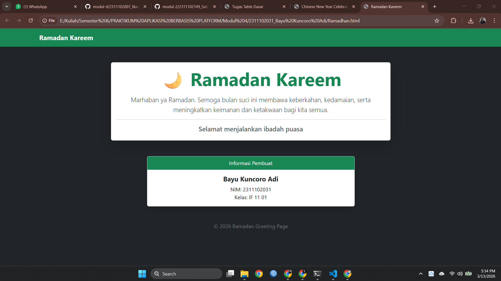

<div align="center">
  <br />
  <h1>LAPORAN PRAKTIKUM <br>APLIKASI BERBASIS PLATFORM</h1>
  <br />
  <h3>MODUL 4 <br> BOOTSTRAP</h3>
  <br />
  <br />
   
  <br />
  <br />
  <br />
  <br />
  <h3>Disusun Oleh :</h3>
  <p>
    <strong>Bayu Kuncoro Adi</strong><br>
    <strong>2311102031</strong><br>
    <strong>S1 IF-11-01</strong>
  </p>
  <br />
  <h3>Dosen Pengampu :</h3>
  <p>
    <strong>Dimas Fanny Hebrasianto Permadi, S.ST., M.Kom</strong>
  </p>
  <br />
  <br />
    <h4>Asisten Praktikum :</h4>
    <strong> Apri Pandu Wicaksono </strong> <br>
    <strong>Rangga Pradarrell Fathi</strong>
  <br />
  <h3>LABORATORIUM HIGH PERFORMANCE
 <br>FAKULTAS INFORMATIKA <br>UNIVERSITAS TELKOM PURWOKERTO <br>2026</h3>
</div>

---

## 1. Dasar Teori

**Bootstrap** adalah sebuah *framework front-end* **open-source** yang banyak digunakan oleh pengembang web untuk mempercepat proses pembuatan tampilan antarmuka website maupun aplikasi web. Framework ini menyediakan berbagai komponen dan template desain berbasis **HTML, CSS, dan JavaScript** yang siap digunakan. Dengan adanya komponen tersebut, pengembang dapat dengan mudah membuat elemen antarmuka seperti tipografi, formulir, tombol, navigasi, serta berbagai komponen UI lainnya tanpa harus membuat semuanya dari awal.

Salah satu fitur penting yang dimiliki Bootstrap adalah **sistem Grid Responsif**. Sistem ini menggunakan struktur dasar berupa **container**, **row**, dan **column** untuk mengatur tata letak elemen pada halaman web. Melalui sistem grid ini, tampilan website dapat menyesuaikan secara otomatis dengan berbagai ukuran layar perangkat, mulai dari komputer desktop hingga tablet dan *smartphone*, sehingga halaman tetap terlihat rapi dan mudah digunakan pada berbagai perangkat.

Beberapa keunggulan utama dari penggunaan Bootstrap antara lain:

1. **Efisiensi Waktu**  
    Pengembang tidak perlu lagi menuliskan kode CSS dasar dari awal, seperti pengaturan **margin**, penggunaan **flexbox**, pembuatan desain **card**, dan berbagai elemen tata letak lainnya, karena semua komponen tersebut telah disediakan oleh Bootstrap dan dapat langsung digunakan.


2. **Konsistensi Tampilan**  
   Bootstrap membantu memastikan tampilan antarmuka tetap konsisten ketika dibuka di berbagai jenis _browser_.

3. **Responsif Secara Default**  
   Sebagian besar komponen Bootstrap dirancang dengan pendekatan **mobile-first**, sehingga tampilan sudah responsif sejak awal pengembangan.

Bootstrap dapat digunakan secara **offline** dengan mengunduh _source file_ dari situs resminya, atau secara **online** melalui layanan **Content Delivery Network (CDN)**.

## 2. Penjelasan Kode HTML

Berikut merupakan implementasi kartu ucapan Ramadhan berbasis _Native Bootstrap 5_ murni dengan penggunaan berbagai _utilities class_ tanpa menyertakan dokumen CSS tambahan apa pun, beserta hasil eksekusinya.

### Kode HTML (`Ramadhan.html`)

```html
<!DOCTYPE html>
<html lang="id">
<head>

<meta charset="UTF-8">
<meta name="viewport" content="width=device-width, initial-scale=1">

<title>Ramadan Kareem</title>

<!-- Bootstrap CSS -->
<link href="https://cdn.jsdelivr.net/npm/bootstrap@5.3.3/dist/css/bootstrap.min.css" rel="stylesheet">

</head>
<body class="bg-dark text-light">

<!-- Navbar -->
<nav class="navbar navbar-expand-lg navbar-dark bg-success">
<div class="container">
<a class="navbar-brand fw-bold" href="#">Ramadan Kareem</a>
</div>
</nav>

<!-- Hero Section -->
<div class="container text-center mt-5">

<div class="row justify-content-center">
<div class="col-md-8">

<div class="card shadow-lg border-0">
<div class="card-body">

<h1 class="display-4 text-success fw-bold">
🌙 Ramadan Kareem
</h1>

<p class="lead mt-3">
Marhaban ya Ramadan. Semoga bulan suci ini membawa
keberkahan, kedamaian, serta meningkatkan keimanan
dan ketakwaan bagi kita semua.
</p>

<hr>

<h5 class="text-muted">
Selamat menjalankan ibadah puasa
</h5>

</div>
</div>

</div>
</div>

</div>

<!-- Informasi Pembuat -->
<div class="container mt-5">

<div class="row justify-content-center">
<div class="col-md-6">

<div class="card text-center shadow">

<div class="card-header bg-success text-white">
Informasi Pembuat
</div>

<div class="card-body">

<h5 class="card-title fw-bold">
Bayu Kuncoro Adi
</h5>

<p class="card-text">
NIM: 2311102031 <br>
Kelas: IF 11 01
</p>

</div>

</div>

</div>
</div>

</div>

<!-- Footer -->
<footer class="text-center mt-5 mb-3 text-secondary">
<p>© 2026 Ramadan Greeting Page</p>
</footer>

<!-- Bootstrap JS -->
<script src="https://cdn.jsdelivr.net/npm/bootstrap@5.3.3/dist/js/bootstrap.bundle.min.js"></script>

</body>
</html>
```

### Hasil Tampilan (Screenshot)



### Penjelasan Code

Program HTML di atas digunakan untuk membuat sebuah halaman web sederhana bertema **ucapan Ramadan** dengan memanfaatkan **framework Bootstrap** agar tampilan halaman lebih rapi, responsif, dan modern tanpa perlu menulis banyak kode CSS secara manual. Pada **baris pertama** terdapat deklarasi `<!DOCTYPE html>` yang berfungsi untuk memberi tahu browser bahwa dokumen tersebut menggunakan standar **HTML5**. Selanjutnya, tag `<html lang="id">` menunjukkan bahwa bahasa utama yang digunakan pada halaman tersebut adalah **Bahasa Indonesia**, sehingga browser dan mesin pencari dapat mengenali bahasa yang digunakan pada konten halaman.

Bagian **`<head>`** berisi berbagai informasi penting mengenai halaman web. Tag `<meta charset="UTF-8">` digunakan untuk mengatur sistem pengkodean karakter agar halaman dapat menampilkan berbagai jenis karakter dengan benar, termasuk simbol atau emoji seperti bulan sabit yang digunakan pada judul halaman. Kemudian terdapat `<meta name="viewport" content="width=device-width, initial-scale=1">` yang berfungsi untuk mengatur tampilan halaman agar bersifat **responsif** dan dapat menyesuaikan ukuran layar perangkat seperti komputer, tablet, maupun smartphone. Selanjutnya terdapat tag `<title>` yang berfungsi untuk menentukan judul halaman yang akan ditampilkan pada tab browser, yaitu **“Ramadan Kareem”**. Setelah itu, program memuat **Bootstrap CSS** menggunakan tag `<link>` yang mengarah ke **CDN (Content Delivery Network)** Bootstrap versi 5.3.3. Dengan memuat Bootstrap melalui CDN, berbagai komponen dan kelas desain Bootstrap dapat langsung digunakan pada halaman tanpa harus membuat file CSS tambahan.

Pada bagian **`<body>`**, atribut `class="bg-dark text-light"` digunakan untuk mengatur tampilan dasar halaman menggunakan kelas bawaan Bootstrap. Kelas `bg-dark` memberikan latar belakang berwarna gelap, sedangkan `text-light` membuat warna teks menjadi terang sehingga kontras dengan latar belakang. Setelah itu terdapat bagian **navbar** yang dibuat menggunakan elemen `<nav>` dengan kelas `navbar navbar-expand-lg navbar-dark bg-success`. Kelas `navbar` digunakan untuk membuat komponen navigasi, `navbar-expand-lg` mengatur agar navbar dapat menyesuaikan ukuran layar pada perangkat besar, `navbar-dark` mengatur warna teks agar cocok dengan latar belakang gelap, dan `bg-success` memberikan warna latar hijau yang identik dengan nuansa Ramadan atau Islami. Di dalam navbar terdapat elemen `<div class="container">` yang berfungsi untuk menjaga tata letak konten tetap rapi dan terpusat. Kemudian terdapat elemen `<a class="navbar-brand fw-bold">` yang menampilkan teks **“Ramadan Kareem”** sebagai identitas atau judul utama pada bagian navigasi.

Setelah navbar, terdapat bagian **Hero Section**, yaitu bagian utama yang menampilkan pesan ucapan Ramadan. Bagian ini dibungkus menggunakan `<div class="container text-center mt-5">`. Kelas `container` berfungsi sebagai wadah utama dengan lebar yang menyesuaikan ukuran layar, `text-center` digunakan untuk menempatkan teks di tengah, dan `mt-5` memberikan jarak atas yang cukup agar konten tidak terlalu dekat dengan navbar. Di dalamnya digunakan sistem **Grid Bootstrap**, yaitu kombinasi `row` dan `col`. Elemen `<div class="row justify-content-center">` digunakan untuk membuat baris pada layout grid dan memposisikan konten di tengah secara horizontal. Kemudian `<div class="col-md-8">` menentukan bahwa konten akan menempati delapan kolom dari total dua belas kolom grid pada ukuran layar medium atau lebih besar.

Di dalam kolom tersebut terdapat komponen **card** Bootstrap yang dibuat menggunakan `<div class="card shadow-lg border-0">`. Komponen card digunakan untuk menampilkan konten dalam bentuk panel yang rapi. Kelas `shadow-lg` memberikan efek bayangan besar sehingga kartu terlihat lebih menonjol, sedangkan `border-0` menghilangkan garis tepi kartu agar tampil lebih bersih. Di dalam card terdapat `<div class="card-body">` yang berfungsi sebagai area utama untuk menempatkan isi kartu. Selanjutnya terdapat elemen `<h1 class="display-4 text-success fw-bold">` yang menampilkan judul besar **“🌙 Ramadan Kareem”**. Kelas `display-4` digunakan untuk membuat ukuran teks sangat besar sesuai gaya tipografi Bootstrap, `text-success` memberikan warna hijau pada teks, dan `fw-bold` membuat teks tampil lebih tebal.

Di bawah judul terdapat elemen `<p class="lead mt-3">` yang berisi pesan ucapan Ramadan. Kelas `lead` digunakan untuk membuat paragraf terlihat lebih menonjol dibandingkan teks biasa, sedangkan `mt-3` memberikan jarak atas dari elemen sebelumnya. Paragraf ini berisi pesan yang menyampaikan harapan agar bulan Ramadan membawa keberkahan, kedamaian, serta meningkatkan keimanan dan ketakwaan. Setelah itu terdapat elemen `<hr>` yang berfungsi sebagai garis pemisah antara pesan utama dengan teks berikutnya. Kemudian terdapat elemen `<h5 class="text-muted">` yang menampilkan ucapan **“Selamat menjalankan ibadah puasa”** dengan warna teks yang lebih lembut menggunakan kelas `text-muted`.

Bagian berikutnya adalah **Informasi Pembuat** yang ditampilkan menggunakan struktur grid Bootstrap yang sama dengan sebelumnya. Elemen `<div class="container mt-5">` digunakan sebagai wadah utama dengan jarak atas tambahan. Di dalamnya terdapat `<div class="row justify-content-center">` untuk memusatkan konten dan `<div class="col-md-6">` yang menentukan lebar konten sebesar enam kolom pada layar menengah atau lebih besar. Di dalam kolom ini digunakan komponen **card** lagi dengan kelas `card text-center shadow`. Kelas `text-center` membuat seluruh teks berada di tengah, sedangkan `shadow` memberikan efek bayangan ringan pada kartu. Bagian atas kartu menggunakan `<div class="card-header bg-success text-white">` yang berfungsi sebagai header kartu dengan latar belakang hijau dan teks putih. Di dalam header tersebut terdapat teks **“Informasi Pembuat”**. Pada bagian `<div class="card-body">` terdapat `<h5 class="card-title fw-bold">` yang menampilkan nama **Bayu Kuncoro Adi** dengan teks tebal, serta `<p class="card-text">` yang berisi informasi **NIM: 2311102031** dan **Kelas: IF 11 01**.

Pada bagian akhir halaman terdapat elemen **footer** yang dibuat menggunakan `<footer class="text-center mt-5 mb-3 text-secondary">`. Kelas `text-center` digunakan untuk menempatkan teks di tengah, `mt-5` memberikan jarak dari bagian sebelumnya, `mb-3` memberikan jarak bawah, dan `text-secondary` memberikan warna teks abu-abu agar terlihat lebih halus. Di dalam footer terdapat paragraf yang menampilkan teks **“© 2026 Ramadan Greeting Page”** sebagai penanda hak cipta atau identitas halaman.

Terakhir, program memuat **Bootstrap JavaScript** menggunakan `<script src="https://cdn.jsdelivr.net/npm/bootstrap@5.3.3/dist/js/bootstrap.bundle.min.js"></script>`. Script ini digunakan untuk mengaktifkan berbagai komponen interaktif Bootstrap seperti dropdown, modal, dan navbar responsif jika diperlukan. Secara keseluruhan, program ini memanfaatkan **komponen dan utility class Bootstrap** seperti container, grid system, navbar, card, tipografi, dan spacing utilities untuk membuat halaman ucapan Ramadan yang rapi, responsif, dan modern tanpa perlu menulis kode CSS tambahan secara manual.


## Refrensi

- [Materi Modul 4](https://drive.google.com/file/d/1TW5Y0AdzkVk24ThPUf1OQNs2Mnw3XNO5/view?usp=sharing)
