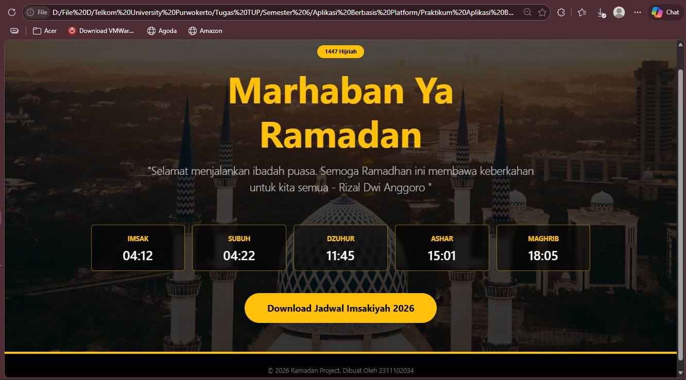

<div align="center">
  <br />
  <h1>LAPORAN PRAKTIKUM <br>APLIKASI BERBASIS PLATFORM</h1>
  <br />
  <h3>MODUL 4 <br> BOOTSTRAP</h3>
  <br />
   
  <br />
  <br />
  <br />
  <h3>Disusun Oleh :</h3>
  <p>
    <strong>Rizal Dwi Anggoro</strong><br>
    <strong>2311102034</strong><br>
    <strong>IF-11-REG01</strong>
  </p>
  <br />
  <h3>Dosen Pengampu :</h3>
  <p>
    <strong>Dimas Fanny Hebrasianto Permadi, S.ST., M.Kom</strong>
  </p>
  <br />
  <br />
    <h4>Asisten Praktikum :</h4>
    <strong> Apri Pandu Wicaksono </strong> <br>
    <strong>Rangga Pradarrell Fathi</strong>
  <br />
  <h3>LABORATORIUM HIGH PERFORMANCE
 <br>FAKULTAS INFORMATIKA <br>UNIVERSITAS TELKOM PURWOKERTO <br>2026</h3>
</div>

---

### DASAR TEORI :
Bootstrap merupakan sebuah front-end framework gratis yang digunakan untuk mempermudah dan mempercepat proses pembuatan antarmuka website. Bootstrap pertama kali dikembangkan oleh Mark Otto dan Jacob Thornton di Twitter dan dirilis sebagai proyek open source pada Agustus 2011 di GitHub. Framework ini menyediakan berbagai komponen siap pakai berbasis HTML, CSS, dan JavaScript seperti tipografi, form, button, navigasi, card, grid system, hingga komponen interaktif lainnya. Selain itu, Bootstrap juga mendukung desain responsif, yaitu tampilan website dapat menyesuaikan ukuran layar perangkat, baik pada smartphone, tablet, maupun komputer desktop.

Dalam pengembangan website menggunakan HTML (HyperText Markup Language), terdapat berbagai tag yang digunakan untuk menyusun struktur halaman web. Beberapa tag yang digunakan pada program di atas antara lain `<!DOCTYPE html>` yang berfungsi untuk mendefinisikan bahwa dokumen menggunakan standar HTML5, `<html>` sebagai elemen utama yang membungkus seluruh isi halaman, `<head>` yang berisi informasi metadata halaman seperti judul dan pengaturan karakter, serta `<meta>` yang digunakan untuk mengatur karakter teks dan tampilan responsif pada berbagai perangkat. Tag `<title>` digunakan untuk menampilkan judul halaman pada tab browser, sedangkan `<link>` digunakan untuk menghubungkan file eksternal seperti Bootstrap CSS dan file CSS tambahan.

Pada bagian isi halaman digunakan tag `<body>` yang berisi seluruh konten yang akan ditampilkan pada website. Tag `<section>` digunakan untuk membagi halaman menjadi bagian tertentu, misalnya sebagai hero section atau bagian utama halaman. Tag `<div>` digunakan sebagai wadah atau container untuk mengelompokkan elemen lain agar lebih mudah diatur tata letaknya. Tag `<h1>` digunakan untuk menampilkan judul utama halaman, sedangkan `<p>` digunakan untuk menampilkan paragraf teks. Tag `<span>` digunakan untuk menampilkan teks kecil seperti badge atau label, dan tag `<small>` digunakan untuk menampilkan teks dengan ukuran lebih kecil. Selain itu terdapat tag `<a>` yang berfungsi sebagai hyperlink atau tombol navigasi yang dapat mengarah ke halaman lain atau file tertentu, serta tag `<footer>` yang digunakan untuk menampilkan informasi penutup seperti copyright. Pada bagian akhir terdapat tag `<script>` yang digunakan untuk memuat file JavaScript Bootstrap agar komponen Bootstrap dapat berjalan dengan baik.

Selain HTML, program ini juga menggunakan CSS (Cascading Style Sheets) untuk mengatur tampilan visual halaman web. CSS memungkinkan pengembang untuk mengatur warna, ukuran, posisi, animasi, dan berbagai efek tampilan lainnya. Pada program di atas digunakan beberapa selector CSS seperti .hero-section untuk mengatur tampilan bagian utama halaman dengan memberikan background gambar dan efek gradasi, .btn-warning untuk mengatur tampilan tombol agar memiliki efek transisi saat disentuh, serta .card untuk mengatur tampilan kartu jadwal waktu sholat agar terlihat lebih menarik dengan efek blur dan perubahan warna saat hover. Dengan kombinasi HTML, CSS, dan Bootstrap, halaman web dapat memiliki struktur yang rapi, tampilan yang menarik, serta responsif di berbagai ukuran layar perangkat.

### UNGUIDED : 
**Code :**

**Code HTML(index.html) :**
```html
<!-- 
Nama : Rizal Dwi Anggoro
NIM : 2311102034
Kelas : IF-11-REG01
-->

<!DOCTYPE html>
<html lang="id">
<head>
    <meta charset="UTF-8">
    <meta name="viewport" content="width=device-width, initial-scale=1.0">
    <title>Ramadan Kareem 1447H</title>
    <link href="https://cdn.jsdelivr.net/npm/bootstrap@5.3.0/dist/css/bootstrap.min.css" rel="stylesheet">
    <link rel="stylesheet" href="style.css">
</head>
<body class="bg-dark text-light">

    <section class="hero-section min-vh-100 d-flex align-items-center justify-content-center border-bottom border-warning border-5">
        <div class="container text-center py-5">
            
            <div class="row justify-content-center mb-5">
                <div class="col-lg-8">
                    <span class="badge rounded-pill text-bg-warning px-3 py-2 mb-3 shadow-sm">1447 Hijriah</span>
                    <h1 class="display-1 fw-bold text-warning mb-3">Marhaban Ya Ramadan</h1>
                    <p class="lead fs-4 opacity-75">"Selamat menjalankan ibadah puasa. Semoga Ramadhan ini membawa keberkahan untuk kita semua - Rizal Dwi Anggoro "</p>
                </div>
            </div>

            <div class="row g-3 justify-content-center">
                <div class="col-6 col-md-2">
                    <div class="card bg-black bg-opacity-50 border-warning border-opacity-50 text-light h-100">
                        <div class="card-body">
                            <small class="text-warning text-uppercase fw-bold">Imsak</small>
                            <h3 class="mb-0 mt-2">04:12</h3>
                        </div>
                    </div>
                </div>
                <div class="col-6 col-md-2">
                    <div class="card bg-black bg-opacity-50 border-warning border-opacity-50 text-light h-100">
                        <div class="card-body">
                            <small class="text-warning text-uppercase fw-bold">Subuh</small>
                            <h3 class="mb-0 mt-2">04:22</h3>
                        </div>
                    </div>
                </div>
                <div class="col-6 col-md-2">
                    <div class="card bg-black bg-opacity-50 border-warning border-opacity-50 text-light h-100">
                        <div class="card-body">
                            <small class="text-warning text-uppercase fw-bold">Dzuhur</small>
                            <h3 class="mb-0 mt-2">11:45</h3>
                        </div>
                    </div>
                </div>
                <div class="col-6 col-md-2">
                    <div class="card bg-black bg-opacity-50 border-warning border-opacity-50 text-light h-100">
                        <div class="card-body">
                            <small class="text-warning text-uppercase fw-bold">Ashar</small>
                            <h3 class="mb-0 mt-2">15:01</h3>
                        </div>
                    </div>
                </div>
                <div class="col-6 col-md-2">
                    <div class="card bg-black bg-opacity-50 border-warning border-opacity-50 text-light h-100">
                        <div class="card-body">
                            <small class="text-warning text-uppercase fw-bold">Maghrib</small>
                            <h3 class="mb-0 mt-2">18:05</h3>
                        </div>
                    </div>
                </div>
            </div>

            <div class="mt-5">
                <a href="#" class="btn btn-warning btn-lg px-5 py-3 fw-bold rounded-pill shadow">Download Jadwal Imsakiyah 2026</a>
            </div>

        </div>
    </section>

    <footer class="bg-black py-4 border-top border-secondary border-opacity-25">
        <div class="container text-center">
            <p class="small text-secondary mb-0">© 2026 Ramadan Project. Dibuat Oleh 2311102034</p>
        </div>
    </footer>

    <script src="https://cdn.jsdelivr.net/npm/bootstrap@5.3.0/dist/js/bootstrap.bundle.min.js"></script>
</body>
</html>
```


```css
/*
Nama : Rizal Dwi Anggoro
NIM : 2311102034
Kelas : IF-11-REG01
*/

.hero-section {
    /* Menggunakan gambar bernuansa Ramadan/Masjid */
    background: linear-gradient(rgba(0, 0, 0, 0.7), rgba(0, 0, 0, 0.8)), 
                url('https://images.unsplash.com/photo-1519817650390-64a93db51149?auto=format&fit=crop&w=1920&q=80');
    background-size: cover;
    background-position: center;
    background-attachment: fixed; /* Memberikan efek parallax sederhana */
}

/* Transisi halus untuk hover tombol */
.btn-warning {
    transition: all 0.3s ease-in-out;
}

.btn-warning:hover {
    transform: translateY(-3px);
    box-shadow: 0 10px 20px rgba(255, 193, 7, 0.3) !important;
}

/* Modifikasi tipis untuk card agar lebih estetik */
.card {
    transition: background 0.3s;
    backdrop-filter: blur(4px); /* Efek kaca */
}

.card:hover {
    background-color: rgba(255, 193, 7, 0.1) !important;
}
```

**Hasil :**



**Penjelasan :**

Kode HTML pada program di atas digunakan untuk membuat halaman web bertema Ramadan Kareem 1447H dengan tampilan yang responsif menggunakan framework Bootstrap 5. 

Pada bagian `<body>` digunakan class Bootstrap bg-dark dan text-light untuk memberikan latar belakang gelap dengan teks berwarna terang. Di dalamnya terdapat `<section>` dengan class hero-section yang berfungsi sebagai bagian utama halaman dengan tinggi minimal satu layar (min-vh-100) serta menggunakan Flexbox (d-flex, align-items-center, justify-content-center) agar konten berada di tengah halaman. Di dalam section terdapat container yang berisi judul utama “Marhaban Ya Ramadan”, teks ucapan, serta badge yang menunjukkan tahun 1447 Hijriah. Selanjutnya dibuat beberapa card menggunakan grid system Bootstrap (row dan col) yang menampilkan jadwal waktu sholat seperti Imsak, Subuh, Dzuhur, Ashar, dan Maghrib. Pada bagian bawah terdapat tombol dengan class btn btn-warning yang berfungsi sebagai tombol untuk mengunduh jadwal imsakiyah. Terakhir terdapat bagian `<footer>` yang menampilkan informasi copyright halaman.

Pada bagian CSS digunakan untuk memperindah tampilan halaman. Class .hero-section digunakan untuk memberikan background gambar bertema Ramadan atau masjid yang dipadukan dengan linear-gradient berwarna gelap agar teks tetap mudah dibaca. Properti background-size: cover membuat gambar menyesuaikan ukuran layar, background-position: center memposisikan gambar di tengah, dan background-attachment: fixed memberikan efek parallax sederhana ketika halaman di-scroll. Selanjutnya pada class .btn-warning ditambahkan efek transisi agar animasi lebih halus ketika kursor diarahkan ke tombol, sedangkan pada .btn-warning:hover ditambahkan efek transform dan shadow sehingga tombol terlihat sedikit terangkat saat disentuh. Selain itu pada class .card ditambahkan efek blur (backdrop-filter) agar tampilan card terlihat seperti kaca dan lebih modern. Ketika card disentuh (.card:hover), warna latar belakang akan sedikit berubah sehingga memberikan efek interaktif pada pengguna.