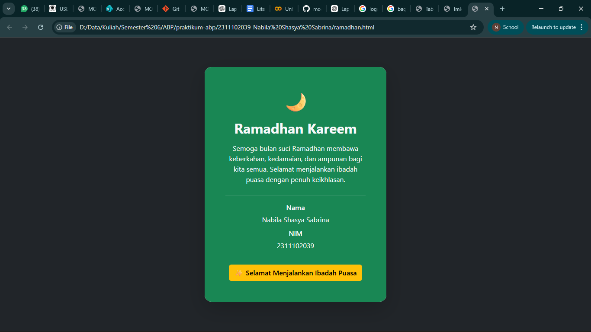

<div align="center">
  <br />
  <h1>LAPORAN PRAKTIKUM <br>APLIKASI BERBASIS PLATFORM</h1>
  <br />
  <h3>MODUL 4 <br> IMPLEMENTASI BOOTSTRAP</h3>
  <br />
  <br />
  
  <br />
  <br />
  <br />
  <br />

  <h3>Penyusun :</h3>
  <p>
    <strong>Nabila Shasya Sabrina</strong><br>
    <strong>2311102039</strong><br>
    <strong>S1 IF-11-01</strong>
  </p>

  <br />

  <h3>Dosen Pengampu :</h3>
  <p>
    <strong>Dimas Fanny Hebrasianto Permadi, S.ST., M.Kom</strong>
  </p>

  <br />
  <br />

  <h4>Asisten Praktikum :</h4>
  <strong>Apri Pandu Wicaksono</strong><br>
  <strong>Rangga Pradarrell Fathi</strong>

  <br />

  <h3>
    LABORATORIUM HIGH PERFORMANCE<br>
    FAKULTAS INFORMATIKA<br>
    UNIVERSITAS TELKOM PURWOKERTO<br>
    2026
  </h3>
</div>

---

## 1. Dasar Teori
Bootstrap merupakan salah satu framework front-end yang banyak digunakan dalam pengembangan antarmuka website. Framework ini bersifat open-source dan menyediakan berbagai komponen siap pakai yang dapat membantu pengembang membangun tampilan web secara lebih cepat dan efisien. Bootstrap memanfaatkan kombinasi teknologi HTML, CSS, dan JavaScript untuk menyediakan berbagai elemen antarmuka seperti tombol, kartu (card), navigasi, form, serta berbagai komponen visual lainnya.

Salah satu fitur penting yang dimiliki Bootstrap adalah sistem grid yang responsif. Sistem ini menggunakan struktur container, row, dan column untuk mengatur posisi elemen dalam halaman. Dengan pendekatan tersebut, tata letak halaman dapat menyesuaikan ukuran layar perangkat secara otomatis, baik ketika dibuka melalui komputer, tablet, maupun perangkat mobile.

Penggunaan Bootstrap memiliki beberapa keuntungan, di antaranya:

Mempercepat proses pengembangan
Banyak komponen antarmuka sudah tersedia sehingga pengembang tidak perlu menulis CSS dari awal.

Tampilan lebih konsisten
Bootstrap dirancang agar kompatibel dengan berbagai browser sehingga tampilan halaman menjadi lebih stabil.

Mendukung desain responsif
Framework ini menerapkan konsep mobile-first, sehingga halaman web tetap nyaman dilihat pada berbagai ukuran layar.

Bootstrap dapat digunakan dengan dua cara, yaitu dengan mengunduh file framework secara langsung untuk penggunaan offline atau dengan memanfaatkan CDN (Content Delivery Network) sehingga library dapat diakses secara online melalui internet.

---

## 2. Penjelasan Kode HTML

Berikut merupakan implementasi kartu ucapan Ramadhan berbasis _Native Bootstrap 5_ murni dengan penggunaan berbagai _utilities class_ tanpa menyertakan dokumen CSS tambahan apa pun, beserta hasil eksekusinya.

### Kode HTML (ramadhan.html)

```html
<!DOCTYPE html>
<html lang="id">
<head>
<meta charset="UTF-8">
<meta name="viewport" content="width=device-width, initial-scale=1">

<title>Kartu Ucapan Ramadhan</title>

<!-- Bootstrap CDN -->
<link href="https://cdn.jsdelivr.net/npm/bootstrap@5.3.3/dist/css/bootstrap.min.css" rel="stylesheet">

</head>

<body class="bg-dark">

<div class="container vh-100 d-flex justify-content-center align-items-center">

<div class="card text-center shadow-lg border-0 rounded-4" style="max-width: 420px;">

<div class="card-body bg-success text-light p-5 rounded-4">

<h1 class="display-5 mb-3">🌙</h1>

<h2 class="fw-bold mb-3">Ramadhan Kareem</h2>

<p class="mb-4">
Semoga bulan suci Ramadhan membawa keberkahan,
kedamaian, dan ampunan bagi kita semua.
Selamat menjalankan ibadah puasa dengan penuh keikhlasan.
</p>

<hr class="border-light">

<div class="mt-3">
<p class="mb-1 fw-semibold">Nama</p>
<p class="mb-2">Nabila Shasya Sabrina</p>

<p class="mb-1 fw-semibold">NIM</p>
<p class="mb-3">2311102039</p>
</div>

<a href="#" class="btn btn-warning fw-semibold mt-3">
✨ Selamat Menjalankan Ibadah Puasa
</a>

</div>

</div>

</div>

</body>
</html>
```

### Hasil Tampilan



### Penjelasan Code

Pada bagian head, terdapat beberapa tag penting yang digunakan untuk mengatur konfigurasi dasar halaman. Tag <meta charset="UTF-8"> berfungsi agar halaman dapat menampilkan berbagai karakter dengan benar. Sementara itu, tag <meta name="viewport"> digunakan agar tampilan halaman dapat menyesuaikan ukuran layar perangkat sehingga tetap responsif ketika dibuka melalui smartphone atau tablet.

Selanjutnya, Bootstrap dihubungkan ke dokumen HTML menggunakan CDN melalui tag <link>. Dengan memanfaatkan CDN, seluruh komponen Bootstrap dapat langsung digunakan tanpa perlu mengunduh file framework secara manual.

Pada elemen <body>, digunakan class bg-dark yang merupakan utility class dari Bootstrap untuk memberikan warna latar belakang gelap pada halaman. Warna ini dipilih agar kartu ucapan yang berada di tengah halaman terlihat lebih menonjol.

Elemen container digunakan sebagai pembungkus utama halaman. Di dalamnya terdapat beberapa utility class Bootstrap seperti d-flex, vh-100, justify-content-center, dan align-items-center. Kombinasi class tersebut memanfaatkan sistem Flexbox sehingga konten dapat ditempatkan tepat di tengah halaman, baik secara horizontal maupun vertikal.

Komponen utama yang digunakan pada halaman ini adalah card Bootstrap. Komponen card digunakan untuk menampilkan isi ucapan Ramadhan secara terstruktur. Beberapa class tambahan digunakan untuk memperindah tampilan kartu, seperti shadow-lg yang memberikan efek bayangan, rounded-4 untuk membuat sudut kartu lebih melengkung, serta border-0 untuk menghilangkan garis tepi default.

Pada bagian card-body, digunakan class bg-success untuk memberikan latar belakang berwarna hijau yang identik dengan nuansa Ramadhan. Selain itu, class text-light digunakan agar warna teks tetap kontras dan mudah dibaca di atas latar belakang tersebut. Properti p-5 memberikan ruang padding yang cukup sehingga isi kartu tidak terlihat terlalu rapat.

Elemen teks di dalam kartu juga memanfaatkan beberapa utility class Bootstrap. Class fw-bold digunakan untuk menampilkan judul dengan huruf yang lebih tebal, sedangkan class seperti mb-3 dan mb-4 berfungsi untuk mengatur jarak antar elemen menggunakan margin bawah.

Elemen <hr> digunakan sebagai garis pemisah antara teks ucapan Ramadhan dan informasi identitas pembuat halaman. Class border-light ditambahkan agar garis tersebut tetap terlihat jelas di atas latar belakang hijau.

Di bagian bawah kartu terdapat sebuah tombol yang dibuat menggunakan class btn btn-warning. Tombol ini berfungsi sebagai elemen dekoratif yang menampilkan pesan tambahan ucapan Ramadhan.

Secara keseluruhan, halaman ini dibuat dengan memanfaatkan berbagai utility class Bootstrap 5 tanpa menggunakan CSS tambahan. Hal ini menunjukkan bahwa Bootstrap mampu membantu membangun tampilan halaman web yang rapi dan responsif hanya dengan menggunakan class yang telah disediakan.