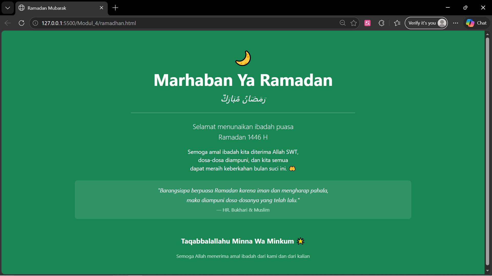

<div align="center">

# LAPORAN PRAKTIKUM  
# APLIKASI BERBASIS PLATFORM

## MODUL 4
## BOOTSTRAP


### Disusun Oleh
**Raihan Ramadhan**  
2311102040  
S1 IF-11-REG01  

### Dosen Pengampu
**Dimas Fanny Hebrasianto Permadi, S.ST., M.Kom**

### Asisten Praktikum
Apri Pandu Wicaksono  
Rangga Pradarrell Fathi  

### LABORATORIUM HIGH PERFORMANCE  
FAKULTAS INFORMATIKA  
UNIVERSITAS TELKOM PURWOKERTO  
2026

</div>

---

# 1. Dasar Teori

Bootstrap merupakan sebuah front-end framework gratis untuk pengembangan antar muka web yang lebih cepat dan lebih mudah. Dikembangkan oleh Mark Otto dan Jacom Thornton di Twitter dan dirilis sebagai produk open source pada Agustus 2011 di GitHub. Bootstrap mencakup template desain berbasis HTML dan
CSS untuk tipografi, form, button, navigasi, modal, image carousells dan masih banyak lagi, serta terdapat opsional plugin JavaScript. Selain itu, Bootstrap memiliki kemampuan untuk membuat desain responsif yang secara otomatis menyesuaikan diri agar terlihat baik di segala perangkat, mulai dari perangkat ponsel hingga desktop pc.
## UNGUIDED

**Code :**

```html
<!DOCTYPE html>
<html lang="id">
<head>
  <meta charset="UTF-8" />
  <meta name="viewport" content="width=device-width, initial-scale=1.0" />
  <title>Ramadan Mubarak</title>
  <link href="https://cdn.jsdelivr.net/npm/bootstrap@5.3.3/dist/css/bootstrap.min.css" rel="stylesheet" />
</head>
<body class="bg-success min-vh-100 d-flex align-items-center justify-content-center">

  <div class="container text-center text-white py-5">

    <p class="fs-1 mb-1">🌙</p>

    <h1 class="display-5 fw-bold">Marhaban Ya Ramadan</h1>
    <p class="fs-4 fst-italic mb-4">رَمَضَانُ مُبَارَكٌ</p>

    <hr class="border-white opacity-50 w-50 mx-auto" />

    <p class="lead mt-4">
      Selamat menunaikan ibadah puasa <br />
      Ramadan 1446 H
    </p>

    <p class="mt-3">
      Semoga amal ibadah kita diterima Allah SWT, <br />
      dosa-dosa diampuni, dan kita semua <br />
      dapat meraih keberkahan bulan suci ini. 🤲
    </p>

    <div class="mt-4 p-3 bg-white bg-opacity-10 rounded-3 w-75 mx-auto">
      <p class="fst-italic mb-1">"Barangsiapa berpuasa Ramadan karena iman dan mengharap pahala,</p>
      <p class="fst-italic mb-1">maka diampuni dosa-dosanya yang telah lalu."</p>
      <small class="opacity-75">— HR. Bukhari & Muslim</small>
    </div>

    <p class="mt-5 fw-bold fs-5">Taqabbalallahu Minna Wa Minkum 🌟</p>
    <small class="opacity-75">Semoga Allah menerima amal ibadah dari kami dan dari kalian</small>

  </div>

</body>
</html>
```

**Output :**

<p align="center">

</p>
## Penjelasan Kode Program Halaman Ramadan

Kode program tersebut merupakan halaman web sederhana bertema **Ramadan** yang dibuat menggunakan **HTML dan Bootstrap 5 tanpa CSS tambahan maupun JavaScript**.

Bagian `<!DOCTYPE html>` digunakan untuk mendefinisikan bahwa dokumen menggunakan standar **HTML5**, sedangkan `<html lang="id">` menunjukkan bahwa bahasa halaman adalah **Bahasa Indonesia**.

Pada bagian `<head>` terdapat beberapa meta tag seperti `charset="UTF-8"` untuk memastikan semua karakter dapat ditampilkan dengan benar, termasuk karakter Arab seperti **رَمَضَانُ**, serta `viewport` yang membuat halaman dapat menyesuaikan ukuran layar perangkat. Judul halaman ditentukan oleh `<title>Ramadan Mubarak</title>`. Selain itu terdapat tag `<link>` yang menghubungkan halaman dengan file CSS Bootstrap 5 melalui CDN sehingga semua class Bootstrap dapat langsung digunakan tanpa perlu mengunduh file secara manual.

Elemen `<body>` dikasih class Bootstrap `bg-success` untuk mengatur warna latar belakang menjadi hijau, `min-vh-100` agar tinggi halaman minimal satu layar penuh, serta `d-flex align-items-center justify-content-center` untuk mengaktifkan Flexbox sehingga seluruh konten di dalamnya otomatis rata tengah secara horizontal maupun vertikal.

Di dalam body terdapat `<div class="container">` sebagai pembungkus utama seluruh isi halaman. Class `text-center` membuat semua teks rata tengah dan `text-white` membuat warna teks menjadi putih. Di dalamnya terdapat judul utama menggunakan tag `<h1>` dengan class `display-5 fw-bold` agar tulisannya besar dan tebal, lalu teks Arab menggunakan class `fst-italic` agar tampil miring, serta `mb-4` untuk memberikan jarak bawah.

Tag `<hr>` digunakan sebagai garis pemisah antar bagian, dikasih class `border-white opacity-50 w-50 mx-auto` agar garisnya berwarna putih dengan transparansi 50%, lebarnya setengah halaman, dan posisinya di tengah. Setelah itu terdapat beberapa tag `<p>` untuk isi teks ucapan, salah satunya menggunakan class `lead` agar ukuran teks sedikit lebih besar dari paragraf biasa.

Bagian kotak hadis menggunakan sebuah `<div>` dengan class `bg-white bg-opacity-10` agar latar belakangnya putih namun transparan 10%, `rounded-3` agar sudut kotak sedikit melengkung, `p-3` untuk padding di dalam kotak, serta `w-75 mx-auto` agar lebarnya 75% dari container dan posisinya berada di tengah. Di dalamnya terdapat teks hadis menggunakan class `fst-italic` dan keterangan sumber menggunakan tag `<small>` dengan class `opacity-75` agar terlihat lebih redup.

Secara keseluruhan, program ini membuat halaman ucapan Ramadan yang sederhana namun terstruktur dengan memanfaatkan struktur HTML untuk konten dan seluruh tampilan visual diatur sepenuhnya menggunakan class-class bawaan Bootstrap 5 tanpa menulis CSS maupun JavaScript tambahan sama sekali.

## Refrensi
- [Materi Modul  BOOTSTRAP](https://drive.google.com/file/d/1TW5Y0AdzkVk24ThPUf1OQNs2Mnw3XNO5/view?usp=drive_link)