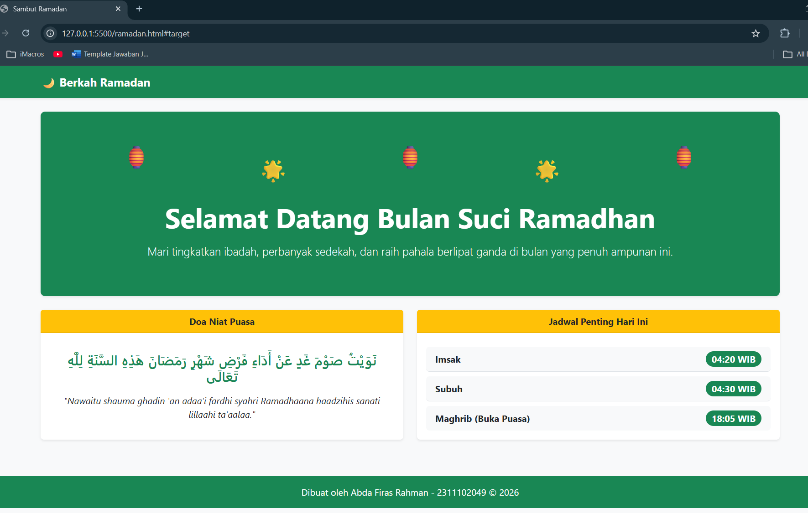

<div align="center">
  <br />

  <h1>LAPORAN PRAKTIKUM <br>
  APLIKASI BERBASIS PLATFORM
  </h1>

  <br />

  <h3>MODUL 4  <br>
  BOOTSTRAP
  </h3>

  <br />

  <p align="center">

</p>

  <br />
  <br />
  <br />

  <h3>Disusun Oleh :</h3>

  <p>
    <strong>Abda Firas Rahman</strong><br>
    <strong>2311102049</strong><br>
    <strong>S1 IF-11-REG01</strong>
  </p>

  <br />

  <h3>Dosen Pengampu :</h3>

  <p>
    <strong>Dimas Fanny Hebrasianto Permadi, S.ST., M.Kom</strong>
  </p>
  
  <br />
  <br />
    <h4>Asisten Praktikum :</h4>
    <strong>Apri Pandu Wicaksono </strong> <br>
    <strong>Rangga Pradarrell Fathi</strong>
  <br />

  <h3>LABORATORIUM HIGH PERFORMANCE
 <br>FAKULTAS INFORMATIKA <br>UNIVERSITAS TELKOM PURWOKERTO <br>2026</h3>
</div>

<hr>

### Dasar Teori

Bootstrap adalah framework CSS sumber terbuka yang banyak digunakan dalam pengembangan antarmuka web modern yang bersifat responsif dan berorientasi pada pendekatan mobile-first. Framework ini menggunakan sistem grid fleksibel berbasis 12 kolom yang memungkinkan pengembang menyusun tata letak elemen secara terstruktur sehingga tampilan halaman dapat menyesuaikan dengan berbagai ukuran layar mulai dari perangkat seluler hingga layar desktop.

Salah satu keunggulan utama Bootstrap adalah kemampuannya meningkatkan efisiensi dalam proses pengembangan. Hal ini karena Bootstrap menyediakan berbagai komponen antarmuka siap pakai seperti navbar, card, dan button yang telah dirancang dengan standar estetika serta memperhatikan aspek aksesibilitas. Selain itu Bootstrap juga dilengkapi dengan berbagai utility classes yang memudahkan pengaturan detail tampilan seperti jarak (spacing), tipografi, serta warna tanpa perlu membuat kode CSS tambahan dari awal. Dari sisi teknis Bootstrap memanfaatkan teknologi Flexbox untuk mengatur tata letak secara lebih fleksibel dan kuat sehingga tampilan desain tetap konsisten dan stabil meskipun diterapkan pada proyek web yang lebih kompleks.

## Kode program 
Berikut adalah kode program UNGUIDED:

```html
<!DOCTYPE html>
<html lang="id">
<head>
    <meta charset="UTF-8">
    <meta name="viewport" content="width=device-width, initial-scale=1.0">
    <title>Sambut Ramadan</title>
    <link href="https://cdn.jsdelivr.net/npm/bootstrap@5.3.0/dist/css/bootstrap.min.css" rel="stylesheet">
</head>
<body class="bg-light">

    <nav class="navbar navbar-expand-lg navbar-dark bg-success shadow-sm">
        <div class="container">
            <a class="navbar-brand fw-bold" href="#">🌙 Berkah Ramadan</a>
        </div>
    </nav>

            <!-----     Nama   : Abda Firas Rahman
                        Nim    : 2311102049
                        Kelas  : IF-11-REG01
            ----->
            
    <div class="container mt-4">
        <div class="p-5 text-center bg-success text-white rounded-3 shadow-sm position-relative overflow-hidden">
            
            <div class="d-flex justify-content-around fs-1 mb-4">
                <span>🏮</span>
                <span class="mt-4">🌟</span> <span>🏮</span>
                <span class="mt-4">🌟</span>
                <span>🏮</span>
            </div>

            <h1 class="display-5 fw-bold">Selamat Datang Bulan Suci Ramadhan</h1>
            <p class="lead mt-3">Mari tingkatkan ibadah, perbanyak sedekah, dan raih pahala berlipat ganda di bulan yang penuh ampunan ini.</p>
        </div>
    </div>

    <div class="container mt-4">
        <div class="row">
            
            <div class="col-md-6 mb-3">
                <div class="card border-0 shadow-sm h-100">
                    <div class="card-header bg-warning text-dark fw-bold text-center">
                        Doa Niat Puasa
                    </div>
                    <div class="card-body text-center d-flex flex-column justify-content-center">
                        <h4 class="card-title text-success mb-3">نَوَيْتُ صَوْمَ غَدٍ عَنْ أَدَاءِ فَرْضِ شَهْرِ رَمَضَانَ هَذِهِ السَّنَةِ لِلَّهِ تَعَالَى</h4>
                        <p class="card-text fst-italic">"Nawaitu shauma ghadin 'an adaa'i fardhi syahri Ramadhaana haadzihis sanati lillaahi ta'aalaa."</p>
                    </div>
                </div>
            </div>

            <div class="col-md-6 mb-3">
                <div class="card border-0 shadow-sm h-100">
                    <div class="card-header bg-warning text-dark fw-bold text-center">
                        Jadwal Penting Hari Ini
                    </div>
                    <div class="card-body">
                        <ul class="list-group list-group-flush mt-2">
                            <li class="list-group-item d-flex justify-content-between align-items-center bg-light rounded mb-2">
                                <strong>Imsak</strong>
                                <span class="badge bg-success rounded-pill fs-6">04:15 WIB</span>
                            </li>
                            <li class="list-group-item d-flex justify-content-between align-items-center bg-light rounded mb-2">
                                <strong>Subuh</strong>
                                <span class="badge bg-success rounded-pill fs-6">04:25 WIB</span>
                            </li>
                            <li class="list-group-item d-flex justify-content-between align-items-center bg-light rounded">
                                <strong>Maghrib (Buka Puasa)</strong>
                                <span class="badge bg-success rounded-pill fs-6">17:55 WIB</span>
                            </li>
                        </ul>
                    </div>
                </div>
            </div>

        </div>
    </div>

    <footer class="text-center mt-5 p-3 bg-success text-white">
        <p class="mb-0">Dibuat oleh Abda Firas Rahman - 2311102049 &copy; 2026</p>
    </footer>

    <script src="https://cdn.jsdelivr.net/npm/bootstrap@5.3.0/dist/js/bootstrap.bundle.min.js"></script>
</body>
</html>
```

### Penjelasan Dari Kode Program:

Projek ini adalah halaman *landing page* bertema Ramadan yang dirancang sangat sederhana dan cocok untuk pemula. Keseluruhan tampilan halaman ini dibuat murni menggunakan kerangka kerja **Bootstrap 5** yang dipanggil melalui CDN sehingga sama sekali tidak memerlukan tambahan *file* CSS terpisah untuk mengatur gayanya. 

Pada bagian paling atas itu ada navigasi dasar yang menggunakan komponen `navbar`. Navigasi inilah diberi kelas `bg-success` untuk menghasilkan warna latar hijau khas Islami serta `shadow-sm` untuk memberikan efek bayangan halus agar posisinya sedikit lebih menonjol. Tepat di bawahnya, terdapat area *banner* utama yang memanfaatkan kelas `p-5` dan `rounded-3` untuk menciptakan kotak dengan ruang dalam yang lega serta sudut yang melengkung lembut. Hiasan lampion pada *banner* ini murni menggunakan trik susunan emoji. Emoji tersebut dibungkus dalam wadah `d-flex justify-content-around` agar jarak antar ikon tersebar merata dari kiri ke kanan. Tambahan margin atas `mt-4` pada ikon bintang sukses menciptakan ilusi visual seolah-olah lampion tersebut menggantung dengan panjang yang bervariasi.

Memasuki area konten utama halaman ini memanfaatkan sistem *grid* bawaan Bootstrap, yaitu `row` dan `col-md-6`. Sistem ini sangat berguna karena membagi konten menjadi dua kolom yang bersisian rapi di layar laptop, namun akan otomatis bertumpuk ke bawah dengan responsif ketika diakses melalui layar HP. Setiap bagian konten di dalam kolom tersebut dibungkus menggunakan komponen `card` yang telah diperhalus. Garis kaku bawaan dihilangkan dengan `border-0` diganti dengan bayangan lembut dari `shadow-sm` dan dipastikan memiliki tinggi yang sejajar menggunakan `h-100`. 

Khusus untuk kartu bagian kiri yang memuat doa niat puasa teks Arab beserta artinya berhasil diposisikan persis di tengah-tengah kotak secara vertikal dan horizontal berkat kombinasi tata letak `d-flex flex-column justify-content-center`. Sementara itu, kartu di sebelah kanan menampilkan jadwal waktu penting menggunakan susunan `list-group`. Agar nama waktu dan jamnya terpisah rapi di sisi kiri dan kanan secara sejajar digunakanlah deretan kelas utilitas `d-flex justify-content-between align-items-center`. Jamnya semakin terlihat modern dan berbentuk kapsul kecil karena diberi kelas `badge`, `bg-success`, dan `rounded-pill`.

### Tampilan Hasil Kode Program:


