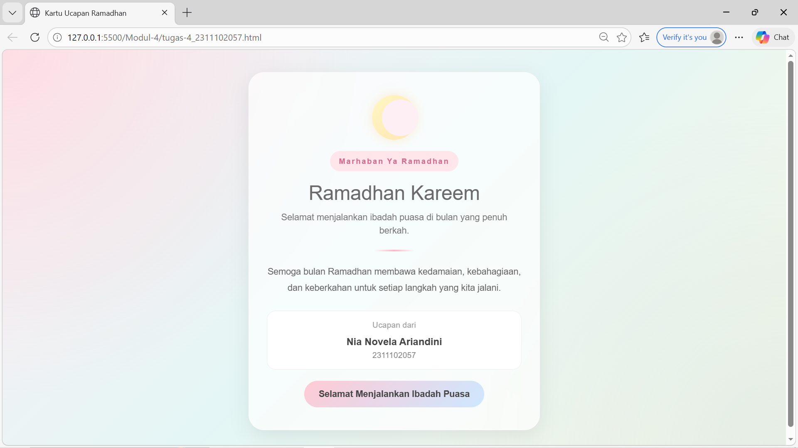

<div align="center">
  <br />
  <h1>LAPORAN PRAKTIKUM <br>APLIKASI BERBASIS PLATFORM</h1>
  <br />
  <h3>MODUL 4 <br> BOOTSTRAP</h3>
  <br />
   
  <br />
  <br />
  <br />
  <h3>Disusun Oleh :</h3>
  <p>
    <strong>Nia Novela Ariandini</strong><br>
    <strong>2311102057</strong><br>
    <strong>S1 IF-11-01</strong>
  </p>
  <br />
  <h3>Dosen Pengampu :</h3>
  <p>
    <strong>Dimas Fanny Hebrasianto Permadi, S.ST., M.Kom</strong>
  </p>
  <br />
  <br />
    <h4>Asisten Praktikum :</h4>
    <strong> Apri Pandu Wicaksono </strong> <br>
    <strong>Rangga Pradarrell Fathi</strong>
  <br />
  <br />
  <br />
  <br />
  <h3>LABORATORIUM HIGH PERFORMANCE
 <br>FAKULTAS INFORMATIKA <br>UNIVERSITAS TELKOM PURWOKERTO <br>2026</h3>
</div>

---

## 1. Dasar Teori

**Bootstrap** merupakan salah satu *framework front-end* yang sering digunakan untuk membantu proses pembuatan tampilan website agar lebih cepat dan praktis. Framework ini menyediakan berbagai komponen siap pakai yang dibangun menggunakan **HTML, CSS, dan JavaScript**, seperti tombol, kartu (*card*), navigasi, formulir, tipografi, dan berbagai elemen antarmuka lainnya.

Salah satu fitur utama Bootstrap adalah adanya **sistem grid responsif**. Sistem ini memanfaatkan struktur **container**, **row**, dan **column** untuk mengatur tata letak halaman. Dengan sistem tersebut, tampilan website dapat menyesuaikan secara otomatis dengan berbagai ukuran layar, mulai dari laptop, tablet, hingga smartphone.

Beberapa kelebihan dari Bootstrap antara lain:

1. **Mempermudah Proses Pengembangan**  
   Bootstrap menyediakan banyak class siap pakai sehingga developer tidak perlu menulis seluruh kode tampilan dari awal.

2. **Tampilan Lebih Konsisten**  
   Komponen Bootstrap membantu menjaga tampilan website agar tetap seragam di berbagai browser.

3. **Responsif Secara Otomatis**  
   Bootstrap dirancang dengan konsep *mobile-first*, sehingga tampilan web sudah menyesuaikan dengan perangkat mobile sejak awal.

Bootstrap dapat digunakan dengan dua cara, yaitu dengan mengunduh file Bootstrap secara langsung atau dengan menggunakan **CDN (Content Delivery Network)**. Pada praktikum ini Bootstrap dipanggil melalui CDN karena lebih praktis dan tidak perlu mengunduh file tambahan.

---

## 2. Penjelasan Kode HTML

### Kode HTML (`ramadhan.html`)

```html
<!DOCTYPE html>
<html lang="id">

<head>
    <meta charset="UTF-8">
    <meta name="viewport" content="width=device-width, initial-scale=1">

    <title>Kartu Ucapan Ramadhan</title>

    <link href="https://cdn.jsdelivr.net/npm/bootstrap@5.3.3/dist/css/bootstrap.min.css" rel="stylesheet">

    <style>
        * {
            margin: 0;
            padding: 0;
            box-sizing: border-box;
            font-family: Arial, Helvetica, sans-serif;
        }

        body {
            min-height: 100vh;
            background:
                radial-gradient(circle at top left, rgba(255, 182, 193, .3), transparent 40%),
                radial-gradient(circle at bottom right, rgba(173, 216, 230, .3), transparent 40%),
                linear-gradient(135deg, #fdeff4, #e3f6f5, #fef6e4);
            display: flex;
            align-items: center;
            justify-content: center;
            padding: 40px 15px;
            color: #5a5a5a;
        }

        .card-wrapper {
            width: 100%;
            max-width: 520px;
        }

        .ramadhan-card {
            background: rgba(255, 255, 255, .7);
            border-radius: 28px;
            padding: 40px 32px;
            text-align: center;
            backdrop-filter: blur(10px);
            box-shadow: 0 10px 35px rgba(0, 0, 0, .08);
            border: 1px solid rgba(255, 255, 255, .6);
        }

        .moon {
            width: 80px;
            height: 80px;
            margin: 0 auto 20px;
            border-radius: 50%;
            background: linear-gradient(135deg, #fff7c2, #ffe5b4);
            position: relative;
            box-shadow: 0 0 20px rgba(255, 210, 150, .4);
        }

        .moon:after {
            content: "";
            position: absolute;
            width: 65px;
            height: 65px;
            border-radius: 50%;
            background: #fdeff4;
            top: 8px;
            left: 18px;
        }

        .tag {
            display: inline-block;
            padding: 8px 16px;
            border-radius: 999px;
            background: #ffe6eb;
            color: #d36b8c;
            font-weight: 700;
            font-size: .85rem;
            letter-spacing: 2px;
            margin-bottom: 18px;
        }

        h1 {
            font-size: 2.2rem;
            margin-bottom: 10px;
            color: #6a6a6a;
        }

        .subtitle {
            font-size: 1rem;
            margin-bottom: 22px;
            color: #777;
        }

        .divider {
            width: 70px;
            height: 3px;
            margin: 0 auto 22px;
            border-radius: 999px;
            background: linear-gradient(90deg, transparent, #ffb6c1, transparent);
        }

        .message {
            font-size: 1rem;
            line-height: 1.8;
            margin-bottom: 26px;
            color: #666;
        }

        .signature-box {
            background: #fff;
            border-radius: 16px;
            padding: 14px;
            margin-bottom: 20px;
            border: 1px solid #f0f0f0;
        }

        .signature-title {
            font-size: .9rem;
            color: #999;
            margin-bottom: 6px;
        }

        .signature-name {
            font-weight: bold;
            font-size: 1.1rem;
            color: #444;
        }

        .signature-sub {
            font-size: .9rem;
            color: #888;
        }

        .btn-card {
            display: inline-block;
            padding: 12px 26px;
            border-radius: 999px;
            background: linear-gradient(135deg, #ffcad4, #cde7ff);
            color: #444;
            text-decoration: none;
            font-weight: bold;
            transition: .25s;
        }

        .btn-card:hover {
            transform: translateY(-2px);
            background: linear-gradient(135deg, #ffd6e0, #d8ecff);
        }
    </style>
</head>

<body>

    <div class="card-wrapper">

        <div class="ramadhan-card">

            <div class="moon"></div>

            <div class="tag">Marhaban Ya Ramadhan</div>

            <h1>Ramadhan Kareem</h1>

            <p class="subtitle">
                Selamat menjalankan ibadah puasa di bulan yang penuh berkah.
            </p>

            <div class="divider"></div>

            <p class="message">
                Semoga bulan Ramadhan membawa kedamaian,
                kebahagiaan, dan keberkahan untuk setiap
                langkah yang kita jalani.
            </p>

            <div class="signature-box">

                <div class="signature-title">Ucapan dari</div>

                <div class="signature-name">
                    Nia Novela Ariandini
                </div>

                <div class="signature-sub">
                    2311102057
                </div>

            </div>

            <a href="#" class="btn-card">
                Selamat Menjalankan Ibadah Puasa
            </a>

        </div>

    </div>

</body>

</html>
```

### Hasil Tampilan (Screenshot)



## Penjelasan Code

### 1. Struktur Dasar HTML

Pada bagian awal terdapat deklarasi `<!DOCTYPE html>` yang 
menunjukkan bahwa dokumen menggunakan standar **HTML5**.

Tag `<html lang="id">` menandakan bahwa bahasa utama yang 
digunakan pada halaman tersebut adalah **Bahasa Indonesia**.

Di dalam bagian `<head>` terdapat beberapa elemen penting, yaitu:

- `<meta charset="UTF-8">` digunakan agar karakter teks dapat 
  ditampilkan dengan benar.

- `<meta name="viewport" content="width=device-width, initial-scale=1">` 
  digunakan supaya tampilan website dapat menyesuaikan ukuran layar 
  perangkat seperti laptop maupun smartphone.

- `<title>` digunakan untuk memberikan judul halaman yang akan 
  tampil pada tab browser.

Selain itu terdapat juga pemanggilan **Bootstrap melalui CDN** 
menggunakan tag `<link>`. Dengan cara ini kita dapat menggunakan 
fitur Bootstrap tanpa harus mengunduh file framework secara langsung.

---

### 2. Struktur Konten Halaman

Pada bagian `<body>`, seluruh isi halaman ditempatkan di dalam 
`<div class="card-wrapper">` yang berfungsi sebagai pembungkus 
utama kartu ucapan.

Di dalamnya terdapat `<div class="ramadhan-card">` yang berfungsi 
sebagai komponen utama kartu ucapan Ramadhan.

Elemen `<div class="moon">` digunakan sebagai dekorasi berbentuk 
bulan sabit yang dibuat menggunakan CSS.

Tag `<div class="tag">` digunakan untuk menampilkan teks kecil 
sebagai label bertuliskan **Marhaban Ya Ramadhan**.

Kemudian tag `<h1>` digunakan sebagai judul utama ucapan Ramadhan, 
sedangkan `<p class="subtitle">` digunakan untuk menampilkan 
kalimat pembuka mengenai bulan suci Ramadhan.

Elemen `<div class="divider">` berfungsi sebagai garis pemisah 
visual antara judul dan isi pesan.

Tag `<p class="message">` digunakan untuk menampilkan pesan atau 
doa Ramadhan.

Selanjutnya terdapat `<div class="signature-box">` yang berisi 
identitas pengirim ucapan, yaitu:

- **Nia Novela Ariandini**  
- **2311102057**

Terakhir terdapat elemen `<a class="btn-card">` yang berfungsi 
sebagai tombol ucapan Ramadhan dengan tampilan yang lebih menarik.

---

### 3. Styling CSS

Pada selector universal `*`, properti `margin: 0`, `padding: 0`, 
dan `box-sizing: border-box` digunakan untuk mereset tampilan 
default browser agar semua elemen memiliki pengaturan jarak 
yang konsisten.

Pada bagian `body`, digunakan **background gradasi warna pastel** 
dengan kombinasi warna pink lembut, biru muda, dan krem agar 
tampilan terlihat lebih soft dan modern.

Class `.ramadhan-card` digunakan untuk membuat tampilan kartu 
ucapan dengan latar semi transparan, sudut melengkung, serta 
bayangan halus sehingga terlihat seperti kartu digital.

Class `.moon` digunakan untuk membuat dekorasi bulan sabit 
dengan memanfaatkan `border-radius` dan pseudo-element CSS.

Class `.tag`, `.subtitle`, `.message`, dan `.signature-box` 
digunakan untuk mengatur tampilan teks agar terlihat lebih rapi 
dan mudah dibaca.

Class `.btn-card` digunakan untuk membuat tombol dengan warna 
pastel dan efek **hover**. Saat kursor diarahkan ke tombol, 
tombol akan sedikit terangkat sehingga memberikan efek 
interaktif.

Dengan kombinasi HTML dan CSS tersebut, halaman kartu ucapan 
Ramadhan dapat ditampilkan dengan tampilan yang sederhana, 
rapi, dan tetap menarik secara visual.

## Refrensi

- [Materi Modul 4](https://drive.google.com/file/d/1TW5Y0AdzkVk24ThPUf1OQNs2Mnw3XNO5/view?usp=sharing)