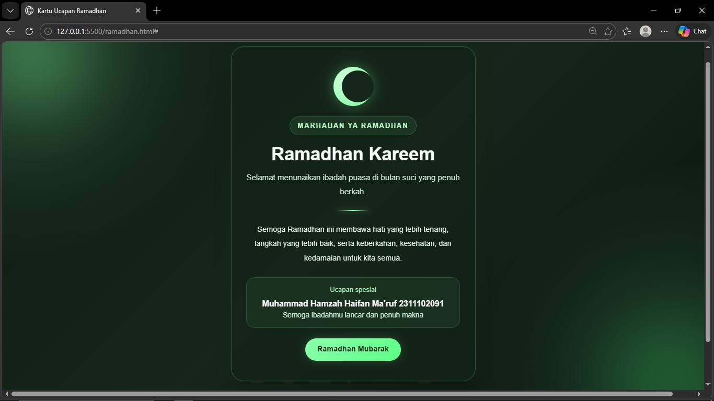

<div align="center">
  <br />
  <h1>LAPORAN PRAKTIKUM <br>APLIKASI BERBASIS PLATFORM</h1>
  <br />
  <h3>MODUL 4 <br> BOOTSTRAP</h3>
  <br />
  <br />
   
  <br />
  <br />
  <br />
  <br />
  <h3>Disusun Oleh :</h3>
  <p>
    <strong>Muhammad Hamzah Haifan Ma'ruf</strong><br>
    <strong>2311102091</strong><br>
    <strong>S1 IF-11-01</strong>
  </p>
  <br />
  <h3>Dosen Pengampu :</h3>
  <p>
    <strong>Dimas Fanny Hebrasianto Permadi, S.ST., M.Kom</strong>
  </p>
  <br />
  <br />
    <h4>Asisten Praktikum :</h4>
    <strong> Apri Pandu Wicaksono </strong> <br>
    <strong>Rangga Pradarrell Fathi</strong>
  <br />
  <h3>LABORATORIUM HIGH PERFORMANCE
 <br>FAKULTAS INFORMATIKA <br>UNIVERSITAS TELKOM PURWOKERTO <br>2026</h3>
</div>

---

## 1. Dasar Teori

**Bootstrap** adalah *framework front-end* yang digunakan untuk membantu proses pembuatan tampilan website agar lebih cepat dan praktis. Framework ini menyediakan berbagai komponen siap pakai berbasis **HTML, CSS, dan JavaScript** yang dapat digunakan untuk membangun antarmuka web seperti tombol, kartu, navigasi, formulir, tipografi, dan elemen visual lainnya.

Salah satu kelebihan utama Bootstrap adalah adanya **sistem grid responsif**. Sistem ini menggunakan susunan **container**, **row**, dan **column** untuk mengatur tata letak halaman. Dengan pendekatan tersebut, tampilan website dapat menyesuaikan diri secara otomatis pada berbagai ukuran layar, baik laptop, tablet, maupun smartphone.

Beberapa kelebihan Bootstrap antara lain:

1. **Mempercepat Pengembangan**  
   Pengguna tidak perlu menulis seluruh kode tampilan dari awal karena Bootstrap sudah menyediakan banyak class siap pakai.

2. **Tampilan Lebih Konsisten**  
   Komponen Bootstrap membantu menjaga tampilan antarmuka agar tetap seragam pada berbagai browser.

3. **Responsif Secara Otomatis**  
   Banyak komponen Bootstrap dibuat dengan pendekatan *mobile-first*, sehingga tampilan web sudah menyesuaikan berbagai perangkat sejak awal.

Bootstrap dapat digunakan dengan dua cara, yaitu dengan mengunduh file Bootstrap secara langsung atau dengan memanggilnya melalui **CDN (Content Delivery Network)**. Pada praktikum ini, Bootstrap digunakan melalui CDN agar lebih mudah diterapkan.

---

## 2. Penjelasan Kode HTML
### Kode HTML (`ramadhan.html`)

```html
<!DOCTYPE html>
<html lang="id">
<head>
<meta charset="UTF-8">
<meta name="viewport" content="width=device-width, initial-scale=1">
<title>Kartu Ucapan Ramadhan</title>

<link
href="https://cdn.jsdelivr.net/npm/bootstrap@5.3.3/dist/css/bootstrap.min.css"
rel="stylesheet">

<style>

*{
margin:0;
padding:0;
box-sizing:border-box;
font-family:Arial,sans-serif;
}

body{
min-height:100vh;
background:
radial-gradient(circle at top left, rgba(145,255,176,.16), transparent 30%),
radial-gradient(circle at bottom right, rgba(120,255,160,.14), transparent 30%),
linear-gradient(135deg,#0d1b12,#15261a,#0b140f);
display:flex;
justify-content:center;
align-items:center;
color:#f5fff7;
position:relative;
padding:40px 15px;
}

.glow{
position:absolute;
border-radius:50%;
filter:blur(80px);
z-index:0;
opacity:.45;
}

.glow-1{
width:220px;
height:220px;
background:#7dff9b;
top:-50px;
left:-40px;
}

.glow-2{
width:260px;
height:260px;
background:#3cff78;
bottom:-80px;
right:-50px;
opacity:.25;
}

.card-wrap{
position:relative;
z-index:2;
width:100%;
max-width:520px;
}

.ramadhan-card{
background:rgba(20,35,24,.72);
border:1px solid rgba(138,255,169,.22);
border-radius:28px;
padding:42px 32px;
text-align:center;
backdrop-filter:blur(14px);
box-shadow:
0 0 0 1px rgba(130,255,161,.05),
0 10px 40px rgba(0,0,0,.35),
0 0 30px rgba(83,255,129,.08);
}

.moon{
width:84px;
height:84px;
margin:0 auto 22px;
border-radius:50%;
background:radial-gradient(circle at 35% 35%,#d9ffe3,#9effb6 60%,#78ff98);
box-shadow:0 0 30px rgba(126,255,156,.35);
position:relative;
}

.moon:after{
content:"";
position:absolute;
width:68px;
height:68px;
border-radius:50%;
background:#15261a;
top:8px;
left:18px;
}

.tag{
display:inline-block;
padding:8px 16px;
margin-bottom:18px;
border-radius:999px;
background:rgba(129,255,159,.08);
border:1px solid rgba(129,255,159,.18);
color:#baffca;
font-size:.9rem;
letter-spacing:2px;
text-transform:uppercase;
font-weight:700;
}

h1{
font-size:2.4rem;
font-weight:700;
color:#f7fff8;
margin-bottom:10px;
}

.subtitle{
font-size:1.05rem;
color:#cfeeda;
line-height:1.8;
margin-bottom:24px;
}

.divider{
width:70px;
height:3px;
margin:0 auto 24px;
border-radius:999px;
background:linear-gradient(90deg,transparent,#8cffab,transparent);
box-shadow:0 0 12px rgba(140,255,171,.45);
}

.message{
font-size:1rem;
line-height:1.9;
color:#e7ffee;
margin-bottom:26px;
}

.signature-box{
padding:14px 18px;
border-radius:18px;
background:rgba(129,255,159,.06);
border:1px solid rgba(129,255,159,.14);
margin-bottom:22px;
}

.signature-title{
font-size:.9rem;
color:#a9efbb;
margin-bottom:6px;
}

.signature-name{
font-size:1.1rem;
font-weight:700;
color:#fff;
}

.signature-sub{
font-size:.95rem;
color:#d8f7e1;
}

.btn-card{
display:inline-block;
padding:12px 26px;
border-radius:999px;
background:linear-gradient(135deg,#8cffab,#5cff87);
color:#0f1d13;
text-decoration:none;
font-weight:700;
box-shadow:0 0 18px rgba(92,255,135,.22);
transition:.25s;
}

.btn-card:hover{
transform:translateY(-2px);
background:linear-gradient(135deg,#b6ffc7,#79ff9b);
}

</style>
</head>

<body>

<div class="glow glow-1"></div>
<div class="glow glow-2"></div>

<div class="card-wrap">

<div class="ramadhan-card">

<div class="moon"></div>

<div class="tag">Marhaban Ya Ramadhan</div>

<h1>Ramadhan Kareem</h1>

<p class="subtitle">
Selamat menunaikan ibadah puasa di bulan suci yang penuh berkah.
</p>

<div class="divider"></div>

<p class="message">
Semoga Ramadhan ini membawa hati yang lebih tenang,
langkah yang lebih baik,
serta keberkahan, kesehatan,
dan kedamaian untuk kita semua.
</p>

<div class="signature-box">
<div class="signature-title">Ucapan spesial</div>
<div class="signature-name">Muhammad Hamzah Haifan Ma'ruf 2311102091</div>
<div class="signature-sub">Semoga ibadahmu lancar dan penuh makna</div>
</div>

<a href="#" class="btn-card">Ramadhan Mubarak</a>

</div>

</div>

</body>
</html>
```

### Hasil Tampilan (Screenshot)




### Penjelasan Code

#### 1. Struktur Dasar HTML

- `<!DOCTYPE html>` digunakan untuk mendeklarasikan bahwa dokumen menggunakan standar **HTML5**.
- `<html lang="id">` menunjukkan bahwa bahasa utama halaman adalah **Bahasa Indonesia**.
- Pada bagian `<head>` terdapat beberapa elemen penting:
  - `<meta charset="UTF-8">` digunakan agar semua karakter teks dapat ditampilkan dengan benar.
  - `<meta name="viewport" content="width=device-width, initial-scale=1">` berfungsi agar tampilan website dapat menyesuaikan ukuran layar perangkat seperti laptop maupun smartphone.
  - `<title>` digunakan untuk memberi judul halaman pada tab browser.

---

#### 2. Penggunaan Bootstrap

Pada kode ini digunakan **Bootstrap 5** untuk membantu pengaturan tata letak halaman.

```html
<link
href="https://cdn.jsdelivr.net/npm/bootstrap@5.3.3/dist/css/bootstrap.min.css"
rel="stylesheet">
```
## Refrensi

- [Materi Modul 4](https://drive.google.com/file/d/1TW5Y0AdzkVk24ThPUf1OQNs2Mnw3XNO5/view?usp=sharing)