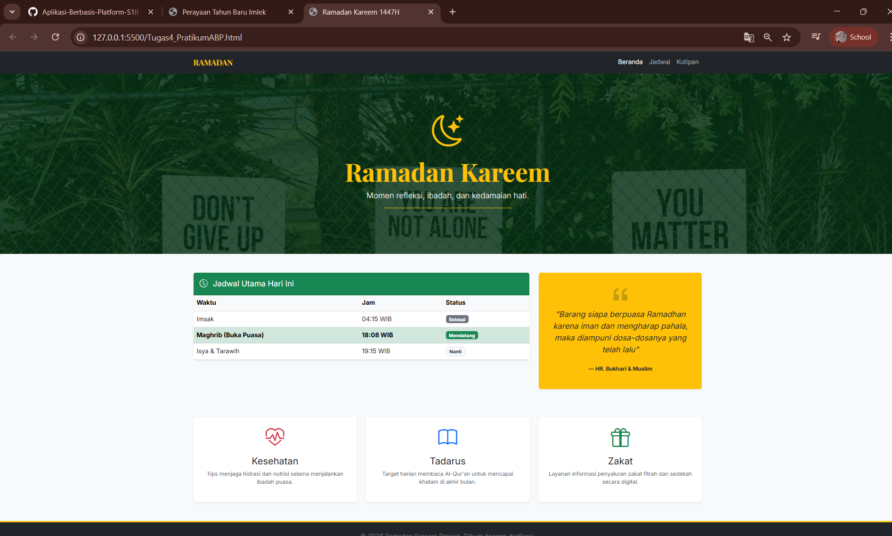

<div align="center">
  <br />

  <h1>LAPORAN PRAKTIKUM <br>
  APLIKASI BERBASIS PLATFORM
  </h1>

  <br />

  <h3>MODUL 4  <br>
  BOOTSTRAP
  </h3>

  <br />

  <p align="center">

</p>

  <br />
  <br />
  <br />

  <h3>Disusun Oleh :</h3>

  <p>
    <strong>Aisyah Anis Mazaya</strong><br>
    <strong>2311102095</strong><br>
    <strong>S1 IF-11-REG01</strong>
  </p>

  <br />

  <h3>Dosen Pengampu :</h3>

  <p>
    <strong>Dimas Fanny Hebrasianto Permadi, S.ST., M.Kom</strong>
  </p>
  
  <br />
  <br />
    <h4>Asisten Praktikum :</h4>
    <strong>Apri Pandu Wicaksono </strong> <br>
    <strong>Rangga Pradarrell Fathi</strong>
  <br />

  <h3>LABORATORIUM HIGH PERFORMANCE
 <br>FAKULTAS INFORMATIKA <br>UNIVERSITAS TELKOM PURWOKERTO <br>2026</h3>
</div>

<hr>

## Dasar Teori

Bootstrap merupakan kerangka kerja (*framework*) CSS sumber terbuka yang menjadi standar dalam pengembangan antarmuka web modern yang responsif dan *mobile-first*. Mengandalkan arsitektur sistem *grid* berbasis 12 kolom yang fleksibel, Bootstrap memungkinkan pengembang untuk mengatur tata letak elemen secara presisi agar adaptif terhadap berbagai resolusi perangkat, mulai dari layar seluler hingga monitor desktop. 

Efisiensi kerja menjadi keunggulan utama dari kerangka kerja ini berkat ketersediaan komponen UI siap pakai seperti *navbar*, *cards*, dan *buttons* yang telah teruji secara estetika dan aksesibilitas. Selain itu, keberadaan *utility classes* yang melimpah memudahkan pengaturan detail desain seperti jarak (*spacing*), tipografi, dan skema warna tanpa harus menulis kode CSS tambahan dari nol. Secara teknis, Bootstrap memanfaatkan modul Flexbox untuk memberikan kontrol tata letak yang kuat, sehingga memastikan integritas desain tetap terjaga dan konsisten meskipun diimplementasikan dalam proyek web yang kompleks.

## Kode program 
Berikut adalah kode nya:

```html
<!DOCTYPE html>
<html lang="id">
<head>
    <meta charset="UTF-8">
    <meta name="viewport" content="width=device-width, initial-scale=1.0">
    <title>Ramadan Kareem 1447H</title>
    <link href="https://cdn.jsdelivr.net/npm/bootstrap@5.3.0/dist/css/bootstrap.min.css" rel="stylesheet">
    <link rel="stylesheet" href="https://cdn.jsdelivr.net/npm/bootstrap-icons@1.11.0/font/bootstrap-icons.css">
    <link href="https://fonts.googleapis.com/css2?family=Inter:wght@300;400;700&family=Playfair+Display:wght@700&display=swap" rel="stylesheet">
    
    <!-- 2311102095 - Aisyah Anis Mazaya - Modul_4 -->

    <style>
        body {
            font-family: 'Inter', sans-serif;
            background-color: #f8f9fa;
        }
        .display-font {
            font-family: 'Playfair Display', serif;
        }
        .hero-section {
            background: linear-gradient(rgba(0, 45, 15, 0.8), rgba(0, 45, 15, 0.8)), 
                        url('https://images.unsplash.com/photo-1564121211835-e88c852648ab?ixlib=rb-1.2.1&auto=format&fit=crop&w=1350&q=80');
            background-size: cover;
            background-position: center;
            color: #ffc107;
            padding: 100px 0;
        }
    </style>
</head>
<body>

    <nav class="navbar navbar-expand-lg navbar-dark bg-dark sticky-top">
        <div class="container">
            <a class="navbar-brand display-font fw-bold text-warning" href="#">RAMADAN</a>
            <button class="navbar-toggler" type="button" data-bs-toggle="collapse" data-bs-target="#navbarNav">
                <span class="navbar-toggler-icon"></span>
            </button>
            <div class="collapse navbar-collapse" id="navbarNav">
                <ul class="navbar-nav ms-auto">
                    <li class="nav-item"><a class="nav-link active" href="#">Beranda</a></li>
                    <li class="nav-item"><a class="nav-link" href="#jadwal">Jadwal</a></li>
                    <li class="nav-item"><a class="nav-link" href="#kutipan">Kutipan</a></li>
                </ul>
            </div>
        </div>
    </nav>

    <header class="hero-section text-center">
        <div class="container">
            <i class="bi bi-moon-stars display-1"></i>
            <h1 class="display-3 fw-bold display-font mt-3">Ramadan Kareem</h1>
            <p class="lead text-light">Momen refleksi, ibadah, dan kedamaian hati.</p>
            <hr class="w-25 mx-auto border-warning opacity-100">
        </div>
    </header>

    <main class="container my-5">
        <div class="row g-4">
            
            <section id="jadwal" class="col-lg-8">
                <div class="card shadow-sm border-0">
                    <div class="card-header bg-success text-white py-3">
                        <h5 class="mb-0"><i class="bi bi-clock-history me-2"></i> Jadwal Utama Hari Ini</h5>
                    </div>
                    <div class="card-body p-0">
                        <table class="table table-hover mb-0">
                            <thead class="table-light">
                                <tr>
                                    <th>Waktu</th>
                                    <th>Jam</th>
                                    <th>Status</th>
                                </tr>
                            </thead>
                            <tbody>
                                <tr>
                                    <td>Imsak</td>
                                    <td>04:15 WIB</td>
                                    <td><span class="badge bg-secondary">Selesai</span></td>
                                </tr>
                                <tr class="table-success">
                                    <td><strong>Maghrib (Buka Puasa)</strong></td>
                                    <td><strong>18:08 WIB</strong></td>
                                    <td><span class="badge bg-success shadow-sm">Mendatang</span></td>
                                </tr>
                                <tr>
                                    <td>Isya & Tarawih</td>
                                    <td>19:15 WIB</td>
                                    <td><span class="badge bg-light text-dark border">Nanti</span></td>
                                </tr>
                            </tbody>
                        </table>
                    </div>
                </div>
            </section>

            <aside id="kutipan" class="col-lg-4">
                <div class="card bg-warning text-dark border-0 h-100 shadow-sm">
                    <div class="card-body d-flex flex-column justify-content-center text-center p-4">
                        <i class="bi bi-quote display-4 opacity-25"></i>
                        <p class="fst-italic fs-5">
                            "Barang siapa berpuasa Ramadhan karena iman dan mengharap pahala, maka diampuni dosa-dosanya yang telah lalu"
                        </p>
                        <footer class="blockquote-footer text-dark mt-2 fw-bold">HR. Bukhari & Muslim</footer>
                    </div>
                </div>
            </aside>

        </div>

        <div class="row mt-5 text-center g-4">
            <div class="col-md-4">
                <div class="p-4 bg-white shadow-sm rounded">
                    <i class="bi bi-heart-pulse text-danger display-5"></i>
                    <h4 class="mt-3">Kesehatan</h4>
                    <p class="text-muted small">Tips menjaga hidrasi dan nutrisi selama menjalankan ibadah puasa.</p>
                </div>
            </div>
            <div class="col-md-4">
                <div class="p-4 bg-white shadow-sm rounded">
                    <i class="bi bi-book text-primary display-5"></i>
                    <h4 class="mt-3">Tadarus</h4>
                    <p class="text-muted small">Target harian membaca Al-Qur'an untuk mencapai khatam di akhir bulan.</p>
                </div>
            </div>
            <div class="col-md-4">
                <div class="p-4 bg-white shadow-sm rounded">
                    <i class="bi bi-gift text-success display-5"></i>
                    <h4 class="mt-3">Zakat</h4>
                    <p class="text-muted small">Layanan informasi penyaluran zakat fitrah dan sedekah secara digital.</p>
                </div>
            </div>
        </div>
    </main>

    <footer class="bg-dark text-secondary py-4 mt-5 border-top border-warning border-4">
        <div class="container text-center">
            <p class="mb-0">&copy; 2026 Ramadan Kareem Project. Dibuat dengan dedikasi.</p>
        </div>
    </footer>

    <script src="https://cdn.jsdelivr.net/npm/bootstrap@5.3.0/dist/js/bootstrap.bundle.min.js"></script>
</body>
</html>
```

## Tampilan Hasil Kode 


### Penjelasan Kode Program

Kode di atas merupakan implementasi *landing page* responsif bertema Ramadan yang dibangun menggunakan framework **Bootstrap 5**. Fokus utama dari praktikum ini adalah pemanfaatan *library* eksternal untuk mempercepat proses pengembangan antarmuka yang modern dan fungsional. Penggunaan Bootstrap memungkinkan integrasi komponen siap pakai seperti *Navbar*, *Card*, *Table*, hingga sistem *Grid* yang memastikan tampilan tetap rapi saat diakses melalui perangkat seluler maupun desktop.

Pada bagian visual, halaman ini menggunakan perpaduan teknik **Custom CSS** dan *utility classes* dari Bootstrap. Elemen `.hero-section` dirancang menggunakan *linear gradient* yang ditumpuk di atas gambar latar belakang untuk menciptakan kontras yang baik bagi teks. Selain itu, aspek tipografi diperkuat dengan integrasi **Google Fonts** (Inter dan Playfair Display) serta **Bootstrap Icons** untuk memberikan petunjuk visual yang intuitif pada setiap bagian, seperti ikon bulan, jam, dan kutipan.

Secara fungsional, struktur konten dibagi menjadi beberapa bagian utama menggunakan elemen semantik HTML5 seperti `<nav>`, `<header>`, `<main>`, dan `<footer>`. Bagian jadwal menggunakan komponen tabel Bootstrap dengan *contextual classes* (seperti `.table-success`) untuk menyoroti waktu krusial seperti berbuka puasa. Selain itu, penggunaan sistem *Grid* (`row` dan `col`) pada bagian fitur kesehatan, tadarus, dan zakat menunjukkan bagaimana pembagian tata letak secara proporsional dilakukan secara otomatis. Implementasi ini membuktikan bahwa penggunaan framework dapat meningkatkan efisiensi pengembangan tanpa mengorbankan estetika dan aksesibilitas web.