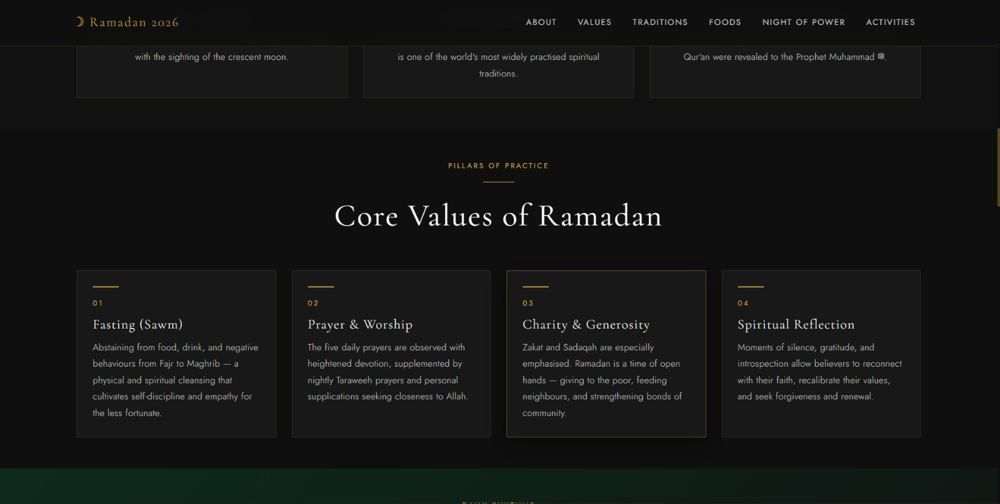
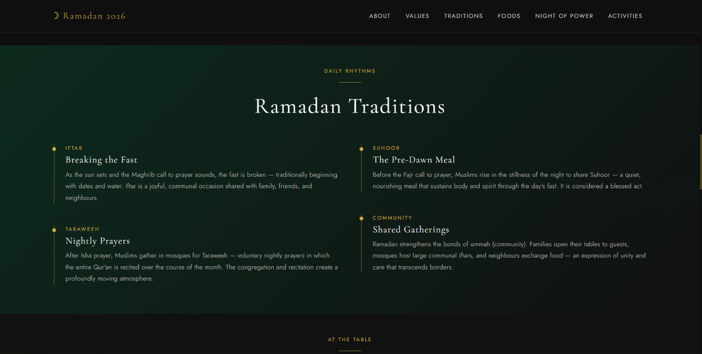
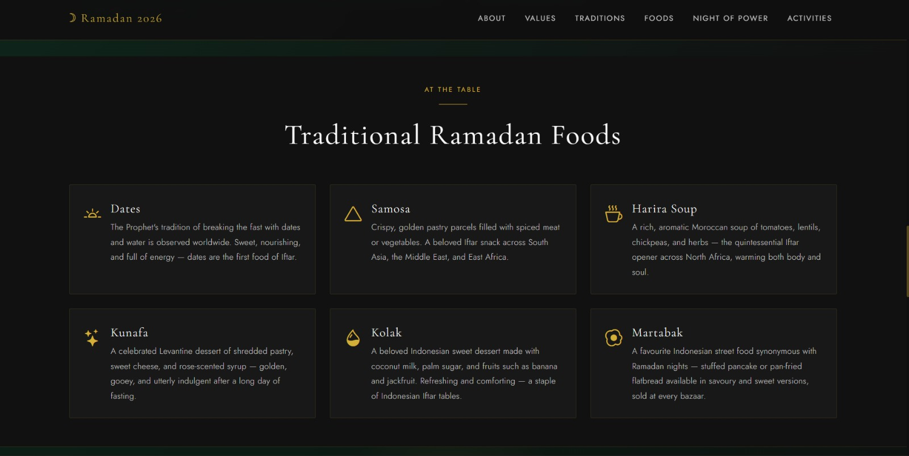
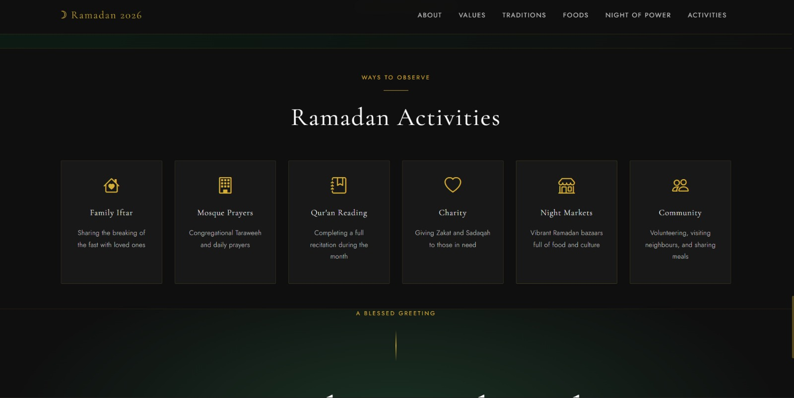
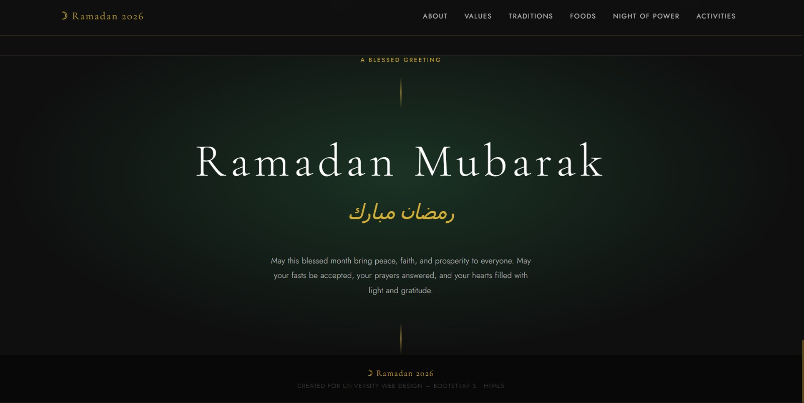

<div align="center">
  <br />
  <h1>LAPORAN PRAKTIKUM <br>APLIKASI BERBASIS PLATFORM</h1>
  <br />
  <h2>MODUL 4 <br> BOOTSTRAP </h2>
  <br />
  <br />
   
  <br />
  <br />
  <br />
  <h3>Disusun Oleh :</h3>
  <p>
    <strong>Rafaldo Al Maqdis</strong><br> 
    <strong>2311102099</strong><br> 
    <strong>S1 IF-11-REG 01</strong>
  </p>
  <br />
  <h3>Dosen Pengampu :</h3>
  <p>
    <strong>Dimas Fanny Hebrasianto Permadi, S.ST., M.Kom</strong>
  </p>
  <br />
  <br />
    <h4>Asisten Praktikum :</h4>
    <strong> Apri Pandu Wicaksono </strong> <br>
    <strong>Rangga Pradarrell Fathi</strong>
  <br />
  <h2>LABORATORIUM HIGH PERFORMANCE
 <br>FAKULTAS INFORMATIKA <br>UNIVERSITAS TELKOM PURWOKERTO <br>2026</h2>
</div>

---

# 1. Dasar Teori

## Pengenalan Bootstrap dalam Pengembangan Web

Bootstrap merupakan salah satu **framework front-end** yang bersifat gratis dan open-source yang dirancang untuk mempermudah proses pembuatan tampilan antarmuka (user interface) pada website. Framework ini dikembangkan oleh **Mark Otto** dan **Jacob Thornton** saat bekerja di perusahaan Twitter dan pertama kali diperkenalkan kepada publik pada tahun 2011.

Framework ini menyediakan berbagai komponen siap pakai yang dibangun menggunakan **HTML, CSS, dan JavaScript**. Beberapa komponen yang tersedia antara lain sistem navigasi, tombol, formulir, kartu (card), sistem grid, serta berbagai elemen interaktif lainnya. Dengan memanfaatkan komponen tersebut, pengembang web tidak perlu lagi membuat desain dari awal karena banyak elemen tampilan sudah tersedia dalam bentuk **class Bootstrap** yang dapat langsung digunakan pada elemen HTML.

Salah satu keunggulan utama Bootstrap adalah kemampuannya dalam membuat **desain responsif**. Artinya, tampilan website yang dibuat menggunakan Bootstrap dapat menyesuaikan ukuran layar secara otomatis, baik ketika diakses melalui **smartphone, tablet, maupun komputer desktop**. Hal ini membuat pengalaman pengguna menjadi lebih nyaman pada berbagai perangkat.

---

## Cara Menggunakan Bootstrap

Bootstrap dapat diintegrasikan ke dalam proyek website melalui beberapa cara. Dua metode yang paling umum digunakan adalah sebagai berikut.

### 1. Menggunakan File Bootstrap Secara Lokal

Metode ini dilakukan dengan cara **mengunduh file Bootstrap** terlebih dahulu dari situs resminya, kemudian menyimpannya ke dalam folder proyek. Setelah itu, file **CSS dan JavaScript Bootstrap** dipanggil ke dalam dokumen HTML menggunakan tag `<link>` untuk CSS dan `<script>` untuk JavaScript.

Keuntungan dari metode ini adalah halaman web tetap dapat dijalankan **tanpa memerlukan koneksi internet**, karena seluruh file Bootstrap sudah tersimpan di dalam proyek secara lokal.

---

### 2. Menggunakan CDN (Content Delivery Network)

Cara lain untuk menggunakan Bootstrap adalah dengan memanfaatkan **CDN (Content Delivery Network)**. Metode ini dilakukan dengan menambahkan link Bootstrap yang berasal dari server CDN ke dalam dokumen HTML.

Ketika halaman dibuka, browser akan mengambil file Bootstrap dari server CDN seperti **jsDelivr** atau **Bootstrap CDN**. Metode ini biasanya lebih praktis karena tidak perlu menyimpan file Bootstrap secara manual di dalam proyek. Namun, halaman web harus memiliki **koneksi internet** agar file Bootstrap dapat dimuat dengan baik.

---

## Sistem Layout pada Bootstrap

Bootstrap memiliki sistem tata letak yang dikenal sebagai **Bootstrap Grid System**. Sistem ini digunakan untuk mengatur posisi dan susunan elemen dalam halaman web agar lebih terstruktur dan responsif.

Struktur utama pada sistem grid Bootstrap terdiri dari tiga bagian utama, yaitu:

- **Container**  
  Merupakan elemen pembungkus utama yang digunakan untuk menampung seluruh konten pada halaman.

- **Row**  
  Digunakan untuk membuat baris dalam tata letak halaman.

- **Column**  
  Berfungsi sebagai tempat untuk menampilkan konten di dalam setiap baris.

Grid system pada Bootstrap menggunakan teknologi **Flexbox**, sehingga tata letak elemen dapat menyesuaikan secara otomatis pada berbagai ukuran layar.

---

## Komponen dan Utility Class Bootstrap

Selain menyediakan komponen antarmuka, Bootstrap juga memiliki berbagai **utility class** yang memudahkan pengembang dalam mengatur tampilan elemen HTML tanpa harus menuliskan kode CSS secara manual.

Beberapa fitur yang sering digunakan antara lain sebagai berikut.

### Pengaturan Teks

Bootstrap menyediakan beberapa class untuk mengatur tampilan teks, misalnya:

- `.text-center` digunakan untuk membuat teks berada di tengah.
- `.fw-bold` digunakan untuk membuat teks menjadi tebal.
- `.fst-italic` digunakan untuk membuat teks tampil dalam gaya miring.

---

### Tombol (Button)

Bootstrap juga menyediakan berbagai variasi tombol yang dapat digunakan dengan menambahkan class `.btn` serta variasi warna tertentu, misalnya:

- `.btn-primary`
- `.btn-success`
- `.btn-danger`
- `.btn-warning`

Class tersebut memudahkan pengembang dalam membuat tombol dengan tampilan yang konsisten.

---

### Formulir

Bootstrap menyediakan gaya khusus untuk elemen formulir seperti input dan textarea menggunakan class `.form-control`. Dengan class tersebut, tampilan elemen formulir akan terlihat lebih rapi, modern, dan konsisten pada berbagai jenis browser.

---

# 2. Unguided

Pada bagian ini dilakukan implementasi pembuatan **halaman kartu ucapan Ramadan** menggunakan HTML dan CSS dengan konsep desain modern. Halaman tersebut memanfaatkan pengaturan layout, penggunaan tipografi yang tepat, serta beberapa efek animasi sederhana agar tampilan website terlihat lebih menarik dan interaktif bagi pengguna.

## Kode HTML (`tugas-4.html`)

```html
<!DOCTYPE html>
<html lang="en">
<head>
  <meta charset="UTF-8" />
  <meta name="viewport" content="width=device-width, initial-scale=1.0" />
  <title>Ramadan 2026 — A Sacred Month</title>

  <!-- Bootstrap 5 -->
  <link href="https://cdn.jsdelivr.net/npm/bootstrap@5.3.3/dist/css/bootstrap.min.css" rel="stylesheet" />
  <!-- Bootstrap Icons -->
  <link href="https://cdn.jsdelivr.net/npm/bootstrap-icons@1.11.3/font/bootstrap-icons.css" rel="stylesheet" />
  <!-- Google Fonts: Cormorant Garamond + Jost -->
  <link href="https://fonts.googleapis.com/css2?family=Cormorant+Garamond:ital,wght@0,300;0,400;0,600;1,300;1,400&family=Jost:wght@200;300;400;500&display=swap" rel="stylesheet" />

  <style>
    /* ── CSS Variables ─────────────────────────────────────── */
    :root {
      --gold:        #d4af37;
      --gold-light:  #e8cc6a;
      --silver:      #c0c0c0;
      --black:       #0f0f0f;
      --dark-grey:   #2c2c2c;
      --mid-grey:    #4a4a4a;
      --light-grey:  #e5e5e5;
      --white:       #ffffff;
      --green:       #1b4332;
      --green-light: #2d6a4f;
    }

    /* ── Base ──────────────────────────────────────────────── */
    html { scroll-behavior: smooth; }

    body {
      background-color: var(--black);
      color: var(--light-grey);
      font-family: 'Jost', sans-serif;
      font-weight: 300;
      letter-spacing: 0.02em;
    }

    h1, h2, h3, h4, h5 {
      font-family: 'Cormorant Garamond', serif;
      font-weight: 400;
      letter-spacing: 0.04em;
    }

    /* ── Gold accent line ──────────────────────────────────── */
    .gold-line {
      display: block;
      width: 48px;
      height: 1px;
      background: var(--gold);
      margin: 0 auto 1.5rem;
    }
    .gold-line-left {
      display: block;
      width: 40px;
      height: 1px;
      background: var(--gold);
      margin-bottom: 1rem;
    }

    /* ── Navbar ────────────────────────────────────────────── */
    .navbar {
      background-color: rgba(15,15,15,.95) !important;
      border-bottom: 1px solid rgba(212,175,55,.18);
      backdrop-filter: blur(8px);
    }
    .navbar-brand {
      font-family: 'Cormorant Garamond', serif;
      font-size: 1.25rem;
      color: var(--gold) !important;
      letter-spacing: 0.1em;
    }
    .nav-link {
      color: var(--silver) !important;
      font-size: .8rem;
      font-weight: 400;
      letter-spacing: .12em;
      text-transform: uppercase;
      transition: color .25s;
    }
    .nav-link:hover { color: var(--gold) !important; }

    /* ── Section titles ────────────────────────────────────── */
    .section-label {
      font-size: .7rem;
      letter-spacing: .22em;
      text-transform: uppercase;
      color: var(--gold);
      font-weight: 400;
    }
    .section-title {
      font-size: clamp(2rem, 4vw, 3rem);
      color: var(--white);
      line-height: 1.15;
    }
    .section-body {
      color: var(--silver);
      font-size: .95rem;
      line-height: 1.85;
    }

    /* ── Hero ──────────────────────────────────────────────── */
    #hero {
      min-height: 100vh;
      background: radial-gradient(ellipse at 50% 60%, #1b3325 0%, #0f0f0f 65%);
      position: relative;
      overflow: hidden;
    }
    #hero::before {
      content: '';
      position: absolute;
      inset: 0;
      background:
        radial-gradient(circle at 20% 80%, rgba(212,175,55,.07) 0%, transparent 50%),
        radial-gradient(circle at 80% 20%, rgba(27,67,50,.25) 0%, transparent 50%);
      pointer-events: none;
    }

    /* Stars */
    .stars {
      position: absolute;
      inset: 0;
      overflow: hidden;
      pointer-events: none;
    }
    .star {
      position: absolute;
      background: var(--gold);
      border-radius: 50%;
      animation: twinkle 3s infinite ease-in-out alternate;
    }
    @keyframes twinkle {
      from { opacity: .15; transform: scale(1); }
      to   { opacity: .7;  transform: scale(1.4); }
    }

    /* SVG crescent + lantern */
    .hero-svg-wrap {
      position: absolute;
      inset: 0;
      pointer-events: none;
    }

    .hero-title {
      font-family: 'Cormorant Garamond', serif;
      font-size: clamp(3.5rem, 9vw, 7.5rem);
      font-weight: 300;
      color: var(--white);
      letter-spacing: .1em;
      line-height: 1;
      text-shadow: 0 2px 40px rgba(212,175,55,.2);
    }
    .hero-year {
      color: var(--gold);
      font-style: italic;
    }
    .hero-subtitle {
      font-family: 'Cormorant Garamond', serif;
      font-size: clamp(1rem, 2.2vw, 1.4rem);
      color: var(--silver);
      font-weight: 300;
      letter-spacing: .15em;
    }
    .hero-divider {
      width: 1px;
      height: 60px;
      background: linear-gradient(to bottom, transparent, var(--gold), transparent);
      margin: 0 auto;
    }

    /* ── Sections alternate bg ─────────────────────────────── */
    .section-dark   { background-color: var(--black); }
    .section-darker { background-color: #111111; }
    .section-green  { background: linear-gradient(135deg, #0d2b1e 0%, #111 100%); }

    /* ── Cards ─────────────────────────────────────────────── */
    .card-ramadan {
      background: #181818;
      border: 1px solid rgba(212,175,55,.14);
      border-radius: 2px;
      transition: border-color .3s, transform .3s, box-shadow .3s;
    }
    .card-ramadan:hover {
      border-color: rgba(212,175,55,.45);
      transform: translateY(-4px);
      box-shadow: 0 12px 40px rgba(0,0,0,.5);
    }
    .card-icon {
      font-size: 1.8rem;
      color: var(--gold);
    }
    .card-title-r {
      font-family: 'Cormorant Garamond', serif;
      font-size: 1.3rem;
      color: var(--white);
      letter-spacing: .05em;
    }
    .card-text-r {
      color: var(--silver);
      font-size: .875rem;
      line-height: 1.8;
    }

    /* ── Laylat al-Qadr highlight ──────────────────────────── */
    #laylat {
      background: linear-gradient(135deg, #0c1f16 0%, #0f0f0f 100%);
      border-top: 1px solid rgba(212,175,55,.15);
      border-bottom: 1px solid rgba(212,175,55,.15);
      position: relative;
      overflow: hidden;
    }
    #laylat::before {
      content: '';
      position: absolute;
      top: -80px; left: 50%;
      transform: translateX(-50%);
      width: 400px; height: 400px;
      background: radial-gradient(circle, rgba(212,175,55,.08) 0%, transparent 70%);
      pointer-events: none;
    }
    .laylat-number {
      font-family: 'Cormorant Garamond', serif;
      font-size: clamp(4rem, 10vw, 8rem);
      color: rgba(212,175,55,.12);
      font-weight: 300;
      line-height: 1;
      letter-spacing: .05em;
    }

    /* ── Tradition timeline cards ──────────────────────────── */
    .tradition-card {
      border-left: 2px solid rgba(212,175,55,.35);
      padding-left: 1.5rem;
      position: relative;
    }
    .tradition-card::before {
      content: '';
      position: absolute;
      left: -5px; top: 6px;
      width: 8px; height: 8px;
      border-radius: 50%;
      background: var(--gold);
    }

    /* ── Closing ───────────────────────────────────────────── */
    #closing {
      background: radial-gradient(ellipse at 50% 40%, #1b3325 0%, #0f0f0f 70%);
      border-top: 1px solid rgba(212,175,55,.12);
    }
    .closing-title {
      font-family: 'Cormorant Garamond', serif;
      font-size: clamp(3rem, 7vw, 5.5rem);
      color: var(--white);
      font-weight: 300;
      letter-spacing: .1em;
    }
    .closing-arabic {
      font-family: 'Cormorant Garamond', serif;
      font-size: clamp(1.6rem, 4vw, 2.5rem);
      color: var(--gold);
      font-style: italic;
      letter-spacing: .06em;
    }

    /* ── Footer ────────────────────────────────────────────── */
    footer {
      background: #080808;
      border-top: 1px solid rgba(212,175,55,.1);
      color: var(--mid-grey);
      font-size: .78rem;
      letter-spacing: .08em;
    }

    /* ── Scrollbar ─────────────────────────────────────────── */
    ::-webkit-scrollbar { width: 5px; }
    ::-webkit-scrollbar-track { background: var(--black); }
    ::-webkit-scrollbar-thumb { background: rgba(212,175,55,.35); border-radius: 10px; }
  </style>
</head>
<body>

<!-- ═══════════════════════ NAVBAR ═══════════════════════════ -->
<nav class="navbar navbar-expand-lg sticky-top py-3">
  <div class="container">
    <a class="navbar-brand" href="#">☽ Ramadan 2026</a>
    <button class="navbar-toggler border-0" type="button" data-bs-toggle="collapse" data-bs-target="#navMenu">
      <span class="navbar-toggler-icon" style="filter:invert(1) sepia(1) saturate(2) hue-rotate(5deg);"></span>
    </button>
    <div class="collapse navbar-collapse justify-content-end" id="navMenu">
      <ul class="navbar-nav gap-3">
        <li class="nav-item"><a class="nav-link" href="#about">About</a></li>
        <li class="nav-item"><a class="nav-link" href="#values">Values</a></li>
        <li class="nav-item"><a class="nav-link" href="#traditions">Traditions</a></li>
        <li class="nav-item"><a class="nav-link" href="#foods">Foods</a></li>
        <li class="nav-item"><a class="nav-link" href="#laylat">Night of Power</a></li>
        <li class="nav-item"><a class="nav-link" href="#activities">Activities</a></li>
      </ul>
    </div>
  </div>
</nav>

<!-- ═══════════════════════ HERO ══════════════════════════════ -->
<section id="hero" class="d-flex align-items-center justify-content-center text-center">

  <!-- Scattered stars -->
  <div class="stars" id="starsContainer"></div>

  <!-- SVG decorative elements -->
  <div class="hero-svg-wrap">
    <!-- Crescent top-right -->
    <svg style="position:absolute;top:8%;right:6%;width:clamp(80px,12vw,160px);opacity:.55;" viewBox="0 0 120 120" xmlns="http://www.w3.org/2000/svg">
      <circle cx="65" cy="60" r="46" fill="none" stroke="#d4af37" stroke-width="1"/>
      <circle cx="88" cy="52" r="42" fill="#0f0f0f"/>
    </svg>
    <!-- Lantern left -->
    <svg style="position:absolute;bottom:14%;left:5%;width:clamp(40px,6vw,80px);opacity:.35;" viewBox="0 0 60 100" xmlns="http://www.w3.org/2000/svg">
      <line x1="30" y1="0" x2="30" y2="10" stroke="#d4af37" stroke-width="1.5"/>
      <rect x="14" y="10" width="32" height="6" rx="2" fill="none" stroke="#d4af37" stroke-width="1"/>
      <rect x="10" y="16" width="40" height="58" rx="4" fill="none" stroke="#d4af37" stroke-width="1"/>
      <line x1="10" y1="38" x2="50" y2="38" stroke="#d4af37" stroke-width=".8" opacity=".6"/>
      <line x1="10" y1="52" x2="50" y2="52" stroke="#d4af37" stroke-width=".8" opacity=".6"/>
      <line x1="30" y1="74" x2="30" y2="100" stroke="#d4af37" stroke-width="1.5"/>
    </svg>
    <!-- Lantern right -->
    <svg style="position:absolute;bottom:20%;right:7%;width:clamp(30px,5vw,60px);opacity:.3;" viewBox="0 0 60 100" xmlns="http://www.w3.org/2000/svg">
      <line x1="30" y1="0" x2="30" y2="10" stroke="#d4af37" stroke-width="1.5"/>
      <rect x="14" y="10" width="32" height="6" rx="2" fill="none" stroke="#d4af37" stroke-width="1"/>
      <rect x="10" y="16" width="40" height="58" rx="4" fill="none" stroke="#d4af37" stroke-width="1"/>
      <line x1="10" y1="38" x2="50" y2="38" stroke="#d4af37" stroke-width=".8" opacity=".6"/>
      <line x1="10" y1="52" x2="50" y2="52" stroke="#d4af37" stroke-width=".8" opacity=".6"/>
      <line x1="30" y1="74" x2="30" y2="100" stroke="#d4af37" stroke-width="1.5"/>
    </svg>
    <!-- Mosque silhouette bottom -->
    <svg style="position:absolute;bottom:0;left:50%;transform:translateX(-50%);width:min(100%,900px);opacity:.12;" viewBox="0 0 900 180" xmlns="http://www.w3.org/2000/svg">
      <!-- main dome -->
      <ellipse cx="450" cy="130" rx="90" ry="70" fill="#d4af37"/>
      <rect x="360" y="130" width="180" height="50" fill="#d4af37"/>
      <!-- side minarets -->
      <rect x="310" y="80" width="22" height="100" fill="#d4af37"/>
      <ellipse cx="321" cy="75" rx="14" ry="22" fill="#d4af37"/>
      <rect x="315" y="55" width="12" height="20" fill="#d4af37"/>
      <rect x="568" y="80" width="22" height="100" fill="#d4af37"/>
      <ellipse cx="579" cy="75" rx="14" ry="22" fill="#d4af37"/>
      <rect x="573" y="55" width="12" height="20" fill="#d4af37"/>
      <!-- small minarets -->
      <rect x="200" y="110" width="16" height="70" fill="#d4af37"/>
      <ellipse cx="208" cy="106" rx="10" ry="16" fill="#d4af37"/>
      <rect x="684" y="110" width="16" height="70" fill="#d4af37"/>
      <ellipse cx="692" cy="106" rx="10" ry="16" fill="#d4af37"/>
    </svg>
  </div>

  <div class="container position-relative z-1 py-5">
    <p class="section-label mb-4">Ramadan 1447 AH</p>
    <h1 class="hero-title mb-0">Ramadan</h1>
    <h1 class="hero-title mb-4"><span class="hero-year">2026</span></h1>
    <div class="hero-divider mb-4"></div>
    <p class="hero-subtitle px-md-5">
      A Sacred Month of Reflection, Faith, and Community
    </p>
    <div class="mt-5 d-flex justify-content-center gap-4">
      <a href="#about" class="btn btn-outline-light btn-sm px-4 py-2" style="border-color:rgba(212,175,55,.5);color:var(--gold);font-size:.75rem;letter-spacing:.14em;text-transform:uppercase;">
        Discover More
      </a>
    </div>
  </div>
</section>

<!-- ═══════════════════════ ABOUT ═════════════════════════════ -->
<section id="about" class="section-darker py-6">
  <div class="container py-5">
    <div class="row justify-content-center">
      <div class="col-lg-7 text-center">
        <p class="section-label mb-3">The Sacred Month</p>
        <span class="gold-line"></span>
        <h2 class="section-title mb-4">About Ramadan</h2>
        <p class="section-body">
          Ramadan is the ninth month of the Islamic calendar and one of the holiest times for Muslims around the world.
          During this month, Muslims fast from dawn until sunset, devote time to prayer, reflection, and acts of charity.
          It is a time of profound spiritual discipline — a renewal of faith, gratitude, and connection to community.
        </p>
      </div>
    </div>
    <!-- three pillars -->
    <div class="row g-4 mt-5 justify-content-center">
      <div class="col-sm-6 col-md-4">
        <div class="card-ramadan p-4 text-center h-100">
          <i class="bi bi-moon-stars card-icon mb-3 d-block"></i>
          <p class="card-title-r mb-2">29 – 30 Days</p>
          <p class="card-text-r mb-0">Ramadan spans one full lunar month, beginning and ending with the sighting of the crescent moon.</p>
        </div>
      </div>
      <div class="col-sm-6 col-md-4">
        <div class="card-ramadan p-4 text-center h-100">
          <i class="bi bi-globe2 card-icon mb-3 d-block"></i>
          <p class="card-title-r mb-2">1.8 Billion Muslims</p>
          <p class="card-text-r mb-0">Observed by Muslim communities across every continent, it is one of the world's most widely practised spiritual traditions.</p>
        </div>
      </div>
      <div class="col-sm-6 col-md-4">
        <div class="card-ramadan p-4 text-center h-100">
          <i class="bi bi-book card-icon mb-3 d-block"></i>
          <p class="card-title-r mb-2">Month of the Qur'an</p>
          <p class="card-text-r mb-0">It was during Ramadan that the first verses of the Holy Qur'an were revealed to the Prophet Muhammad ﷺ.</p>
        </div>
      </div>
    </div>
  </div>
</section>

<!-- ═══════════════════════ CORE VALUES ══════════════════════ -->
<section id="values" class="section-dark py-6">
  <div class="container py-5">
    <div class="row justify-content-center text-center mb-5">
      <div class="col-lg-6">
        <p class="section-label mb-3">Pillars of Practice</p>
        <span class="gold-line"></span>
        <h2 class="section-title">Core Values of Ramadan</h2>
      </div>
    </div>
    <div class="row g-4">
      <div class="col-sm-6 col-lg-3">
        <div class="card-ramadan p-4 h-100">
          <span class="gold-line-left"></span>
          <p class="section-label mb-2">01</p>
          <p class="card-title-r mb-2">Fasting (Sawm)</p>
          <p class="card-text-r mb-0">Abstaining from food, drink, and negative behaviours from Fajr to Maghrib — a physical and spiritual cleansing that cultivates self-discipline and empathy for the less fortunate.</p>
        </div>
      </div>
      <div class="col-sm-6 col-lg-3">
        <div class="card-ramadan p-4 h-100">
          <span class="gold-line-left"></span>
          <p class="section-label mb-2">02</p>
          <p class="card-title-r mb-2">Prayer & Worship</p>
          <p class="card-text-r mb-0">The five daily prayers are observed with heightened devotion, supplemented by nightly Taraweeh prayers and personal supplications seeking closeness to Allah.</p>
        </div>
      </div>
      <div class="col-sm-6 col-lg-3">
        <div class="card-ramadan p-4 h-100">
          <span class="gold-line-left"></span>
          <p class="section-label mb-2">03</p>
          <p class="card-title-r mb-2">Charity & Generosity</p>
          <p class="card-text-r mb-0">Zakat and Sadaqah are especially emphasised. Ramadan is a time of open hands — giving to the poor, feeding neighbours, and strengthening bonds of community.</p>
        </div>
      </div>
      <div class="col-sm-6 col-lg-3">
        <div class="card-ramadan p-4 h-100">
          <span class="gold-line-left"></span>
          <p class="section-label mb-2">04</p>
          <p class="card-title-r mb-2">Spiritual Reflection</p>
          <p class="card-text-r mb-0">Moments of silence, gratitude, and introspection allow believers to reconnect with their faith, recalibrate their values, and seek forgiveness and renewal.</p>
        </div>
      </div>
    </div>
  </div>
</section>

<!-- ═══════════════════════ TRADITIONS ═══════════════════════ -->
<section id="traditions" class="section-green py-6">
  <div class="container py-5">
    <div class="row justify-content-center text-center mb-5">
      <div class="col-lg-6">
        <p class="section-label mb-3">Daily Rhythms</p>
        <span class="gold-line"></span>
        <h2 class="section-title">Ramadan Traditions</h2>
      </div>
    </div>
    <div class="row g-5">
      <div class="col-md-6">
        <div class="tradition-card mb-5">
          <p class="section-label mb-1">Iftar</p>
          <h4 class="card-title-r mb-2">Breaking the Fast</h4>
          <p class="card-text-r">As the sun sets and the Maghrib call to prayer sounds, the fast is broken — traditionally beginning with dates and water. Iftar is a joyful, communal occasion shared with family, friends, and neighbours.</p>
        </div>
        <div class="tradition-card">
          <p class="section-label mb-1">Taraweeh</p>
          <h4 class="card-title-r mb-2">Nightly Prayers</h4>
          <p class="card-text-r">After Isha prayer, Muslims gather in mosques for Taraweeh — voluntary nightly prayers in which the entire Qur'an is recited over the course of the month. The congregation and recitation create a profoundly moving atmosphere.</p>
        </div>
      </div>
      <div class="col-md-6">
        <div class="tradition-card mb-5">
          <p class="section-label mb-1">Suhoor</p>
          <h4 class="card-title-r mb-2">The Pre-Dawn Meal</h4>
          <p class="card-text-r">Before the Fajr call to prayer, Muslims rise in the stillness of the night to share Suhoor — a quiet, nourishing meal that sustains body and spirit through the day's fast. It is considered a blessed act.</p>
        </div>
        <div class="tradition-card">
          <p class="section-label mb-1">Community</p>
          <h4 class="card-title-r mb-2">Shared Gatherings</h4>
          <p class="card-text-r">Ramadan strengthens the bonds of ummah (community). Families open their tables to guests, mosques host large communal iftars, and neighbours exchange food — an expression of unity and care that transcends borders.</p>
        </div>
      </div>
    </div>
  </div>
</section>

<!-- ═══════════════════════ FOODS ════════════════════════════ -->
<section id="foods" class="section-darker py-6">
  <div class="container py-5">
    <div class="row justify-content-center text-center mb-5">
      <div class="col-lg-6">
        <p class="section-label mb-3">At the Table</p>
        <span class="gold-line"></span>
        <h2 class="section-title">Traditional Ramadan Foods</h2>
      </div>
    </div>
    <div class="row g-4">

      <div class="col-sm-6 col-lg-4">
        <div class="card-ramadan p-4 h-100">
          <div class="d-flex align-items-start gap-3">
            <i class="bi bi-brightness-alt-high card-icon mt-1"></i>
            <div>
              <p class="card-title-r mb-1">Dates</p>
              <p class="card-text-r mb-0">The Prophet's tradition of breaking the fast with dates and water is observed worldwide. Sweet, nourishing, and full of energy — dates are the first food of Iftar.</p>
            </div>
          </div>
        </div>
      </div>

      <div class="col-sm-6 col-lg-4">
        <div class="card-ramadan p-4 h-100">
          <div class="d-flex align-items-start gap-3">
            <i class="bi bi-triangle card-icon mt-1"></i>
            <div>
              <p class="card-title-r mb-1">Samosa</p>
              <p class="card-text-r mb-0">Crispy, golden pastry parcels filled with spiced meat or vegetables. A beloved Iftar snack across South Asia, the Middle East, and East Africa.</p>
            </div>
          </div>
        </div>
      </div>

      <div class="col-sm-6 col-lg-4">
        <div class="card-ramadan p-4 h-100">
          <div class="d-flex align-items-start gap-3">
            <i class="bi bi-cup-hot card-icon mt-1"></i>
            <div>
              <p class="card-title-r mb-1">Harira Soup</p>
              <p class="card-text-r mb-0">A rich, aromatic Moroccan soup of tomatoes, lentils, chickpeas, and herbs — the quintessential Iftar opener across North Africa, warming both body and soul.</p>
            </div>
          </div>
        </div>
      </div>

      <div class="col-sm-6 col-lg-4">
        <div class="card-ramadan p-4 h-100">
          <div class="d-flex align-items-start gap-3">
            <i class="bi bi-stars card-icon mt-1"></i>
            <div>
              <p class="card-title-r mb-1">Kunafa</p>
              <p class="card-text-r mb-0">A celebrated Levantine dessert of shredded pastry, sweet cheese, and rose-scented syrup — golden, gooey, and utterly indulgent after a long day of fasting.</p>
            </div>
          </div>
        </div>
      </div>

      <div class="col-sm-6 col-lg-4">
        <div class="card-ramadan p-4 h-100">
          <div class="d-flex align-items-start gap-3">
            <i class="bi bi-droplet-half card-icon mt-1"></i>
            <div>
              <p class="card-title-r mb-1">Kolak</p>
              <p class="card-text-r mb-0">A beloved Indonesian sweet dessert made with coconut milk, palm sugar, and fruits such as banana and jackfruit. Refreshing and comforting — a staple of Indonesian Iftar tables.</p>
            </div>
          </div>
        </div>
      </div>

      <div class="col-sm-6 col-lg-4">
        <div class="card-ramadan p-4 h-100">
          <div class="d-flex align-items-start gap-3">
            <i class="bi bi-egg-fried card-icon mt-1"></i>
            <div>
              <p class="card-title-r mb-1">Martabak</p>
              <p class="card-text-r mb-0">A favourite Indonesian street food synonymous with Ramadan nights — stuffed pancake or pan-fried flatbread available in savoury and sweet versions, sold at every bazaar.</p>
            </div>
          </div>
        </div>
      </div>

    </div>
  </div>
</section>

<!-- ═══════════════════════ LAYLAT AL-QADR ═══════════════════ -->
<section id="laylat" class="py-6">
  <div class="container py-5">
    <div class="row align-items-center">
      <div class="col-lg-5 text-center text-lg-start mb-5 mb-lg-0">
        <div class="laylat-number">27</div>
        <p class="section-label mt-n2 mb-0">Last Ten Nights</p>
      </div>
      <div class="col-lg-7">
        <p class="section-label mb-3">The Most Sacred Night</p>
        <span class="gold-line-left"></span>
        <h2 class="section-title mb-4">Laylat al-Qadr</h2>
        <p class="section-body mb-4">
          Translated as <em>The Night of Power</em>, Laylat al-Qadr is considered the most sacred night of the entire year.
          It is believed to fall during the final ten nights of Ramadan — most commonly on the 27th night — and is described in the Qur'an as
          <em>"better than a thousand months."</em>
        </p>
        <p class="section-body">
          Muslims spend these nights in intense worship, recitation of the Qur'an, supplication, and remembrance of Allah.
          It is a night when mercy descends, prayers are answered, and destinies are written — a luminous culmination of the holy month.
        </p>
        <div class="mt-4 p-4" style="border:1px solid rgba(212,175,55,.2);background:rgba(212,175,55,.04);">
          <p class="mb-0" style="font-family:'Cormorant Garamond',serif;font-size:1.15rem;color:var(--gold);font-style:italic;letter-spacing:.05em;">
            "Indeed, We revealed it [the Qur'an] on the Night of Power. And what will make you realize what the Night of Power is? The Night of Power is better than a thousand months."
          </p>
          <p class="mt-2 mb-0 section-label" style="font-size:.65rem;">— Surah Al-Qadr (97:1–3)</p>
        </div>
      </div>
    </div>
  </div>
</section>

<!-- ═══════════════════════ ACTIVITIES ═══════════════════════ -->
<section id="activities" class="section-dark py-6">
  <div class="container py-5">
    <div class="row justify-content-center text-center mb-5">
      <div class="col-lg-6">
        <p class="section-label mb-3">Ways to Observe</p>
        <span class="gold-line"></span>
        <h2 class="section-title">Ramadan Activities</h2>
      </div>
    </div>
    <div class="row g-4 justify-content-center">

      <div class="col-6 col-md-4 col-lg-2">
        <div class="card-ramadan p-4 text-center h-100">
          <i class="bi bi-house-heart card-icon mb-3 d-block" style="font-size:2rem;"></i>
          <p class="card-title-r" style="font-size:1rem;">Family Iftar</p>
          <p class="card-text-r" style="font-size:.8rem;">Sharing the breaking of the fast with loved ones</p>
        </div>
      </div>

      <div class="col-6 col-md-4 col-lg-2">
        <div class="card-ramadan p-4 text-center h-100">
          <i class="bi bi-building card-icon mb-3 d-block" style="font-size:2rem;"></i>
          <p class="card-title-r" style="font-size:1rem;">Mosque Prayers</p>
          <p class="card-text-r" style="font-size:.8rem;">Congregational Taraweeh and daily prayers</p>
        </div>
      </div>

      <div class="col-6 col-md-4 col-lg-2">
        <div class="card-ramadan p-4 text-center h-100">
          <i class="bi bi-journal-bookmark card-icon mb-3 d-block" style="font-size:2rem;"></i>
          <p class="card-title-r" style="font-size:1rem;">Qur'an Reading</p>
          <p class="card-text-r" style="font-size:.8rem;">Completing a full recitation during the month</p>
        </div>
      </div>

      <div class="col-6 col-md-4 col-lg-2">
        <div class="card-ramadan p-4 text-center h-100">
          <i class="bi bi-heart card-icon mb-3 d-block" style="font-size:2rem;"></i>
          <p class="card-title-r" style="font-size:1rem;">Charity</p>
          <p class="card-text-r" style="font-size:.8rem;">Giving Zakat and Sadaqah to those in need</p>
        </div>
      </div>

      <div class="col-6 col-md-4 col-lg-2">
        <div class="card-ramadan p-4 text-center h-100">
          <i class="bi bi-shop card-icon mb-3 d-block" style="font-size:2rem;"></i>
          <p class="card-title-r" style="font-size:1rem;">Night Markets</p>
          <p class="card-text-r" style="font-size:.8rem;">Vibrant Ramadan bazaars full of food and culture</p>
        </div>
      </div>

      <div class="col-6 col-md-4 col-lg-2">
        <div class="card-ramadan p-4 text-center h-100">
          <i class="bi bi-people card-icon mb-3 d-block" style="font-size:2rem;"></i>
          <p class="card-title-r" style="font-size:1rem;">Community</p>
          <p class="card-text-r" style="font-size:.8rem;">Volunteering, visiting neighbours, and sharing meals</p>
        </div>
      </div>

    </div>
  </div>
</section>

<!-- ═══════════════════════ CLOSING ══════════════════════════ -->
<section id="closing" class="py-6 text-center">
  <div class="container py-6">
    <div class="row justify-content-center">
      <div class="col-lg-8">
        <p class="section-label mb-4">A Blessed Greeting</p>
        <div class="hero-divider mb-5"></div>
        <h2 class="closing-title mb-3">Ramadan Mubarak</h2>
        <p class="closing-arabic mb-5">رمضان مبارك</p>
        <p class="section-body px-md-4 mx-auto" style="max-width:560px;">
          May this blessed month bring peace, faith, and prosperity to everyone.
          May your fasts be accepted, your prayers answered, and your hearts filled
          with light and gratitude.
        </p>
        <div class="hero-divider mt-5"></div>
      </div>
    </div>
  </div>
</section>

<!-- ═══════════════════════ FOOTER ═══════════════════════════ -->
<footer class="py-4 text-center">
  <div class="container">
    <p class="mb-1" style="color:var(--gold);font-family:'Cormorant Garamond',serif;font-size:1rem;letter-spacing:.1em;">☽ Ramadan 2026</p>
    <p class="mb-0" style="color:var(--mid-grey);font-size:.72rem;letter-spacing:.1em;text-transform:uppercase;">
      Created for University Web Design — Bootstrap 5 · HTML5
    </p>
  </div>
</footer>

<!-- Bootstrap JS -->
<script src="https://cdn.jsdelivr.net/npm/bootstrap@5.3.3/dist/js/bootstrap.bundle.min.js"></script>

<!-- Star generator -->
<script>
  const container = document.getElementById('starsContainer');
  for (let i = 0; i < 70; i++) {
    const star = document.createElement('div');
    star.className = 'star';
    const size = Math.random() * 2.5 + .5;
    star.style.cssText = `
      width:${size}px; height:${size}px;
      top:${Math.random() * 100}%;
      left:${Math.random() * 100}%;
      animation-delay:${Math.random() * 4}s;
      animation-duration:${2 + Math.random() * 3}s;
    `;
    container.appendChild(star);
  }
</script>

<!-- Smooth section reveal on scroll -->
<script>
  const observer = new IntersectionObserver((entries) => {
    entries.forEach(e => {
      if (e.isIntersecting) {
        e.target.style.opacity = '1';
        e.target.style.transform = 'translateY(0)';
      }
    });
  }, { threshold: 0.1 });

  document.querySelectorAll('.card-ramadan, .tradition-card').forEach(el => {
    el.style.cssText += 'opacity:0;transform:translateY(20px);transition:opacity .6s ease,transform .6s ease,border-color .3s,box-shadow .3s;';
    observer.observe(el);
  });
</script>

</body>
</html>

```

---

# Hasil Tampilan








---

# Penjelasan Kode

---

````md
# Ramadan 2026 Landing Page
Modern Ramadan Greeting Website using **HTML5, CSS3, Bootstrap 5, and JavaScript**

---

# 1. Deskripsi Proyek

Project ini merupakan sebuah **website kartu ucapan Ramadan** yang dirancang menggunakan teknologi **HTML, CSS, Bootstrap 5, dan JavaScript**.  

Website ini menampilkan berbagai informasi mengenai bulan Ramadan seperti:

- Penjelasan tentang Ramadan
- Nilai-nilai utama Ramadan
- Tradisi Ramadan
- Makanan khas Ramadan
- Malam Laylatul Qadr
- Aktivitas yang biasa dilakukan selama Ramadan

Desain website dibuat dengan konsep **elegan dan modern** dengan tema warna **black, gold, silver, dan dark green** untuk menciptakan nuansa mewah, tenang, dan spiritual.

---

# 2. Teknologi yang Digunakan

Website ini menggunakan beberapa teknologi utama dalam pengembangan web, yaitu:

| Teknologi | Fungsi |
|-----------|--------|
| HTML5 | Membuat struktur halaman web |
| CSS3 | Mengatur tampilan visual dan desain |
| Bootstrap 5 | Framework untuk layout responsif dan komponen UI |
| Bootstrap Icons | Menambahkan ikon pada halaman |
| Google Fonts | Menggunakan font elegan untuk desain |
| JavaScript | Menambahkan animasi dan interaksi |

---

# 3. Struktur Halaman Website

Website ini terdiri dari beberapa bagian utama, yaitu:

1. Navbar
2. Hero Section
3. About Section
4. Core Values
5. Ramadan Traditions
6. Ramadan Foods
7. Laylat al-Qadr Section
8. Ramadan Activities
9. Closing Greeting
10. Footer

Setiap bagian dibuat menggunakan **Bootstrap Grid System** sehingga tampilan website dapat menyesuaikan berbagai ukuran layar.

---

# 4. Penjelasan Struktur HTML

## 4.1 Deklarasi Dokumen HTML

```html
<!DOCTYPE html>
<html lang="en">
````

Bagian ini merupakan deklarasi dokumen HTML yang memberitahu browser bahwa halaman menggunakan standar **HTML5**.

---

## 4.2 Bagian Head

```html
<head>
<meta charset="UTF-8">
<meta name="viewport" content="width=device-width, initial-scale=1.0">
<title>Ramadan 2026 — A Sacred Month</title>
```

Bagian ini berfungsi untuk:

* Menentukan karakter encoding
* Mengatur tampilan responsif pada perangkat mobile
* Menentukan judul halaman pada browser

---

## 4.3 Integrasi Bootstrap

```html
<link href="https://cdn.jsdelivr.net/npm/bootstrap@5.3.3/dist/css/bootstrap.min.css" rel="stylesheet">
```

Kode ini digunakan untuk **menghubungkan Bootstrap melalui CDN** sehingga seluruh komponen Bootstrap dapat digunakan tanpa perlu mengunduh file secara manual.

---

## 4.4 Bootstrap Icons

```html
<link href="https://cdn.jsdelivr.net/npm/bootstrap-icons@1.11.3/font/bootstrap-icons.css" rel="stylesheet">
```

Digunakan untuk menambahkan **ikon Bootstrap** seperti:

* moon
* book
* heart
* mosque
* food icons

Ikon ini digunakan pada berbagai card di halaman.

---

## 4.5 Google Fonts

```html
<link href="https://fonts.googleapis.com/css2?family=Cormorant+Garamond&family=Jost&display=swap" rel="stylesheet">
```

Website menggunakan dua jenis font yaitu:

| Font               | Fungsi            |
| ------------------ | ----------------- |
| Cormorant Garamond | Judul dan heading |
| Jost               | Teks isi          |

Font ini memberikan tampilan yang **elegan dan modern**.

---

# 5. Penjelasan CSS

CSS digunakan untuk mengatur tampilan visual website.

---

## 5.1 CSS Variables

```css
:root {
--gold: #d4af37;
--black: #0f0f0f;
--silver: #c0c0c0;
}
```

Variabel CSS digunakan untuk menyimpan warna utama website sehingga mudah digunakan kembali di seluruh kode.

Tema warna yang digunakan:

* Gold
* Black
* Silver
* Dark Green
* Grey
* White

Tema ini menciptakan tampilan **luxury Ramadan theme**.

---

## 5.2 Navbar Styling

```css
.navbar {
background-color: rgba(15,15,15,.95);
border-bottom: 1px solid rgba(212,175,55,.18);
}
```

CSS ini digunakan untuk:

* Memberikan warna gelap pada navbar
* Menambahkan garis emas tipis
* Memberikan efek blur modern

---

## 5.3 Hero Section

Hero section merupakan bagian pembuka website.

```css
#hero {
min-height: 100vh;
background: radial-gradient(...);
}
```

Fitur pada hero section:

* Background gradient
* Bintang animasi
* Bulan sabit (SVG)
* Lantern decoration
* Siluet masjid

Tujuannya untuk menciptakan **suasana malam Ramadan yang elegan**.

---

## 5.4 Card Component

```css
.card-ramadan {
background: #181818;
border: 1px solid rgba(212,175,55,.14);
}
```

Card digunakan untuk menampilkan informasi seperti:

* Nilai Ramadan
* Makanan Ramadan
* Aktivitas Ramadan

Efek tambahan pada card:

* Hover animation
* Shadow effect
* Border highlight

---

## 5.5 Section Styling

Beberapa section menggunakan variasi background:

| Class          | Fungsi                       |
| -------------- | ---------------------------- |
| section-dark   | Background hitam             |
| section-darker | Background hitam lebih gelap |
| section-green  | Background hijau gradient    |

Hal ini membuat halaman lebih **dinamis dan tidak monoton**.

---

# 6. Penjelasan Layout Bootstrap

Website menggunakan **Bootstrap Grid System**.

Struktur grid terdiri dari:

```
container
   row
      column
```

Contoh:

```html
<div class="container">
<div class="row">
<div class="col-md-4">
```

Keuntungan penggunaan Bootstrap Grid:

* Layout menjadi responsif
* Mudah mengatur posisi konten
* Tampilan konsisten pada berbagai perangkat

---

# 7. Penjelasan JavaScript

JavaScript digunakan untuk menambahkan interaksi dan animasi pada website.

---

## 7.1 Star Generator

Script ini digunakan untuk membuat animasi bintang secara otomatis.

```javascript
for (let i = 0; i < 70; i++) {
const star = document.createElement('div');
}
```

Fungsi script ini:

* Membuat 70 bintang
* Menempatkan bintang secara acak
* Memberikan animasi twinkle

Hasilnya menciptakan efek **langit malam Ramadan**.

---

## 7.2 Scroll Animation

Website menggunakan **Intersection Observer API**.

```javascript
const observer = new IntersectionObserver((entries) => {
```

Fungsi script ini:

* Mendeteksi ketika elemen muncul di layar
* Menampilkan animasi fade-in
* Membuat card muncul secara halus saat scroll

Hal ini meningkatkan **user experience**.

---

# 8. Fitur Utama Website

Beberapa fitur utama pada website ini adalah:

* Responsive layout menggunakan Bootstrap
* Elegant Ramadan theme
* Animasi bintang
* Smooth scroll navigation
* Card hover animation
* Section reveal animation
* SVG decoration (crescent, lantern, mosque)

---


# Referensi

- [Materi Modul 4](https://drive.google.com/file/d/1Qxsa7wNn3PNrDLYzgBKb62GZi4mPkoub/view?usp=drive_link)