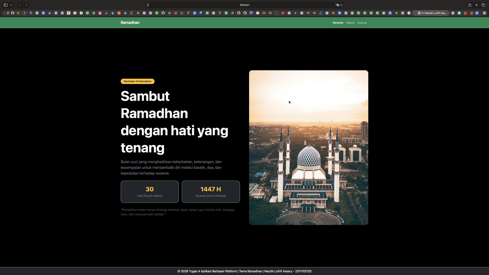

<div align="center">
  <br />
  <h1>LAPORAN PRAKTIKUM <br>APLIKASI BERBASIS PLATFORM</h1>
  <br />
  <h3>MODUL 4 <br> BOOTSTRAP</h3>
  <br />
  <br />
   
  <br />
  <br />
  <br />
  <br />
  <h3>Disusun Oleh :</h3>
  <p>
    <strong>NAUFAL LUTHFI ASSARY</strong><br>
    <strong>2311102125</strong><br>
    <strong>S1 IF-11-REG01</strong>
  </p>
  <br />
  <h3>Dosen Pengampu :</h3>
  <p>
    <strong>Dimas Fanny Hebrasianto Permadi, S.ST., M.Kom</strong>
  </p>
  <br />
  <br />
    <h4>Asisten Praktikum :</h4>
    <strong> Apri Pandu Wicaksono </strong> <br>
    <strong>Rangga Pradarrell Fathi</strong>
  <br />
  <h3>LABORATORIUM HIGH PERFORMANCE
 <br>FAKULTAS INFORMATIKA <br>UNIVERSITAS TELKOM PURWOKERTO <br>2026</h3>
</div>

---

## 1. Dasar Teori

Bootstrap merupakan *front-end framework* gratis yang digunakan untuk mempercepat dan mempermudah pengembangan antarmuka web. Dalam modul praktikum dijelaskan bahwa Bootstrap menyediakan template desain berbasis HTML dan CSS untuk berbagai komponen seperti tipografi, form, button, navigasi, modal, dan *image carousel*, serta dilengkapi plugin JavaScript opsional. Selain itu, Bootstrap juga mendukung desain responsif sehingga tampilan website dapat menyesuaikan diri secara otomatis pada berbagai perangkat, mulai dari ponsel hingga desktop. Oleh karena itu, Bootstrap sangat sesuai digunakan dalam praktikum pemrograman web untuk membangun halaman yang rapi, modern, dan efisien. 

Pemasangan Bootstrap dapat dilakukan dengan dua cara. Pertama, Bootstrap dapat diunduh langsung dari situs resminya lalu dipasang pada proyek web seperti memanggil *external style sheet*. Kedua, Bootstrap dapat digunakan melalui CDN (*Content Delivery Network*) dengan memanggil file CSS dan JavaScript secara online tanpa perlu mengunduh file framework terlebih dahulu. Cara CDN lebih praktis dan cepat diterapkan, meskipun membutuhkan koneksi internet agar tampilan Bootstrap dapat berjalan dengan baik. 

Salah satu konsep dasar dalam Bootstrap adalah **container**. Container merupakan elemen dasar yang dibutuhkan dalam proses *layouting* menggunakan Bootstrap Grid. Modul menjelaskan bahwa terdapat dua jenis container, yaitu `.container` dan `.container-fluid`. Class `.container` menyediakan wadah yang responsif dengan lebar tetap, sedangkan `.container-fluid` menyediakan wadah dengan lebar penuh yang mencakup seluruh area pandang layar. Penggunaan container sangat penting karena menjadi pembungkus utama dalam penyusunan elemen-elemen halaman web agar tampil lebih terstruktur. 

Selain container, Bootstrap juga memiliki **sistem grid** yang digunakan untuk mengatur tata letak dan keselarasan konten. Sistem grid pada Bootstrap menggunakan rangkaian `container`, `row`, dan `column`, serta dibangun dengan *flexbox* sehingga sangat responsif terhadap berbagai ukuran perangkat. Struktur dasar grid dimulai dari pembuatan `container`, kemudian `row`, lalu diikuti penentuan kolom menggunakan class seperti `.col-`, `.col-sm-`, `.col-md-`, `.col-lg-`, dan `.col-xl-`. Dalam modul juga dijelaskan bahwa sistem grid Bootstrap terdiri atas 12 kolom sehingga pengembang dapat membagi area halaman secara fleksibel sesuai kebutuhan desain. 

Bootstrap juga menyediakan berbagai **utility class** untuk pengaturan tampilan teks. Beberapa class yang dijelaskan dalam modul antara lain `.text-left`, `.text-center`, dan `.text-right` untuk mengatur perataan teks, `.text-lowercase`, `.text-uppercase`, dan `.text-capitalize` untuk mengatur bentuk huruf, serta `.fw-bold`, `.fw-light`, `.fw-normal`, dan `.fst-italic` untuk mengatur ketebalan dan gaya huruf. Adanya class-class tersebut memudahkan pengembang dalam melakukan styling teks secara cepat tanpa harus menulis CSS tambahan secara manual. 

Pada elemen tabel, Bootstrap menyediakan class dasar `.table` dan beberapa class tambahan seperti `.table-dark`, `.thead-light`, `.thead-dark`, `.table-striped`, `.table-bordered`, `.table-hover`, dan `.table-sm`. Class-class tersebut digunakan untuk mempercantik tampilan tabel, misalnya dengan memberikan latar belakang gelap, garis tepi tipis, efek belang pada baris, maupun efek perubahan warna saat kursor diarahkan ke baris tertentu. Dengan demikian, tabel yang ditampilkan menjadi lebih menarik dan lebih mudah dibaca oleh pengguna. 

Pada elemen gambar, Bootstrap mampu menangani desain gambar agar responsif pada setiap perangkat. Modul menjelaskan bahwa dengan menambahkan class `.img-fluid` pada tag ``, ukuran gambar akan menyesuaikan ukuran layar dan elemen induknya. Selain itu, tersedia juga class `.img-thumbnail` yang berguna untuk menampilkan gambar dalam ukuran lebih kecil dengan border tipis di sekelilingnya. Fitur ini sangat membantu dalam membuat tampilan gambar menjadi lebih rapi dan proporsional pada halaman web. 

Untuk elemen tombol, Bootstrap menyediakan class dasar `.btn` yang dapat dikombinasikan dengan berbagai variasi class lain seperti `.btn-primary`, `.btn-secondary`, `.btn-danger`, `.btn-success`, `.btn-warning`, `.btn-info`, `.btn-link`, `.btn-sm`, dan `.btn-lg`. Melalui class-class tersebut, tombol dapat diberi warna, ukuran, dan gaya tampilan yang berbeda sehingga antarmuka menjadi lebih menarik dan memberikan *user experience* yang lebih baik. Penggunaan button Bootstrap juga memudahkan pengembang dalam menciptakan konsistensi desain tanpa harus membuat style tombol secara manual dari awal. 

Pada bagian form, Bootstrap menyediakan class `.form-control` yang digunakan untuk memberikan styling yang konsisten pada sebagian besar elemen input dalam tag `<form>`. Modul menjelaskan bahwa terdapat tiga bentuk tata letak form pada Bootstrap, yaitu **vertical form**, **inline form**, dan **horizontal form**. Vertical form merupakan bentuk default ketika form tidak diberi class khusus, inline form menempatkan elemen-elemen form dalam satu baris, sedangkan horizontal form memanfaatkan sistem grid Bootstrap untuk mengatur posisi label dan input dalam kolom yang berbeda. Dengan demikian, Bootstrap membantu pembuatan form yang lebih rapi, konsisten, dan responsif. 

---

## 2. Penjelasan Kode HTML

Berikut merupakan implementasi Tema Ramadhan dengan menggunakan HTML. ⁠Tugas 4, Buat halaman ramadan dan gunakan bootstrap (sebisa mungkin tanpa meggunakan native css full bootstap)

### Kode HTML (`Ramadhan.html`)

```html
<!DOCTYPE html>
<html lang="id">
<head>
  <meta charset="UTF-8">
  <meta name="viewport" content="width=device-width, initial-scale=1.0">
  <title>Ramadhan - Tugas 4 | Naufal Luthfi Assary-2311102125 </title>
  <link href="https://cdn.jsdelivr.net/npm/bootstrap@5.3.3/dist/css/bootstrap.min.css" rel="stylesheet">
</head>
<body class="bg-black text-light vh-100 overflow-hidden d-flex flex-column">

  <!-- Navbar -->
  <nav class="navbar navbar-expand-lg navbar-dark bg-success border-bottom border-secondary-subtle flex-shrink-0">
    <div class="container">
      <a class="navbar-brand fw-semibold" href="#">Ramadhan</a>

      <div class="collapse navbar-collapse show">
        <ul class="navbar-nav ms-auto small">
          <li class="nav-item"><a class="nav-link active" href="#">Beranda</a></li>
          <li class="nav-item"><a class="nav-link" href="#">Makna</a></li>
          <li class="nav-item"><a class="nav-link" href="#">Nuansa</a></li>
        </ul>
      </div>
    </div>
  </nav>

  <!-- Main -->
  <main class="flex-grow-1 d-flex align-items-center">
    <div class="container">
      <div class="row align-items-center g-5">

        <!-- Kiri -->
        <div class="col-lg-6">
          <span class="badge rounded-pill text-bg-warning text-dark px-3 py-2 mb-3">
            Marhaban Ya Ramadhan
          </span>

          <h1 class="display-2 fw-bold lh-sm mb-3">
            Sambut Ramadhan<br>
            dengan hati yang tenang
          </h1>

          <p class="fs-5 text-secondary mb-4">
            Bulan suci yang menghadirkan keberkahan, ketenangan, dan kesempatan
            untuk memperbaiki diri melalui ibadah, doa, dan kepedulian terhadap sesama.
          </p>

          <div class="row g-3 mb-4">
            <div class="col-6">
              <div class="card bg-dark border border-secondary-subtle text-light shadow-sm h-100 rounded-4">
                <div class="card-body text-center py-4">
                  <h2 class="fw-bold text-warning mb-1">30</h2>
                  <p class="mb-0 text-secondary">Hari Penuh Makna</p>
                </div>
              </div>
            </div>

            <div class="col-6">
              <div class="card bg-dark border border-secondary-subtle text-light shadow-sm h-100 rounded-4">
                <div class="card-body text-center py-4">
                  <h2 class="fw-bold text-warning mb-1">1447 H</h2>
                  <p class="mb-0 text-secondary">Nuansa Penuh Berkah</p>
                </div>
              </div>
            </div>
          </div>

          <p class="mb-0 text-light-emphasis fst-italic">
            “Ramadhan bukan hanya tentang menahan lapar, tetapi juga menata hati,
            menjaga lisan, dan memperindah akhlak.”
          </p>
        </div>

        <!-- Kanan -->
        <div class="col-lg-6">
          <div class="card border-0 bg-dark shadow-lg rounded-4 overflow-hidden">
            
          </div>
        </div>

      </div>
    </div>
  </main>

  <!-- Footer -->
  <footer class="py-2 bg-dark text-white text-center border-top border-secondary-subtle flex-shrink-0">
    <div class="container">
      <p class="mb-0">© 2026 Tugas 4 Aplikasi Berbasis Platform | Tema Ramadhan | Naufal Luthfi Assary - 2311102125</p>
    </div>
  </footer>

  <script src="https://cdn.jsdelivr.net/npm/bootstrap@5.3.3/dist/js/bootstrap.bundle.min.js"></script>
</body>
</html>

```

### Hasil Tampilan (Screenshot)



### Penjelasan Code:

- `<DOCTYPE html>`
  - Digunakan untuk menyatakan bahwa dokumen yang dibuat adalah HTML5.

- `<html lang="id">`
  - Merupakan tag utama yang menandai awal dan akhir seluruh dokumen HTML.
  - Atribut `lang="id"` menunjukkan bahwa bahasa utama pada halaman adalah Bahasa Indonesia.

- `<head>`
  - Berisi informasi halaman yang tidak langsung tampil di isi web.

- `<meta charset="UTF-8">`
  - Mengatur encoding karakter agar teks dapat ditampilkan dengan baik.

- `<meta name="viewport" content="width=device-width, initial-scale=1.0">`
  - Membuat tampilan halaman menjadi responsif di berbagai ukuran layar.

- `<title>Ramadan Kareem</title>`
  - Menampilkan judul halaman pada tab browser.

- `<link href="https://cdn.jsdelivr.net/npm/bootstrap@5.3.3/dist/css/bootstrap.min.css" rel="stylesheet">`
  - Menghubungkan file HTML dengan framework Bootstrap melalui CDN.
  - Digunakan agar halaman dapat menggunakan class bawaan Bootstrap untuk mempercepat pembuatan tampilan.

- `<body class="bg-black text-light vh-100 overflow-hidden d-flex flex-column">`
  - Merupakan bagian utama yang berisi seluruh elemen yang tampil pada halaman web.
  - `bg-black` digunakan untuk memberi warna latar hitam.
  - `text-light` digunakan agar teks berwarna terang.
  - `vh-100` membuat tinggi halaman memenuhi 1 layar penuh.
  - `overflow-hidden` membuat halaman tidak bisa di-scroll.
  - `d-flex flex-column` digunakan untuk menyusun elemen secara vertikal.

- `<nav class="navbar navbar-expand-lg navbar-dark bg-success border-bottom border-secondary-subtle flex-shrink-0">`
  - Digunakan untuk membuat bagian **navbar** atau navigasi halaman.
  - `navbar` merupakan class utama Bootstrap untuk navigasi.
  - `navbar-expand-lg` membuat navbar responsif pada layar besar.
  - `navbar-dark` digunakan agar teks navbar terlihat jelas pada background gelap.
  - `bg-success` memberi warna hijau pada navbar.
  - `border-bottom border-secondary-subtle` menambahkan garis tipis di bagian bawah navbar.
  - `flex-shrink-0` menjaga ukuran navbar agar tidak menyusut.

- `<div class="container">`
  - Digunakan sebagai wadah utama agar isi halaman berada di tengah dan rapi.

- `<a class="navbar-brand fw-semibold" href="#">Ramadhan</a>`
  - Menampilkan nama brand atau judul website pada navbar.
  - `fw-semibold` membuat teks terlihat lebih tegas.

- `<div class="collapse navbar-collapse show">`
  - Menjadi wadah menu navigasi pada navbar.

- `<ul class="navbar-nav ms-auto small">`
  - Digunakan untuk menampung daftar menu navbar.
  - `ms-auto` membuat posisi menu berada di sebelah kanan.
  - `small` membuat ukuran teks menu lebih kecil.

- `<li class="nav-item"><a class="nav-link active" href="#">Beranda</a></li>`
  - Membuat item menu **Beranda**.
  - `active` menunjukkan bahwa menu tersebut sedang aktif.

- `<li class="nav-item"><a class="nav-link" href="#">Makna</a></li>`
  - Membuat item menu **Makna**.

- `<li class="nav-item"><a class="nav-link" href="#">Nuansa</a></li>`
  - Membuat item menu **Nuansa**.

- `<main class="flex-grow-1 d-flex align-items-center">`
  - Menjadi wadah isi utama halaman.
  - `flex-grow-1` membuat bagian ini mengisi sisa ruang di antara navbar dan footer.
  - `d-flex align-items-center` membuat isi konten berada di tengah secara vertikal.

- `<div class="row align-items-center g-5">`
  - Digunakan untuk membuat layout grid Bootstrap.
  - `align-items-center` membuat isi kolom sejajar di tengah.
  - `g-5` memberi jarak antar kolom.

- `<div class="col-lg-6">`
  - Digunakan untuk membagi halaman menjadi dua kolom dengan lebar masing-masing 6 grid pada layar besar.

- `<span class="badge rounded-pill text-bg-warning text-dark px-3 py-2 mb-3">Marhaban Ya Ramadan</span>`
  - Digunakan untuk menampilkan badge atau label kecil.
  - `rounded-pill` membuat bentuk badge menjadi lonjong.
  - `text-bg-warning` memberi warna kuning pada badge.
  - `text-dark` membuat teks badge berwarna gelap.
  - `px-3 py-2` memberi padding.
  - `mb-3` memberi jarak bawah.

- `<h1 class="display-2 fw-bold lh-sm mb-3">`
  - Digunakan untuk menampilkan judul utama halaman.
  - `display-2` membuat ukuran huruf sangat besar.
  - `fw-bold` membuat teks tebal.
  - `lh-sm` mengatur jarak antarbaris menjadi lebih rapat.
  - `mb-3` memberi margin bawah.

- `<p class="fs-5 text-secondary mb-4">`
  - Digunakan untuk menampilkan deskripsi singkat.
  - `fs-5` membuat ukuran teks lebih besar dari normal.
  - `text-secondary` memberi warna abu-abu.
  - `mb-4` memberi jarak bawah.

- `<div class="row g-3 mb-4">`
  - Digunakan untuk membuat baris yang berisi dua card informasi.
  - `g-3` memberi jarak antar card.
  - `mb-4` memberi margin bawah.

- `<div class="card bg-dark border border-secondary-subtle text-light shadow-sm h-100 rounded-4">`
  - Digunakan untuk membuat card informasi.
  - `bg-dark` memberi latar belakang gelap.
  - `border border-secondary-subtle` memberi garis tepi tipis.
  - `text-light` membuat warna teks terang.
  - `shadow-sm` memberi bayangan halus.
  - `h-100` membuat tinggi card seragam.
  - `rounded-4` membuat sudut card membulat.

- `<div class="card-body text-center py-4">`
  - Menjadi isi utama dari card.
  - `text-center` membuat isi card rata tengah.
  - `py-4` memberi padding atas dan bawah.

- `<h2 class="fw-bold text-warning mb-1">30</h2>`
  - Menampilkan angka utama pada card.
  - `fw-bold` membuat teks tebal.
  - `text-warning` memberi warna kuning emas.
  - `mb-1` memberi jarak bawah kecil.

- `<p class="mb-0 text-secondary">Hari Penuh Makna</p>`
  - Menampilkan keterangan card.
  - `mb-0` menghilangkan margin bawah.
  - `text-secondary` memberi warna abu-abu.

- `<h2 class="fw-bold text-warning mb-1">1447 H</h2>`
  - Menampilkan informasi tahun Hijriah sebagai card kedua.

- `<p class="mb-0 text-secondary">Nuansa Penuh Berkah</p>`
  - Menampilkan deskripsi untuk card kedua.

- `<p class="mb-0 text-light-emphasis fst-italic">`
  - Digunakan untuk menampilkan kutipan bertema Ramadan.
  - `text-light-emphasis` memberi warna teks terang yang lebih lembut.
  - `fst-italic` membuat teks menjadi miring.
  - `mb-0` menghilangkan margin bawah.

- `<div class="card border-0 bg-dark shadow-lg rounded-4 overflow-hidden">`
  - Digunakan sebagai wadah gambar utama.
  - `border-0` menghilangkan garis tepi.
  - `bg-dark` memberi warna latar gelap.
  - `shadow-lg` memberi bayangan besar agar lebih elegan.
  - `rounded-4` membuat sudut card membulat.
  - `overflow-hidden` memastikan gambar mengikuti bentuk card.

- ``
  - Digunakan untuk menampilkan gambar utama bertema Ramadan.
  - `img-fluid` membuat gambar responsif.
  - `max-height: 60vh` membatasi tinggi gambar maksimal 60% dari tinggi layar.
  - `width: 100%` membuat gambar memenuhi lebar card.
  - `object-fit: cover` menjaga gambar tetap proporsional dan rapi.

- `<footer class="py-2 bg-dark text-white text-center border-top border-secondary-subtle flex-shrink-0">`
  - Digunakan untuk membuat bagian footer atau penutup halaman.
  - `py-2` memberi padding atas dan bawah.
  - `bg-dark` memberi latar belakang gelap.
  - `text-white` membuat teks berwarna putih.
  - `text-center` membuat isi footer rata tengah.
  - `border-top border-secondary-subtle` memberi garis tipis di bagian atas footer.
  - `flex-shrink-0` menjaga footer agar tidak mengecil.

- `<p class="mb-0">© 2026 Tugas 4 Aplikasi Berbasis Platform | Tema Ramadhan | Naufal Luthfi Assary - 2311102125</p>`
  - Menampilkan identitas tugas, tema, nama mahasiswa, dan NIM.
  - `mb-0` menghilangkan margin bawah agar footer terlihat ringkas.

- `<script src="https://cdn.jsdelivr.net/npm/bootstrap@5.3.3/dist/js/bootstrap.bundle.min.js"></script>`
  - Digunakan untuk memanggil file JavaScript Bootstrap.
  - Script ini diperlukan untuk mendukung komponen interaktif Bootstrap jika nantinya digunakan.

## Refrensi
- [Materi Modul 4](https://drive.google.com/file/d/1TW5Y0AdzkVk24ThPUf1OQNs2Mnw3XNO5/view?usp=sharing)