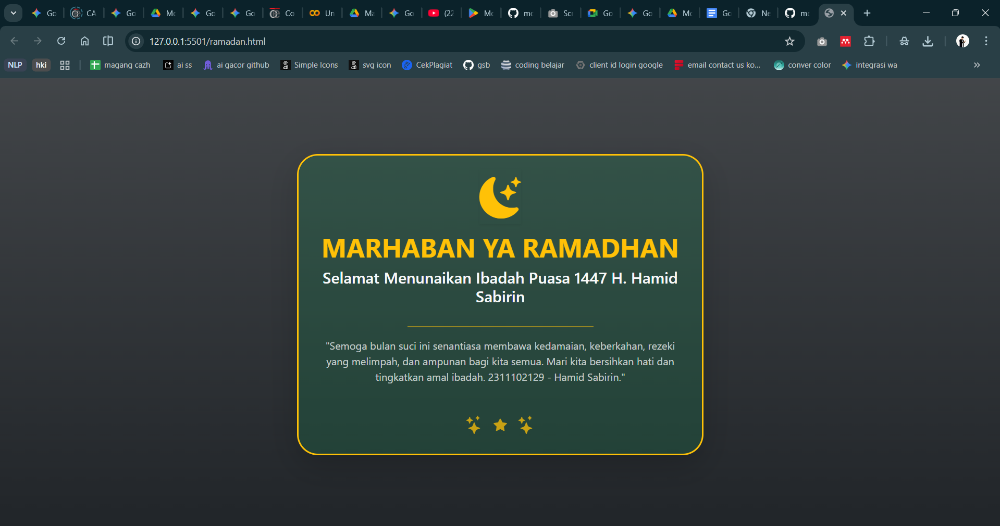

<div align="center">
  <br />
  <h1>LAPORAN PRAKTIKUM <br>APLIKASI BERBASIS PLATFORM</h1>
  <br />
  <h3>MODUL 4 <br> BOOTSTRAP</h3>
  <br />
  <br />
   
  <br />
  <br />
  <br />
  <br />
  <h3>Disusun Oleh :</h3>
  <p>
    <strong>HAMID SABIRIN</strong><br>
    <strong>2311102129</strong><br>
    <strong>S1 IF-11-REG01</strong>
  </p>
  <br />
  <h3>Dosen Pengampu :</h3>
  <p>
    <strong>Dimas Fanny Hebrasianto Permadi, S.ST., M.Kom</strong>
  </p>
  <br />
  <br />
    <h4>Asisten Praktikum :</h4>
    <strong> Apri Pandu Wicaksono </strong> <br>
    <strong>Rangga Pradarrell Fathi</strong>
  <br />
  <h3>LABORATORIUM HIGH PERFORMANCE
 <br>FAKULTAS INFORMATIKA <br>UNIVERSITAS TELKOM PURWOKERTO <br>2026</h3>
</div>

---

## 1. Dasar Teori

**Bootstrap** adalah kerangka kerja (*framework*) *open-source* untuk *front-end* yang sangat populer, diciptakan khusus untuk merancang antarmuka situs web dan aplikasi web agar lebih cepat dan mudah. Di dalamnya, Bootstrap berisi template desain berbasis HTML, CSS, serta JavaScript siap pakai yang dapat digunakan untuk mengatur tipografi, formulir, tombol, navigasi, dan komponen antarmuka lainnya.

Fitur paling krusial dari Bootstrap adalah sistem **Grid Responsive**-nya. Sistem *grid* ini menggunakan kontainer (*container*), baris (*row*), dan kolom (*column*) untuk menata letak layout yang dengan sendirinya bisa mengikuti berbagai varian ukuran layar piranti pengaksesnya (seperti PC, tablet, maupun *smartphone*).

Kelebihan utama menggunakan Bootstrap di antaranya adalah:
1. **Penghematan Waktu:** *Developer* tidak perlu menulis kode CSS dasar (seperti menetapkan margin tertentu, *display flex*, desain *card*, dll) dari nol.
2. **Konsistensi:** Menjamin tampilan antarmuka selaras di berbagai *browser* yang berbeda.
3. **Responsif secara Default:** Komponen bawaan sudah mendukung pergerakan desain *mobile-first*.

Bootstrap dapat digunakan secara luring dengan mengunduh *source file*-nya, maupun terhubung secara daring menggunakan metode *Content Delivery Network* (CDN).

---

## 2. Penjelasan Kode HTML

Berikut merupakan implementasi kartu ucapan Ramadhan berbasis *Native Bootstrap 5* murni dengan penggunaan berbagai *utilities class* tanpa menyertakan dokumen CSS tambahan apa pun, beserta hasil eksekusinya.

### Kode HTML (`ramadan.html`)

```html
<!DOCTYPE html>
<html lang="id">
<head>
    <meta charset="UTF-8">
    <meta name="viewport" content="width=device-width, initial-scale=1.0">
    <title>Tugas 4 - Marhaban Ya Ramadhan</title>
    
    <link href="https://cdn.jsdelivr.net/npm/bootstrap@5.3.3/dist/css/bootstrap.min.css" rel="stylesheet" integrity="sha384-QWTKZyjpPEjISv5WaRU9OFeRpok6YctnYmDr5pNlyT2bRjXh0JMhjY6hW+ALEwIH" crossorigin="anonymous">
    
    <link rel="stylesheet" href="https://cdn.jsdelivr.net/npm/bootstrap-icons@1.11.3/font/bootstrap-icons.min.css">
    
</head>
<body class="bg-dark bg-gradient text-light min-vh-100 d-flex justify-content-center align-items-center">

    <div class="container p-4">
        <div class="row justify-content-center">
            <div class="col-12 col-md-8 col-lg-6">
                
                <div class="card bg-success bg-opacity-25 border border-warning border-3 rounded-5 shadow-lg text-center p-3 p-md-4">
                    
                    <div class="display-3 text-warning mb-3">
                        <i class="bi bi-moon-stars-fill shadow-sm"></i>
                    </div>
                    
                    <h1 class="display-6 text-warning fw-bolder mb-2 text-uppercase">Marhaban Ya Ramadhan</h1>
                    <h4 class="fw-semibold text-light mb-3">Selamat Menunaikan Ibadah Puasa 1447 H. Hamid Sabirin</h4>
                    
                    <hr class="border-warning border-2 opacity-50 w-50 mx-auto mb-3">
                    
                    <p class="fs-6 text-light text-opacity-75 mb-4 px-md-3">
                        "Semoga bulan suci ini senantiasa membawa kedamaian, keberkahan, rezeki yang melimpah, dan ampunan bagi kita semua. Mari kita bersihkan hati dan tingkatkan amal ibadah. 2311102129 - Hamid Sabirin."
                    </p>
                    
                    <div class="mt-3 text-warning opacity-75 d-flex justify-content-center align-items-center gap-3 fs-3">
                        <i class="bi bi-stars"></i>
                        <i class="bi bi-star-fill fs-5"></i>
                        <i class="bi bi-stars"></i>
                    </div>

                </div>

            </div>
        </div>
    </div>

    <script src="https://cdn.jsdelivr.net/npm/bootstrap@5.3.3/dist/js/bootstrap.bundle.min.js" integrity="sha384-YvpcrYf0tY3lHB60NNkmxc5s9fDVZLESaAA55NDzOxhy9GkcIdslK1eN7N6jIeHz" crossorigin="anonymous"></script>
    
</body>
</html>
```

### Hasil Tampilan (Screenshot)



### Penjelasan Code:

- Pada baris **8-10**, dilakukan pemanggilan spesifik *library layout* Bootstrap dan paket *library* ikon dari Bootstrap Icons melalui metode rujukan tautan *Content Delivery Network* (CDN).
- Pada baris **13**, *class helper*-nya secara langsung dimanfaatkan di tag `<body>` HTML. `bg-dark` dan `bg-gradient` untuk membuat latar belakang menjadi gelap dengan pola *gradient* alami, lalu susunan `d-flex justify-content-center align-items-center` dan `min-vh-100` bertugas untuk menyuntikkan properti spesifik Flexbox yang akan mengunci area tampilan agar kartu ucapan berada persis di bagian tengah halaman setiap saat.
- Pada baris **15-17**, deklarasi sistem kolom grid dari Bootstrap diaktifkan dengan penempatan `container`, `row`, serta pembidikan *class grid responsif* dengan memanggil `col-12 col-md-8 col-lg-6`. Penggunaan sistem kolom ini bermakna: Elemen akan bernilai lebar maksimal (`col-12`) pada layar kecil seperti di handphone, akan setara sebesar rasio dua pertiga (`col-md-8`) di tampilan tablet, dan akan menciut di sepertiga tengah layar atau diperkecil secara proporsional ke lebar 6 lajur dari rasio maksimal total 12 grid (`col-lg-6`) saat mendapati layar laptop yang lebar.
- Pada baris **19**, pembuatan model elemen kartu dibentuk menggunakan komponen fundamental Bootstrap yakni `.card`. Adapun agar menghasilkan estetika temanya, berbagai *modifier utilities* dipadupadankan yakni `bg-success bg-opacity-25` agar menciptakan kesan transparansi kaca yang kehijauan, memanggil *border border-warning border-3* sebagai pewarnaan garis melingkar kunir tua, mengaplikasikan *rounded-5* untuk tingkat kurva di keempat sisi ujung kotak, dan *shadow-lg* untuk menampilkan semburat bayangan yang tajam.
- Pada baris **21-38**, penerapan elemen hias seperti ikon, font teks, serta spasi margin sepenuhnya memanfaatkan *utility layout* milik Bootstrap. Misal: Ukuran huruf dan tingkat ketebalannya ditugaskan dari `display-3`, `display-6`, dan `fs-6` (berpengaruh ke font size), `fw-bolder` (menggantikan font-weight biasa). Sedangkan spasi batas antara blok komponen satu dengan lain diatur secara harmonis menggunakan singkatan arah ukur spasi berupa `mb-3` (*margin-bottom: 1rem/16px*) atau format gabung padding `p-3 p-md-4` (*padding pada layar besar disetel ke skala 4*). Murni mendelegasikan perintah *class css* alih-alih merancang file selembar stylesheet khusus.
- Pada baris **46**, dilakukan pemanggilan modul paket fungsional penunjang Javascript bawaan Bootstrap (`bootstrap.bundle.min.js`) menggunakan metode koneksi CDN.

## Refrensi
- [Materi Modul 4](https://drive.google.com/file/d/1TW5Y0AdzkVk24ThPUf1OQNs2Mnw3XNO5/view?usp=sharing)