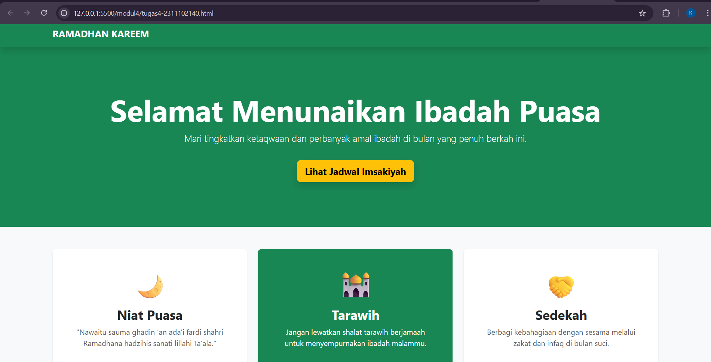

<div align="center">

# LAPORAN PRAKTIKUM  
## ALGORITMA PEMROGRAMAN

### MODUL 4  
### BOOTSTRAP

<br>


<br>

### Disusun Oleh
**Kanasya Abdi Aziz**  
2311102140  
S1 IF-11-01  

<br>

### Dosen Pengampu
**Dimas Fanny Hebrasianto Permadi, S.ST., M.Kom**

<br>

### Asisten Praktikum
Apri Pandu Wicaksono  
Rangga Pradarrell Fathi  

<br>

### Laboratorium High Performance  
Fakultas Informatika  
Universitas Telkom Purwokerto  
2026

</div>

---

# 1. Dasar Teori

**Bootstrap** adalah framework front-end open-source yang membantu mempercepat pengembangan tampilan web atau aplikasi web dengan menyediakan berbagai komponen berbasis **HTML, CSS, dan JavaScript** yang dapat digunakan secara langsung.

Bootstrap menyediakan berbagai komponen antarmuka seperti:

- tipografi  
- formulir  
- tombol  
- navigasi  
- kartu (*card*)  
- layout grid  

Salah satu fitur utama dari Bootstrap adalah **Sistem Grid Responsif**, yang terdiri dari tiga komponen utama yaitu:

- **Container**
- **Row**
- **Column**

Sistem ini memungkinkan tampilan website **menyesuaikan ukuran layar secara otomatis**, baik pada:

- smartphone  
- tablet  
- komputer  

---

## Kelebihan Bootstrap

Ada beberapa keuntungan menggunakan Bootstrap, antara lain:

### 1. Efisiensi Waktu

Karena Bootstrap sudah memiliki banyak komponen siap pakai, pengembang tidak perlu membuat CSS dari awal.  
Beberapa komponen yang sudah tersedia misalnya:

- margin dan padding  
- flexbox  
- card  
- button  
- layout grid  

### 2. Konsistensi Visual

Bootstrap membantu memastikan tampilan website tetap **konsisten di berbagai browser**, sehingga desain tidak berubah ketika dibuka di perangkat atau browser yang berbeda.

### 3. Responsif Sejak Awal

Sebagian besar komponen Bootstrap dibuat dengan pendekatan **mobile-first**, sehingga tampilan website sudah dirancang agar responsif sejak awal pengembangan.

---

### Cara Menggunakan Bootstrap

Bootstrap dapat digunakan dengan dua cara utama:

- **Offline**, yaitu dengan mengunduh file Bootstrap dan menyimpannya di dalam proyek.
- **Online**, yaitu menggunakan **CDN (Content Delivery Network)** sehingga file Bootstrap diambil langsung dari internet.

---

# 2. Penjelasan Kode (Tanpa Petunjuk)

Berikut adalah contoh penggunaan Bootstrap pada halaman ucapan **Ramadhan Kareem**.

## Kode HTML (`tugas4-2311102140.html`)

```html
<!DOCTYPE html>
<html lang="id">
<head>
    <meta charset="UTF-8">
    <meta name="viewport" content="width=device-width, initial-scale=1.0">
    <title>Ramadhan Kareem 1447H</title>
    <link href="https://cdn.jsdelivr.net/npm/bootstrap@5.3.0/dist/css/bootstrap.min.css" rel="stylesheet">
</head>
<body class="bg-light">

    <nav class="navbar navbar-expand-lg navbar-dark bg-success shadow">
        <div class="container">
            <a class="navbar-brand fw-bold" href="#">RAMADHAN KAREEM</a>
        </div>
    </nav>

    <header class="bg-success text-white text-center py-5 mb-5">
        <div class="container py-5">
            <h1 class="display-3 fw-bold">Selamat Menunaikan Ibadah Puasa</h1>
            <p class="lead">Mari tingkatkan ketaqwaan dan perbanyak amal ibadah di bulan yang penuh berkah ini.</p>
            <a href="#jadwal" class="btn btn-warning btn-lg fw-bold mt-3 shadow">Lihat Jadwal Imsakiyah</a>
        </div>
    </header>

    <div class="container">
        <div class="row g-4 text-center mb-5">
            <div class="col-md-4">
                <div class="card h-100 border-0 shadow-sm p-4">
                    <div class="card-body">
                        <h1 class="display-4 text-success mb-3">🌙</h1>
                        <h3 class="card-title fw-bold">Niat Puasa</h3>
                        <p class="card-text text-muted italic">"Nawaitu sauma ghadin 'an ada'i fardi shahri Ramadhana hadzihis sanati lillahi Ta'ala."</p>
                    </div>
                </div>
            </div>

            <div class="col-md-4">
                <div class="card h-100 border-0 shadow-sm p-4 text-white bg-success">
                    <div class="card-body">
                        <h1 class="display-4 mb-3">🕌</h1>
                        <h3 class="card-title fw-bold">Tarawih</h3>
                        <p class="card-text">Jangan lewatkan shalat tarawih berjamaah untuk menyempurnakan ibadah malammu.</p>
                    </div>
                </div>
            </div>

            <div class="col-md-4">
                <div class="card h-100 border-0 shadow-sm p-4">
                    <div class="card-body">
                        <h1 class="display-4 text-success mb-3">🤝</h1>
                        <h3 class="card-title fw-bold">Sedekah</h3>
                        <p class="card-text text-muted">Berbagi kebahagiaan dengan sesama melalui zakat dan infaq di bulan suci.</p>
                    </div>
                </div>
            </div>
        </div>
````

---

# Hasil Tampilan



---

# Penjelasan Kode

## 1. Integrasi Bootstrap 5

Pada bagian `<head>` terdapat link CDN Bootstrap:

```html
<link href="https://cdn.jsdelivr.net/npm/bootstrap@5.3.0/dist/css/bootstrap.min.css" rel="stylesheet">
```

Dengan menggunakan CDN ini, kita tidak perlu menulis CSS secara manual. Kita cukup menggunakan **kelas (class) yang sudah disediakan oleh Bootstrap** untuk mengatur tampilan halaman.

---

## 2. Struktur Navigasi dan Header

### Navbar

Navbar menggunakan kelas:

```
.navbar-dark
.bg-success
```

Kombinasi ini menghasilkan **navigasi berwarna hijau** yang sesuai dengan tema Ramadhan.

### Header (Hero Section)

Bagian header menggunakan kelas:

* `py-5` untuk memberi **padding vertikal**
* `display-3` untuk membuat ukuran teks judul sangat besar
* `fw-bold` untuk menebalkan teks

Hal ini membuat bagian header terlihat **menonjol dan elegan**.

---

## 3. Sistem Grid dan Kartu (Cards)

Bootstrap menggunakan **sistem grid 12 kolom**.

Pada kode ini, satu baris (`.row`) dibagi menjadi **tiga kolom** menggunakan:

```
.col-md-4
```

Artinya setiap kartu akan mengambil **4 dari 12 kolom** pada layar ukuran menengah ke atas.

Tiga kartu tersebut berisi:

* **Niat Puasa**
* **Tarawih**
* **Sedekah**

Beberapa kelas Bootstrap yang digunakan:

* `shadow-sm` → memberi bayangan halus
* `bg-success` → memberi latar belakang hijau
* `text-white` → mengubah warna teks menjadi putih

---

## 4. Tabel Jadwal Imsakiyah

Tabel dibuat menggunakan komponen Bootstrap agar tampil lebih rapi.

Beberapa kelas yang digunakan:

* `.table-hover`
  Memberikan efek highlight ketika baris tabel dilewati kursor.

* `.table-success`
  Memberikan warna hijau pada kolom **Maghrib**, sebagai penanda waktu berbuka puasa.

* `.rounded` dan `.shadow-sm`
  Membuat wadah tabel memiliki **sudut melengkung dan bayangan**, sehingga terlihat lebih modern.

---

# Referensi

* [Materi Modul 4](https://drive.google.com/file/d/1TW5Y0AdzkVk24ThPUf1OQNs2Mnw3XNO5/view)