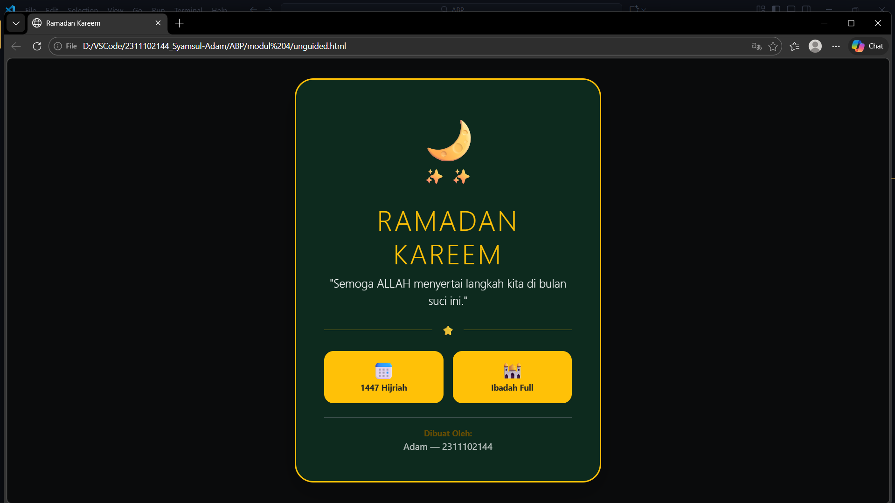

<div align="center">
  <br />
  <h1>LAPORAN PRAKTIKUM <br>APLIKASI BERBASIS PLATFORM</h1>
  <br />
  <h3>MODUL 4 <br> BOOTSTRAP</h3>
  <br />
  <br />
   
  <br />
  <br />
  <br />
  <br />
  <h3>Disusun Oleh :</h3>
  <p>
    <strong>Syamsul Adam</strong><br>
    <strong>2311102144</strong><br>
    <strong>S1 IF-11-01</strong>
  </p>
  <br />
  <h3>Dosen Pengampu :</h3>
  <p>
    <strong>Dimas Fanny Hebrasianto Permadi, S.ST., M.Kom</strong>
  </p>
  <br />
  <br />
    <h4>Asisten Praktikum :</h4>
    <strong> Apri Pandu Wicaksono </strong> <br>
    <strong>Rangga Pradarrell Fathi</strong>
  <br />
  <h3>LABORATORIUM HIGH PERFORMANCE
 <br>FAKULTAS INFORMATIKA <br>UNIVERSITAS TELKOM PURWOKERTO <br>2026</h3>
</div>

---

## 1. Dasar Teori

**Bootstrap** merupakan sebuah kerangka kerja (*framework*) *front-end* gratis dan terbuka yang paling banyak digunakan untuk mempercepat pembuatan desain website. Jika biasanya kita harus menulis kode CSS satu per satu secara manual, Bootstrap sudah menyediakan "cetakan" siap pakai berbasis HTML, CSS, dan JavaScript. Komponen seperti tombol, menu navigasi, hingga kolom formulir bisa langsung kita gunakan tanpa harus membuat desainnya dari nol.

Salah satu alasan utama Bootstrap sangat disukai adalah **Sistem Grid Responsif**-nya. Dengan menggunakan aturan *container*, *row*, dan *column*, kita bisa mengatur tata letak halaman yang secara otomatis menyesuaikan diri dengan ukuran layar, baik itu di monitor komputer yang lebar maupun layar *smartphone* yang kecil.

Beberapa kelebihan utama dari penggunaan Bootstrap antara lain:

1. **Efisiensi Waktu**  
  Pengembang tidak perlu lagi dipusingkan dengan pengaturan dasar seperti margin, *padding*, atau struktur *flexbox*. Semuanya sudah disediakan dalam bentuk *class* siap panggil.

2. **Konsistensi Tampilan**  
   Bootstrap menjamin tampilan website tetap terlihat rapi dan konsisten meskipun dibuka di berbagai jenis peramban (*browser*) yang berbeda.

3. **Responsif Secara Default**  
   Sejak awal, komponen di dalamnya sudah dirancang agar pas untuk tampilan ponsel, sehingga website kita otomatis menjadi responsif tanpa perlu banyak modifikasi tambahan.

Bootstrap bisa digunakan secara **offline** dengan mengunduh filenya langsung, atau secara **online** yang lebih praktis lewat jalur **CDN (Content Delivery Network)**.


### Kode HTML

```html
<!DOCTYPE html>
<html lang="id">

<head>
    <meta charset="UTF-8">
    <meta name="viewport" content="width=device-width, initial-scale=1.0">
    <title>Ramadan Kareem</title>
    <link href="https://cdn.jsdelivr.net/npm/bootstrap@5.3.0/dist/css/bootstrap.min.css" rel="stylesheet">
</head>

<body class="bg-dark text-white vh-100 d-flex justify-content-center align-items-center" 
      style="background: linear-gradient(rgba(0,0,0,0.7), rgba(0,0,0,0.7)), url('https://images.unsplash.com/photo-1548013146-72479768bbaa?auto=format&fit=crop&q=80&w=1600') center/cover;">

    <div class="container">
        <div class="row justify-content-center">
            <div class="col-11 col-sm-10 col-md-8 col-lg-5">
                <div class="p-4 p-md-5 bg-success bg-opacity-25 border border-warning border-3 rounded-5 shadow-lg text-center" 
                     style="backdrop-filter: blur(8px);">
                    
                    <div class="mb-4">
                        <span class="display-1 text-warning">🌙</span>
                        <div class="d-flex justify-content-center gap-2 mt-n3">
                            <span class="fs-3 text-light">✨</span>
                            <span class="fs-3 text-light">✨</span>
                        </div>
                    </div>

                    <h1 class="display-5 fw-black text-warning text-uppercase mb-2" style="letter-spacing: 3px;">
                        Ramadan Kareem
                    </h1>
                    <p class="lead text-light mb-4 italic">"Semoga ALLAH menyertai langkah kita di bulan suci ini."</p>

                    <div class="d-flex align-items-center justify-content-center mb-4">
                        <div class="flex-grow-1 border-bottom border-warning opacity-50"></div>
                        <span class="mx-3 text-warning">⭐</span>
                        <div class="flex-grow-1 border-bottom border-warning opacity-50"></div>
                    </div>

                    <div class="row g-3 mb-4 text-dark">
                        <div class="col-6">
                            <div class="bg-warning p-3 rounded-4 shadow-sm h-100">
                                <h3 class="m-0">📅</h3>
                                <small class="fw-bold">1447 Hijriah</small>
                            </div>
                        </div>
                        <div class="col-6">
                            <div class="bg-warning p-3 rounded-4 shadow-sm h-100">
                                <h3 class="m-0">🕌</h3>
                                <small class="fw-bold">Ibadah Full</small>
                            </div>
                        </div>
                    </div>

                    <div class="mt-4 pt-3 border-top border-secondary border-opacity-50">
                        <p class="small text-warning-emphasis mb-0 fw-bold">Dibuat Oleh:</p>
                        <p class="text-light opacity-75 mb-0">Adam — 2311102144</p>
                    </div>
                </div>
            </div>
        </div>
    </div>

    <script src="https://cdn.jsdelivr.net/npm/bootstrap@5.3.0/dist/js/bootstrap.bundle.min.js"></script>
</body>

</html>
```

### Hasil Tampilan (Screenshot)

 

### Penjelasan Code

Program ini merupakan sebuah aplikasi web responsif yang dirancang untuk menyampaikan ucapan selamat menunaikan ibadah puasa dengan memanfaatkan kerangka kerja Bootstrap 5.3. Secara visual, halaman ini mengadopsi tema religius yang elegan dengan latar belakang gambar mesjid yang dilapisi oleh filter gelap dan efek backdrop blur untuk memastikan keterbacaan konten utama. Kartu ucapan di bagian tengah menggunakan perpaduan kelas utilitas Bootstrap seperti bg-opacity dan border-warning untuk menciptakan estetika bingkai emas, sementara elemen dekoratif seperti emoji bulan sabit dan bintang memperkuat nuansa spiritual bulan Ramadan secara modern.

Secara teknis, pengembangan program ini mengutamakan efisiensi kode dengan meminimalisir penggunaan CSS asli dan memaksimalkan sistem grid serta utility classes bawaan Bootstrap. Penggunaan fitur Flexbox pada elemen body menjamin kartu ucapan selalu berada di pusat layar pada berbagai resolusi perangkat, sementara sistem baris (row) dan kolom (col) digunakan untuk menyusun informasi tambahan secara terstruktur. Dengan menggabungkan desain kartu yang melengkung (rounded-5) dan bayangan yang tegas (shadow-lg), program ini berhasil mendemonstrasikan bagaimana komponen UI siap pakai dapat dirangkai menjadi antarmuka yang tematik, interaktif, dan fungsional bagi pengguna.

## Refrensi

- [Materi Modul 4](https://drive.google.com/file/d/1TW5Y0AdzkVk24ThPUf1OQNs2Mnw3XNO5/view?usp=sharing)