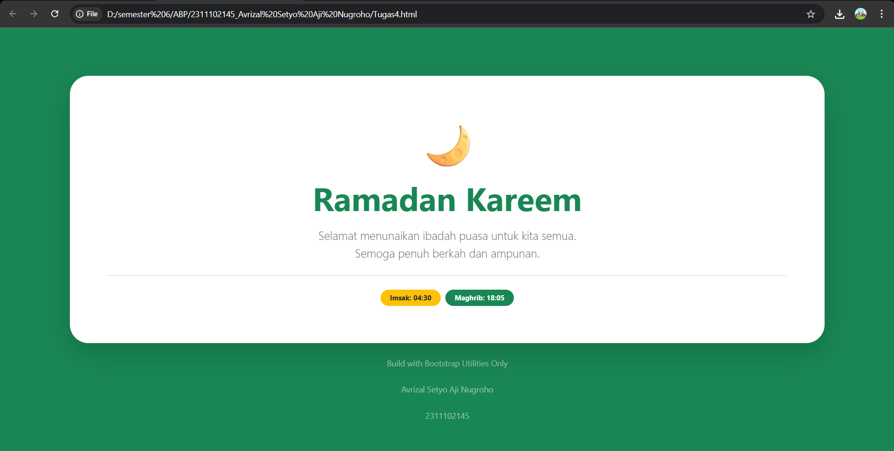

<div align="center">
  <br />
  <h1>LAPORAN PRAKTIKUM <br>APLIKASI BERBASIS PLATFORM</h1>
  <br />
  <h3>MODUL 4 <br> BOOTSTRAP</h3>
  <br />
  <br />
   
  <br />
  <br />
  <br />
  <h3>Disusun Oleh :</h3>
  <p>
    <strong>Avrizal Setyo Aji Nugroho</strong><br>
    <strong>2311102145</strong><br>
    <strong>S1 IF-11-01</strong>
  </p>
  <br />
  <h3>Dosen Pengampu :</h3>
  <p>
    <strong>Dimas Fanny Hebrasianto Permadi, S.ST., M.Kom</strong>
  </p>
  <br />
  <br />
    <h4>Asisten Praktikum :</h4>
    <strong> Apri Pandu Wicaksono </strong> <br>
    <strong>Rangga Pradarrell Fathi</strong>
  <br />
  <h3>LABORATORIUM HIGH PERFORMANCE
 <br>FAKULTAS INFORMATIKA <br>UNIVERSITAS TELKOM PURWOKERTO <br>2026</h3>
</div>

---

## 1. Dasar Teori

**Bootstrap** merupakan sebuah kerangka kerja (_framework_) _front-end_ gratis dan terbuka yang paling banyak digunakan untuk mempercepat pembuatan desain website. Jika biasanya kita harus menulis kode CSS satu per satu secara manual, Bootstrap sudah menyediakan "cetakan" siap pakai berbasis HTML, CSS, dan JavaScript. Komponen seperti tombol, menu navigasi, hingga kolom formulir bisa langsung kita gunakan tanpa harus membuat desainnya dari nol.

Salah satu alasan utama Bootstrap sangat disukai adalah **Sistem Grid Responsif**-nya. Dengan menggunakan aturan _container_, _row_, dan _column_, kita bisa mengatur tata letak halaman yang secara otomatis menyesuaikan diri dengan ukuran layar, baik itu di monitor komputer yang lebar maupun layar _smartphone_ yang kecil.

Beberapa kelebihan utama dari penggunaan Bootstrap antara lain:

1. **Efisiensi Waktu**  
   Pengembang tidak perlu lagi dipusingkan dengan pengaturan dasar seperti margin, _padding_, atau struktur _flexbox_. Semuanya sudah disediakan dalam bentuk _class_ siap panggil.

2. **Konsistensi Tampilan**  
   Bootstrap menjamin tampilan website tetap terlihat rapi dan konsisten meskipun dibuka di berbagai jenis peramban (_browser_) yang berbeda.

3. **Responsif Secara Default**  
   Sejak awal, komponen di dalamnya sudah dirancang agar pas untuk tampilan ponsel, sehingga website kita otomatis menjadi responsif tanpa perlu banyak modifikasi tambahan.

## Bootstrap bisa digunakan secara **offline** dengan mengunduh filenya langsung, atau secara **online** yang lebih praktis lewat jalur **CDN (Content Delivery Network)**.

## 2. Penjelasan Kode HTML

Berikut ini adalah implementasi tabel berdasarkan struktur dasar HTML murni beserta hasil tampilannya.

### Kode HTML (`table.html`)

```html
<!DOCTYPE html>
<html lang="id">
  <head>
    <meta charset="UTF-8" />
    <meta name="viewport" content="width=device-width, initial-scale=1.0" />
    <title>Tugas4_Avrizal Setyo Aji Nugroho</title>
    <link
      href="https://cdn.jsdelivr.net/npm/bootstrap@5.3.0/dist/css/bootstrap.min.css"
      rel="stylesheet"
    />
  </head>

  <body
    class="bg-success d-flex align-items-center justify-content-center vh-100"
  >
    <div class="container text-center">
      <div class="card bg-white shadow-lg border-0 rounded-5 p-5">
        <div class="card-body">
          <div class="display-1 mb-3">🌙</div>

          <h1 class="fw-bold text-success display-4 mb-3">Ramadan Kareem</h1>

          <p class="lead text-muted mb-4">
            Selamat menunaikan ibadah puasa untuk kita semua. <br />
            Semoga penuh berkah dan ampunan.
          </p>

          <hr class="my-4 text-success opacity-25" />

          <div class="d-flex justify-content-center gap-2">
            <span class="badge rounded-pill bg-warning text-dark px-3 py-2"
              >Imsak: 04:30</span
            >
            <span class="badge rounded-pill bg-success px-3 py-2"
              >Maghrib: 18:05</span
            >
          </div>
        </div>
      </div>

      <p class="text-white-50 mt-4 small">
        Build with Bootstrap Utilities Only
      </p>
      <p class="text-white-50 mt-4 small">Avrizal Setyo Aji Nugroho</p>
      <p class="text-white-50 mt-4 small">2311102145</p>
    </div>

    <script src="https://cdn.jsdelivr.net/npm/bootstrap@5.3.0/dist/js/bootstrap.bundle.min.js"></script>
  </body>
</html>
```

### Hasil Tampilan (Screenshot)



### Penjelasan Code

#### A. Integrasi dan Struktur Dasar

- **Koneksi Bootstrap (CDN)**: Di dalam bagian `<head>`, saya mengintegrasikan pustaka Bootstrap melalui CDN menggunakan elemen `<link>`. Metode ini sangat efisien karena memungkinkan penggunaan fitur desain profesional seperti sistem grid dan utilitas CSS secara instan tanpa perlu file lokal tambahan.
- **Struktur Kontainer**: Seluruh konten utama ditempatkan di dalam `<div class="container">` dengan _class_ `text-center`. Hal ini memastikan semua elemen di dalam kartu tersusun rapi secara simetris di tengah halaman.

#### B. Analisis Styling via Utility Classes

Proyek ini mengandalkan sepenuhnya pada **Utility Classes** dari Bootstrap 5 untuk mencapai desain yang bersih:

- **Pusat Tata Letak (Flexbox)**: Pada elemen `body`, saya menerapkan kombinasi kelas `d-flex`, `align-items-center`, dan `justify-content-center`. Penggunaan `vh-100` memastikan kartu terpusat secara presisi di tengah layar pada berbagai ukuran perangkat.
- **Desain Kartu (Card Design)**:
  - **Warna & Bayangan**: Menggunakan `bg-white` untuk kontras yang bersih dengan latar belakang hijau (`bg-success`). Efek kedalaman diberikan melalui kelas `shadow-lg`, sementara sudut yang sangat tumpul (`rounded-5`) memberikan kesan modern.
  - **Padding**: Memberikan ruang dalam yang luas menggunakan `p-5` agar konten lebih nyaman dipandang.
- **Tipografi & Warna**:
  - **Judul Utama**: Teks "Ramadan Kareem" menggunakan `display-4` untuk ukuran yang menonjol serta `fw-bold` dan `text-success` untuk memperkuat tema Ramadan.
  - **Teks Pendukung**: Kelas `lead` dan `text-muted` digunakan pada ucapan puasa untuk menciptakan hierarki visual yang baik.

#### C. Komponen Dekoratif dan Identitas

- **Badge Pill**: Jadwal "Imsak" dan "Maghrib" ditampilkan menggunakan komponen `badge rounded-pill` dengan warna `bg-warning` dan `bg-success` sebagai penanda visual yang jelas.
- **Identitas Penulis**: Nama (**Avrizal Setyo Aji Nugroho**) dan NIM (**2311102145**) diletakkan di bagian bawah menggunakan _class_ `text-white-50` dan `small` agar terlihat estetis di atas latar belakang hijau.

---

## Refrensi

- [Materi Modul 4](https://drive.google.com/file/d/1TW5Y0AdzkVk24ThPUf1OQNs2Mnw3XNO5/view?usp=sharing)
