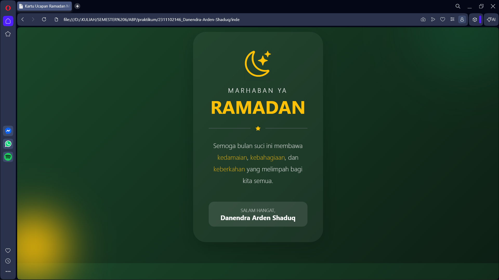

<div align="center">
  <br />
  <h1>LAPORAN PRAKTIKUM <br>APLIKASI BERBASIS PLATFORM</h1>
  <br />
  <h3>MODUL 4 <br> BOOTSTRAP</h3>
  <br />
  <br />
   
  <br />
  <br />
  <br />
  <br />
  <h3>Disusun Oleh :</h3>
  <p>
    <strong>DANENDRA ARDEN SHADUQ</strong><br>
    <strong>2311102146</strong><br>
    <strong>S1 IF-11-REG01</strong>
  </p>
  <br />
  <h3>Dosen Pengampu :</h3>
  <p>
    <strong>Dimas Fanny Hebrasianto Permadi, S.ST., M.Kom</strong>
  </p>
  <br />
  <br />
    <h4>Asisten Praktikum :</h4>
    <strong> Apri Pandu Wicaksono </strong> <br>
    <strong>Rangga Pradarrell Fathi</strong>
  <br />
  <h3>LABORATORIUM HIGH PERFORMANCE
 <br>FAKULTAS INFORMATIKA <br>UNIVERSITAS TELKOM PURWOKERTO <br>2026</h3>
</div>

---

## 1. Dasar Teori

Bootstrap merupakan salah satu framework front-end yang digunakan untuk mempermudah proses pengembangan antarmuka (interface) pada sebuah website. Framework ini menyediakan berbagai komponen desain berbasis HTML, CSS, dan JavaScript seperti tombol, navigasi, form, tabel, serta elemen tata letak yang siap digunakan. Dengan adanya Bootstrap, pengembang web dapat membuat tampilan website yang lebih rapi, konsisten, dan menarik tanpa harus menuliskan kode CSS dari awal. Selain itu, Bootstrap bersifat open source sehingga dapat digunakan secara bebas oleh siapa saja dalam proses pengembangan aplikasi web.

Salah satu keunggulan utama Bootstrap adalah kemampuannya dalam membuat desain responsif, yaitu tampilan website yang dapat menyesuaikan dengan berbagai ukuran layar perangkat, mulai dari smartphone hingga komputer desktop. Hal ini didukung oleh sistem grid yang menggunakan kombinasi container, row, dan column untuk mengatur tata letak elemen pada halaman web. Selain itu, Bootstrap juga menyediakan berbagai class tambahan untuk mengatur teks, gambar, tombol, tabel, dan form sehingga proses pembuatan tampilan web menjadi lebih cepat, efisien, dan terstruktur.

---

## 2. Penjelasan Kode HTML

Berikut adalah penerapan desain kartu ucapan Ramadhan yang dibuat menggunakan Bootstrap 5 murni dengan memanfaatkan berbagai *utility class* yang tersedia, tanpa menambahkan file CSS tambahan, serta dilengkapi dengan hasil tampilan dari implementasi tersebut.

### Kode HTML (`index.html`)

```html
<!DOCTYPE html>
<html lang="id">
<head>
    <meta charset="UTF-8">
    <meta name="viewport" content="width=device-width, initial-scale=1.0">
    <title>Kartu Ucapan Ramadan Modern</title>
    <link href="https://cdn.jsdelivr.net/npm/bootstrap@5.3.0/dist/css/bootstrap.min.css" rel="stylesheet">
    <link rel="stylesheet" href="https://cdn.jsdelivr.net/npm/bootstrap-icons@1.11.0/font/bootstrap-icons.css">
</head>
<body class="bg-dark d-flex align-items-center justify-content-center vh-100 p-4" 
      style="background: linear-gradient(135deg, #1a472a 0%, #0d1f14 100%); overflow: hidden;">

    <div class="position-absolute rounded-circle bg-success opacity-25" style="width: 300px; height: 300px; top: -100px; right: -50px; filter: blur(80px);"></div>
    <div class="position-absolute rounded-circle bg-warning opacity-10" style="width: 200px; height: 200px; bottom: -50px; left: -50px; filter: blur(60px);"></div>

    <div class="card border-0 shadow-lg text-white text-center" 
         style="max-width: 400px; border-radius: 2.5rem; background: rgba(255, 255, 255, 0.05); backdrop-filter: blur(15px); border: 1px solid rgba(255, 255, 255, 0.1);">
        
        <div class="card-body p-5">
            <div class="mb-4">
                <i class="bi bi-moon-stars text-warning display-1 shadow-sm"></i>
            </div>

            <h5 class="text-uppercase fw-lighter tracking-widest mb-1" style="letter-spacing: 0.3rem;">Marhaban Ya</h5>
            <h1 class="display-4 fw-black mb-4 text-warning" style="font-weight: 650;">RAMADAN</h1>
            
            <div class="d-flex align-items-center justify-content-center mb-4 text-white-50">
                <div class="flex-grow-1 border-bottom border-secondary"></div>
                <i class="bi bi-star-fill mx-3 text-warning small"></i>
                <div class="flex-grow-1 border-bottom border-secondary"></div>
            </div>

            <p class="lead fw-light mb-5 opacity-75" style="line-height: 1.8;">
                Semoga bulan suci ini membawa <span class="text-warning">kedamaian</span>, 
                <span class="text-warning">kebahagiaan</span>, dan <span class="text-warning">keberkahan</span> yang melimpah bagi kita semua.
            </p>

            <div class="bg-white bg-opacity-10 py-3 rounded-4">
                <p class="small mb-0 opacity-50 text-uppercase">Salam Hangat,</p>
                <p class="h5 mb-0 fw-bold">Danendra Arden Shaduq</p>
            </div>
        </div>
    </div>
</body>
</html>
```

### Hasil Tampilan (Screenshot)



### Penjelasan Code:

* Pada baris **1–4**, kode mendefinisikan struktur dasar dokumen HTML. `<!DOCTYPE html>` menunjukkan bahwa dokumen menggunakan standar **HTML5**, sedangkan tag `<html lang="id">` menandakan bahwa bahasa utama halaman adalah Bahasa Indonesia. Selanjutnya, pada bagian `<head>` dimasukkan metadata seperti `<meta charset="UTF-8">` untuk mendukung berbagai karakter teks dan `<meta name="viewport">` yang memastikan tampilan halaman dapat menyesuaikan ukuran layar perangkat sehingga bersifat responsif.

* Pada baris **6–7**, dua *library* eksternal dimuat menggunakan metode **CDN (Content Delivery Network)** melalui tag `<link>`. Baris pertama memanggil `bootstrap.min.css` yang berisi seluruh aturan CSS Bootstrap seperti sistem grid, komponen kartu, tipografi, serta berbagai *utility class*. Baris kedua memanggil `bootstrap-icons.css` yang menyediakan kumpulan ikon vektor siap pakai yang dapat digunakan langsung pada elemen HTML.

* Pada baris **10–11**, berbagai *utility class* Bootstrap diterapkan pada tag `<body>` untuk mengatur tata letak halaman. `bg-dark` memberikan latar belakang gelap, `d-flex` mengaktifkan sistem **Flexbox**, `align-items-center` dan `justify-content-center` menempatkan konten tepat di tengah secara vertikal dan horizontal, `vh-100` memastikan tinggi halaman memenuhi seluruh tinggi layar, serta `p-4` menambahkan jarak *padding* di sekitar konten agar tidak menempel pada tepi layar.

* Pada baris **13–14**, dua elemen `<div>` digunakan sebagai dekorasi latar belakang berbentuk lingkaran. Kelas `position-absolute` memungkinkan elemen ditempatkan secara bebas pada halaman, `rounded-circle` membentuk lingkaran sempurna, sementara `bg-success` dan `bg-warning` memberi warna hijau dan kuning. Properti `opacity` dan `filter: blur()` digunakan untuk menciptakan efek cahaya kabur sehingga tampilan halaman terlihat lebih modern dan artistik.

* Pada baris **16**, komponen utama kartu dibuat menggunakan kelas `.card` dari Bootstrap. Kelas tambahan seperti `border-0` menghilangkan garis tepi kartu, `shadow-lg` memberikan bayangan tebal agar kartu terlihat memiliki kedalaman, `text-white` membuat seluruh teks berwarna putih, dan `text-center` memusatkan isi teks di dalam kartu. Properti tambahan seperti `border-radius`, `backdrop-filter: blur`, dan `background: rgba(...)` memberikan efek **glassmorphism** yang membuat kartu tampak seperti kaca transparan.

* Pada baris **20–22**, ikon bulan dan bintang ditampilkan menggunakan **Bootstrap Icons** dengan tag `<i class="bi bi-moon-stars">`. Pembungkus `<div>` menggunakan kelas `display-1` untuk memperbesar ukuran ikon, `text-warning` untuk memberikan warna kuning keemasan, serta `shadow-sm` untuk menambahkan bayangan ringan sehingga ikon tampak lebih menonjol.

* Pada baris **24–25**, judul kartu ucapan ditampilkan menggunakan tag `<h5>` dan `<h1>`. Kelas `text-uppercase` mengubah teks menjadi huruf kapital, `fw-lighter` membuat ketebalan huruf lebih tipis, sedangkan `display-4` memperbesar ukuran teks utama “RAMADAN”. Penambahan `text-warning` memberi warna kuning yang kontras dengan latar belakang gelap sehingga judul terlihat lebih menonjol.

* Pada baris **27–31**, elemen dekoratif pemisah dibuat menggunakan sistem Flexbox. Kelas `d-flex align-items-center justify-content-center` menyejajarkan elemen secara horizontal dan vertikal di tengah, sedangkan `flex-grow-1 border-bottom` membuat garis horizontal di kedua sisi. Ikon bintang di tengah (`bi-star-fill`) diberi kelas `text-warning` dan `mx-3` untuk memberi warna kuning serta jarak kiri-kanan sehingga berfungsi sebagai ornamen pemisah.

* Pada baris **33–37**, paragraf ucapan Ramadan ditampilkan menggunakan tag `<p>` dengan kelas `lead`, `fw-light`, dan `opacity-75`. Kelas `lead` membuat ukuran teks sedikit lebih besar dari paragraf biasa, `fw-light` memberikan ketebalan font yang ringan, sedangkan `opacity-75` memberi efek transparansi agar teks terlihat lebih lembut. Beberapa kata seperti *kedamaian*, *kebahagiaan*, dan *keberkahan* diberi kelas `text-warning` untuk menonjolkan pesan penting dalam ucapan.

* Pada baris **39–42**, bagian penutup kartu menampilkan identitas pengirim. Elemen `<div>` menggunakan kelas `bg-white bg-opacity-10` untuk menciptakan latar belakang putih transparan, `py-3` untuk menambahkan padding vertikal, serta `rounded-4` untuk membuat sudut kotak menjadi membulat. Di dalamnya terdapat teks penutup “Salam Hangat” serta nama pengirim **Danendra Arden Shaduq** yang ditampilkan menggunakan kelas `fw-bold` agar terlihat lebih tegas dan menonjol.

## Refrensi
- [Materi Modul 4](https://drive.google.com/file/d/1TW5Y0AdzkVk24ThPUf1OQNs2Mnw3XNO5/view?usp=sharing)
- [Bootstrap 5 Official Documentation](https://getbootstrap.com/docs/5.3/)
- [Bootstrap Icons](https://icons.getbootstrap.com/)
- [Bootstrap Grid System](https://getbootstrap.com/docs/5.3/layout/grid/)