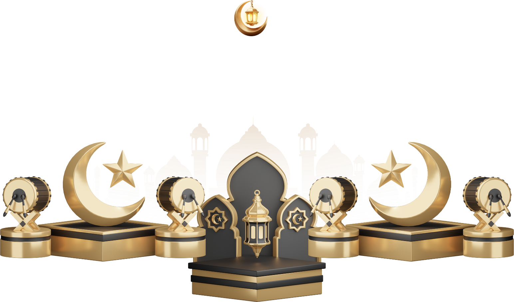
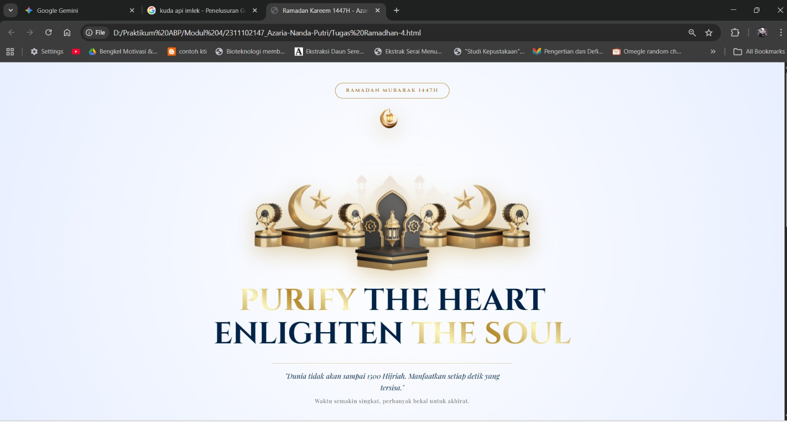
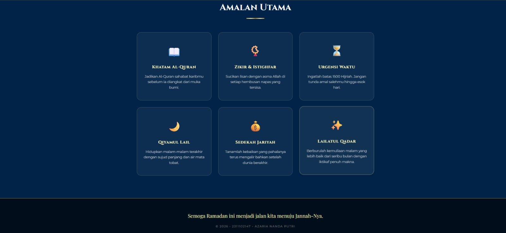

<div align="center">
  <br />
  <h1>LAPORAN PRAKTIKUM <br>APLIKASI BERBASIS PLATFORM</h1>
  <br />
  <h2>MODUL 4 <br> BOOTSTRAP </h2>
  <br />
  <br />
   
  <br />
  <br />
  <br />
  <h3>Disusun Oleh :</h3>
  <p>
    <strong>Satrio Wibowo</strong><br>
    <strong>2311102149</strong><br>
    <strong>S1 IF-11-REG 01</strong>
  </p>
  <br />
  <h3>Dosen Pengampu :</h3>
  <p>
    <strong>Dimas Fanny Hebrasianto Permadi, S.ST., M.Kom</strong>
  </p>
  <br />
  <br />
    <h4>Asisten Praktikum :</h4>
    <strong> Apri Pandu Wicaksono </strong> <br>
    <strong>Rangga Pradarrell Fathi</strong>
  <br />
  <h2>LABORATORIUM HIGH PERFORMANCE
 <br>FAKULTAS INFORMATIKA <br>UNIVERSITAS TELKOM PURWOKERTO <br>2026</h2>
</div>

---
# 1. Dasar Teori

## Pengenalan Bootstrap dalam Pengembangan Web

Bootstrap merupakan sebuah *framework front-end* yang bersifat gratis dan *open-source* yang digunakan untuk membantu proses pembuatan antarmuka (*user interface*) website secara lebih cepat dan efisien. Framework ini pertama kali dikembangkan oleh **Mark Otto** dan **Jacob Thornton** ketika bekerja di Twitter dan dirilis pada tahun 2011.

Bootstrap menyediakan berbagai komponen siap pakai yang berbasis **HTML, CSS, dan JavaScript**, seperti navigasi, tombol, formulir, kartu (*card*), grid layout, serta berbagai komponen interaktif lainnya. Dengan menggunakan Bootstrap, pengembang tidak perlu membuat desain dari awal karena sebagian besar elemen antarmuka sudah tersedia dalam bentuk *class* yang dapat langsung digunakan.

Salah satu keunggulan utama Bootstrap adalah kemampuannya dalam menghasilkan **desain responsif**, yaitu tampilan website dapat menyesuaikan secara otomatis dengan ukuran layar perangkat, baik pada smartphone, tablet, maupun komputer desktop.

---

## Cara Menggunakan Bootstrap

Bootstrap dapat digunakan dalam proyek web melalui beberapa metode integrasi, yaitu:

### 1. Menggunakan File Lokal
Metode ini dilakukan dengan cara **mengunduh file Bootstrap** kemudian menyimpannya di dalam folder proyek. File CSS dan JavaScript dari Bootstrap kemudian dipanggil pada dokumen HTML menggunakan tag `<link>` dan `<script>`.

Keuntungan metode ini adalah proyek dapat dijalankan **tanpa memerlukan koneksi internet**, karena seluruh file Bootstrap sudah tersedia secara lokal.

### 2. Menggunakan CDN (Content Delivery Network)

Metode ini dilakukan dengan menambahkan **link CDN Bootstrap** langsung pada dokumen HTML. Browser akan mengambil file Bootstrap dari server penyedia CDN seperti jsDelivr atau Bootstrap CDN.

Keunggulan metode ini adalah proses integrasi lebih **praktis dan tidak menambah ukuran proyek**, namun halaman web membutuhkan koneksi internet agar file Bootstrap dapat dimuat oleh browser.

---

## Sistem Layout Bootstrap

Bootstrap menggunakan sistem tata letak yang dikenal sebagai **Bootstrap Grid System**. Sistem ini membantu pengembang dalam mengatur posisi elemen halaman menggunakan struktur utama:

- **Container** → pembungkus utama konten
- **Row** → baris untuk mengatur struktur
- **Column** → kolom tempat konten berada

Sistem grid ini berbasis **Flexbox**, sehingga mampu menyesuaikan tata letak secara responsif pada berbagai ukuran layar.

---

## Komponen dan Utilitas Bootstrap

Bootstrap menyediakan berbagai *utility class* yang dapat digunakan untuk mengatur tampilan elemen HTML tanpa perlu menulis CSS secara manual.

Beberapa fitur yang tersedia antara lain:

### Pengaturan Teks
Bootstrap menyediakan kelas untuk mengatur tampilan teks seperti:

- `.text-center` untuk memposisikan teks di tengah
- `.fw-bold` untuk membuat teks tebal
- `.fst-italic` untuk membuat teks miring

### Tombol
Bootstrap menyediakan berbagai variasi tombol yang dapat digunakan dengan menambahkan class `.btn` dan variasi warna seperti:

- `.btn-primary`
- `.btn-success`
- `.btn-danger`
- `.btn-warning`

### Formulir
Bootstrap juga menyediakan gaya khusus untuk elemen formulir menggunakan class seperti `.form-control`, sehingga tampilan input menjadi lebih rapi dan konsisten di berbagai browser.

---

# 2. Unguided

Berikut merupakan implementasi halaman **kartu ucapan Ramadan** menggunakan **HTML dan CSS** dengan desain modern yang memanfaatkan teknik layout, tipografi, serta animasi sederhana agar tampilan halaman menjadi lebih menarik.

## Kode HTML (`tugas-4.html`)

```html
<!DOCTYPE html>
<html lang="id">
<head>
    <meta charset="UTF-8">
    <meta name="viewport" content="width=device-width, initial-scale=1.0">
    <title>Ramadan Kareem 1447H - Azaria Nanda Putri</title>
    
    <link href="https://fonts.googleapis.com/css2?family=Cinzel:wght@400;700&family=Montserrat:wght@300;400;600&family=Playfair+Display:ital,wght@0,400;0,700;1,400&display=swap" rel="stylesheet">

    <style>
        :root {
            --gold: linear-gradient(45deg, #bf953f, #fcf6ba, #b38728, #fbf5b7, #aa771c);
            --royal-blue: #002347;
            --deep-blue: #001a33;
            --marble-white: #ffffff;
            --soft-gray: #f4f7f6;
        }

        * {
            margin: 0;
            padding: 0;
            box-sizing: border-box;
        }

        body {
            font-family: 'Montserrat', sans-serif;
            background-color: var(--marble-white);
            color: var(--royal-blue);
            line-height: 1.6;
            overflow-x: hidden;
        }

        .container {
            max-width: 1100px;
            margin: 0 auto;
            padding: 0 20px;
        }

        /* --- HERO SECTION --- */
        .hero-ramadan {
            min-height: 100vh;
            display: flex;
            align-items: center;
            justify-content: center;
            text-align: center;
            background: radial-gradient(circle at center, #ffffff 0%, #e8efff 100%);
            position: relative;
            padding: 60px 0;
        }

        .badge-spiritual {
            display: inline-block;
            padding: 10px 30px;
            border: 1px solid #b38728;
            border-radius: 50px;
            font-family: 'Cinzel', serif;
            color: #b38728;
            font-weight: 700;
            margin-bottom: 30px;
            letter-spacing: 3px;
            text-transform: uppercase;
            font-size: 0.9rem;
        }

        /* PERUBAHAN DISINI: UKURAN GAMBAR DIPERBESAR */
        .visual-lamp {
            width: 100%;
            max-width: 800px; /* Ukuran diperbesar sesuai permintaan */
            margin: 0 auto 40px;
            display: block;
            filter: drop-shadow(0 15px 30px rgba(179, 135, 40, 0.4));
            animation: float 5s ease-in-out infinite;
        }

        .main-title {
            font-family: 'Cinzel', serif;
            font-size: clamp(2.5rem, 8vw, 5.5rem); /* Sedikit lebih besar */
            line-height: 1.1;
            margin-bottom: 35px;
            text-transform: uppercase;
        }

        .gold-text {
            background: var(--gold);
            -webkit-background-clip: text;
            -webkit-text-fill-color: transparent;
            font-weight: 700;
        }

        .reminder-box {
            font-family: 'Playfair Display', serif;
            max-width: 700px;
            margin: 0 auto;
            padding: 20px;
            border-top: 1px solid rgba(179, 135, 40, 0.3);
        }

        .reminder-text {
            font-style: italic;
            font-size: 1.3rem;
            color: var(--royal-blue);
            margin-bottom: 10px;
        }

        .sub-reminder {
            font-size: 1rem;
            color: #666;
            letter-spacing: 1px;
        }

        /* --- AMALAN SECTION (Gaya Lunar Tradisional) --- */
        .traditions-section {
            padding: 100px 0;
            background-color: var(--royal-blue);
            color: #fff;
            position: relative;
        }

        .section-title {
            text-align: center;
            margin-bottom: 60px;
        }

        .section-title h2 {
            font-family: 'Cinzel', serif;
            font-size: 2.5rem;
            margin-bottom: 15px;
        }

        .divider-gold {
            width: 80px;
            height: 3px;
            background: var(--gold);
            margin: 0 auto;
        }

        .grid-amalan {
            display: grid;
            grid-template-columns: repeat(auto-fit, minmax(250px, 1fr));
            gap: 30px;
        }

        .glass-card-islamic {
            background: rgba(255, 255, 255, 0.05);
            backdrop-filter: blur(15px);
            border: 1px solid rgba(252, 246, 186, 0.2);
            padding: 45px 30px;
            border-radius: 20px;
            text-align: center;
            transition: all 0.4s ease;
        }

        .glass-card-islamic:hover {
            transform: translateY(-15px);
            background: rgba(255, 255, 255, 0.1);
            border-color: #fcf6ba;
            box-shadow: 0 15px 35px rgba(0,0,0,0.4);
        }

        .icon-box {
            font-size: 3rem;
            margin-bottom: 20px;
            display: block;
        }

        .glass-card-islamic h3 {
            font-family: 'Cinzel', serif;
            color: #fcf6ba;
            margin-bottom: 15px;
            letter-spacing: 1px;
        }

        .glass-card-islamic p {
            font-size: 0.95rem;
            opacity: 0.8;
            font-weight: 300;
        }

        /* --- FOOTER --- */
        footer {
            background-color: #000d1a;
            padding: 60px 20px;
            text-align: center;
            border-top: 2px solid #b38728;
        }

        .footer-wish {
            font-family: 'Playfair Display', serif;
            font-size: 1.4rem;
            color: #fcf6ba;
            margin-bottom: 20px;
        }

        .copyright {
            font-size: 0.8rem;
            color: rgba(255, 255, 255, 0.4);
            letter-spacing: 2px;
            text-transform: uppercase;
        }

        /* --- ANIMATIONS --- */
        @keyframes float {
            0%, 100% { transform: translateY(0); }
            50% { transform: translateY(-20px); }
        }

        @media (max-width: 768px) {
            .main-title { font-size: 2.5rem; }
            .grid-amalan { grid-template-columns: 1fr; }
        }
    </style>
</head>
<body>

    <header class="hero-ramadan">
        <div class="container">
            <div class="badge-spiritual">Ramadan Mubarak 1447H</div>
            
            

            <h1 class="main-title">
                <span class="gold-text">PURIFY</span> THE HEART<br>
                ENLIGHTEN <span class="gold-text">THE SOUL</span>
            </h1>
            
            <div class="reminder-box">
                <p class="reminder-text">"Dunia tidak akan sampai 1500 Hijriah. Manfaatkan setiap detik yang tersisa."</p>
                <p class="sub-reminder">Waktu semakin singkat, perbanyak bekal untuk akhirat.</p>
            </div>
        </div>
    </header>

   <section class="traditions-section">
        <div class="container">
            <div class="section-title">
                <h2>Amalan Utama</h2>
                <div class="divider-gold"></div>
            </div>

            <div class="grid-amalan">
                <div class="glass-card-islamic">
                    <span class="icon-box">📖</span>
                    <h3>Khatam Al-Quran</h3>
                    <p>Jadikan Al-Quran sahabat karibmu sebelum ia diangkat dari muka bumi.</p>
                </div>
                <div class="glass-card-islamic">
                    <span class="icon-box">📿</span>
                    <h3>Zikir & Istighfar</h3>
                    <p>Sucikan lisan dengan asma Allah di setiap hembusan napas yang tersisa.</p>
                </div>
                <div class="glass-card-islamic">
                    <span class="icon-box">⏳</span>
                    <h3>Urgensi Waktu</h3>
                    <p>Ingatlah batas 1500 Hijriah. Jangan tunda amal salehmu hingga esok hari.</p>
                </div>
                <div class="glass-card-islamic">
                    <span class="icon-box">🌙</span>
                    <h3>Qiyamul Lail</h3>
                    <p>Hidupkan malam-malam terakhir dengan sujud panjang dan air mata tobat.</p>
                </div>
                <div class="glass-card-islamic">
                    <span class="icon-box">💰</span>
                    <h3>Sedekah Jariyah</h3>
                    <p>Tanamlah kebaikan yang pahalanya terus mengalir bahkan setelah dunia berakhir.</p>
                </div>
                <div class="glass-card-islamic">
                    <span class="icon-box">✨</span>
                    <h3>Lailatul Qadar</h3>
                    <p>Berburulah kemuliaan malam yang lebih baik dari seribu bulan dengan iktikaf penuh makna.</p>
                </div>
            </div>
        </div>
    </section>
    <footer>
        <div class="container">
            <p class="footer-wish">Semoga Ramadan ini menjadi jalan kita menuju Jannah-Nya.</p>
            <p class="copyright">&copy; 2026 • 2311102147 - Azaria Nanda Putri</p>
        </div>
    </footer>

</body>
</html>
```

---

# Hasil Tampilan




---

# Penjelasan Kode

## 1. Bagian Head

Pada bagian `<head>` terdapat beberapa elemen penting yang berfungsi untuk mengatur konfigurasi halaman web.

- **Meta Charset (`UTF-8`)**  
  Digunakan untuk menentukan standar pengkodean karakter agar teks dapat ditampilkan dengan benar pada berbagai browser.

- **Meta Viewport**  
  Digunakan agar tampilan halaman dapat menyesuaikan ukuran layar perangkat sehingga halaman menjadi **responsif**.

- **Google Fonts**  
  Pada bagian ini terdapat pemanggilan beberapa jenis font seperti **Cinzel**, **Montserrat**, dan **Playfair Display** yang digunakan untuk memperindah tampilan teks.

- **Style CSS Internal**  
  Seluruh desain visual halaman ditulis langsung di dalam tag `<style>` yang berisi pengaturan warna, tata letak, animasi, serta efek visual lainnya.

---

## 2. Variabel Warna

    Pada bagian awal CSS digunakan **CSS Custom Properties** dengan selector `:root` untuk mendefinisikan beberapa variabel warna seperti:
    
    - `--gold`
    - `--royal-blue`
    - `--deep-blue`
    - `--marble-white`

    Penggunaan variabel ini memudahkan pengelolaan warna karena dapat digunakan berulang kali di berbagai bagian CSS.

---

## 3. Hero Section

    Bagian **hero section** merupakan bagian pertama yang tampil pada halaman.
    Elemen ini menggunakan class `.hero-ramadan` yang memiliki beberapa pengaturan seperti:

    - tinggi minimum halaman (`min-height: 100vh`)
    - penggunaan **flexbox** untuk memusatkan konten
    - latar belakang menggunakan **radial gradient**

    Di dalamnya terdapat beberapa elemen utama seperti:

    - badge Ramadan Mubarak
    - gambar lampu Ramadan
    - judul utama
    - pesan pengingat

---

## 4. Judul Utama

    Judul utama menggunakan class `.main-title` dengan font **Cinzel** sehingga memberikan kesan elegan.
    Sebagian teks menggunakan class `.gold-text` yang memanfaatkan **gradient warna emas** sehingga menghasilkan efek teks berwarna emas.

---

## 5. Reminder Box

    Bagian `.reminder-box` digunakan untuk menampilkan kutipan pengingat tentang pentingnya memanfaatkan waktu selama Ramadan.
    Teks menggunakan font **Playfair Display** dengan gaya **italic** sehingga terlihat seperti kutipan reflektif.

---

## 6. Section Amalan Ramadan

    Bagian ini berada pada elemen `<section class="traditions-section">`.
    Section ini memiliki latar belakang berwarna **biru gelap** dan berisi beberapa amalan yang dapat dilakukan selama bulan Ramadan.
    Judul section ditampilkan menggunakan `.section-title` dengan tambahan elemen garis dekoratif `.divider-gold`.

---

## 7. Grid Layout Amalan

    Daftar amalan ditampilkan menggunakan **CSS Grid** melalui class `.grid-amalan`.
    Properti berikut digunakan:

    ```
    grid-template-columns: repeat(auto-fit, minmax(250px, 1fr));
    ```
    Artinya setiap kartu akan menyesuaikan jumlah kolom secara otomatis berdasarkan ukuran layar.

---

## 8. Card Amalan

    Setiap amalan ditampilkan dalam bentuk **card** menggunakan class `.glass-card-islamic`.
    Card ini memiliki beberapa efek visual seperti:

    - efek **glassmorphism**
    - border transparan
    - animasi hover yang mengangkat kartu

    Setiap card berisi:

    - ikon emoji
    - judul amalan
    - deskripsi singkat

---

## 9. Animasi Floating

    Gambar lampu Ramadan menggunakan animasi `@keyframes float`.
    Animasi ini membuat gambar bergerak naik turun secara perlahan sehingga memberikan efek **melayang** dan membuat halaman terlihat lebih hidup.

---

## 10. Footer

    Bagian `<footer>` berada di bagian paling bawah halaman dengan latar belakang gelap.

    Footer berisi:

    - pesan harapan Ramadan
    - informasi hak cipta
    - identitas pembuat halaman

---

# 3. Referensi

- [Materi Modul 4](https://drive.google.com/file/d/1Qxsa7wNn3PNrDLYzgBKb62GZi4mPkoub/view?usp=drive_link)
