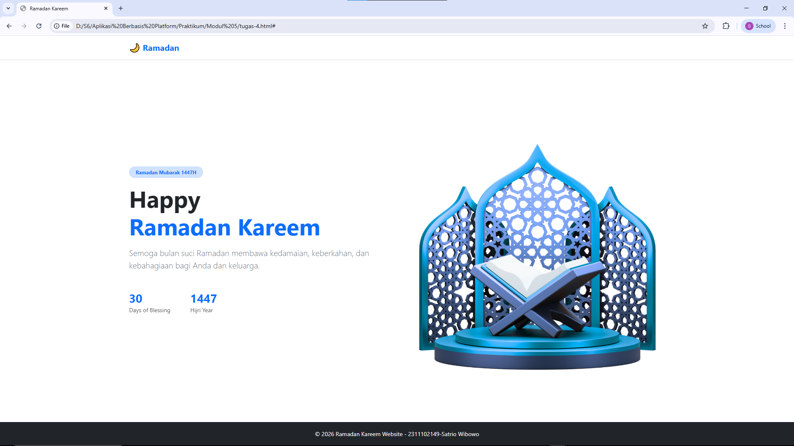

<div align="center">
  <br />
  <h1>LAPORAN PRAKTIKUM <br>APLIKASI BERBASIS PLATFORM</h1>
  <br />
  <h2>MODUL 4 <br> BOOTSTRAP </h2>
  <br />
  <br />
   
  <br />
  <br />
  <br />
  <h3>Disusun Oleh :</h3>
  <p>
    <strong>Satrio Wibowo</strong><br>
    <strong>2311102149</strong><br>
    <strong>S1 IF-11-REG 01</strong>
  </p>
  <br />
  <h3>Dosen Pengampu :</h3>
  <p>
    <strong>Dimas Fanny Hebrasianto Permadi, S.ST., M.Kom</strong>
  </p>
  <br />
  <br />
    <h4>Asisten Praktikum :</h4>
    <strong> Apri Pandu Wicaksono </strong> <br>
    <strong>Rangga Pradarrell Fathi</strong>
  <br />
  <h2>LABORATORIUM HIGH PERFORMANCE
 <br>FAKULTAS INFORMATIKA <br>UNIVERSITAS TELKOM PURWOKERTO <br>2026</h2>
</div>

---

# 1. Dasar Teori

## Panduan Dasar Bootstrap untuk Pengembangan Web

**Apa itu Bootstrap?**
Bootstrap adalah *framework front-end* gratis dan bersifat *open-source* yang dirancang untuk mempercepat serta mempermudah pembuatan antarmuka (*user interface*) situs web. Awalnya dikembangkan oleh Mark Otto dan Jacob Thornton di Twitter (dirilis pada Agustus 2011), Bootstrap menyediakan kumpulan *template* HTML, CSS, dan *plugin* JavaScript siap pakai untuk berbagai elemen seperti tipografi, formulir, tombol, navigasi, hingga korsel gambar (*image carousel*). 

Keunggulan utama Bootstrap adalah kemampuannya dalam menciptakan desain yang responsif; tata letak halaman akan otomatis menyesuaikan diri dengan rapi di berbagai ukuran layar, mulai dari ponsel pintar hingga monitor *desktop*.

---

## Metode Pemasangan Bootstrap
Anda bisa mengintegrasikan Bootstrap ke dalam proyek web melalui dua cara utama:

1. **Metode Lokal:** Anda mengunduh seluruh *file* sumber (*source code*) Bootstrap dan menyimpannya di dalam folder proyek Anda. *File* CSS dan JS kemudian dipanggil menggunakan teknik *External Style Sheet*. 
   * *Keuntungan:* Proyek dapat berjalan sepenuhnya tanpa memerlukan koneksi internet (karena semua aset tersedia secara luring).
2. **Metode CDN (*Content Delivery Network*):** Anda cukup menyematkan tautan (*link*) khusus yang mengarah langsung ke server pihak ketiga (seperti jsDelivr) di dalam baris kode HTML Anda. 
   * *Keuntungan:* Menghemat kapasitas penyimpanan proyek, namun metode ini mewajibkan perangkat terhubung ke internet agar *browser* bisa memuat aset tersebut.

---

## Sistem Tata Letak: *Bootstrap Grid*
Sistem *grid* pada Bootstrap mengandalkan hierarki elemen berupa *container*, *row* (baris), dan *column* (kolom) untuk menyusun tata letak konten. Karena dibangun menggunakan teknologi *flexbox*, sistem *grid* ini sangat fleksibel dan responsif terhadap berbagai ukuran layar perangkat.

---

## Format Teks (*Text Styling*)
Bootstrap menyediakan berbagai *class* praktis untuk mengatur tipografi elemen HTML tanpa harus menulis CSS manual:

* **Perataan Teks:** `.text-left` (kiri), `.text-center` (tengah), `.text-right` (kanan).
* **Kapitalisasi:** `.text-lowercase` (huruf kecil semua), `.text-uppercase` (huruf besar semua), `.text-capitalize` (huruf awal kapital di setiap kata).
* **Ketebalan & Gaya Huruf:** `.fw-bold` (tebal), `.fw-light` (tipis), `.fw-normal` (standar), `.fst-italic` (miring).
* **Ukuran Judul:** `.h1` hingga `.h6` (menyesuaikan ukuran teks persis seperti elemen *heading* standar HTML).

---

## Desain Tombol (*Buttons*)
Untuk meningkatkan pengalaman pengguna (*User Experience*), Bootstrap menyulap tombol standar menjadi lebih modern. Anda bisa menggunakan *class* dasar `.btn` yang dipadukan dengan *class* warna berikut:

* `.btn-primary`: Biru (aksi utama)
* `.btn-secondary`: Abu-abu (aksi sekunder/standar)
* `.btn-danger`: Merah (peringatan kritis/hapus)
* `.btn-success`: Hijau (berhasil/konfirmasi)
* `.btn-warning`: Kuning (perhatian)
* `.btn-info`: Biru muda (informasi)
* `.btn-link`: Mengubah tombol menyerupai tautan teks biasa (*hyperlink*)

---

## Pengaturan Formulir (*Forms*)
Bootstrap juga merapikan tampilan elemen *input* formulir agar konsisten di semua *browser* menggunakan *class* utama `.form-control`. Tersedia tiga gaya tata letak formulir yang bisa Anda terapkan:

1. **Vertikal (*Default*):** Tampilan standar jika tidak ada *class* tambahan. Label dan kotak *input* akan tersusun memanjang ke bawah.
2. ***Inline*:** Menggunakan *utility classes* khusus agar seluruh elemen formulir berjajar menyamping dalam satu baris (cocok untuk formulir pencarian ringkas).
3. **Horizontal:** Memanfaatkan sistem *Grid* Bootstrap (kombinasi *class* `.row` dan `.col-*`) untuk menempatkan label teks dan kotak *input* secara berdampingan dengan ukuran kolom yang presisi.

# 2. Unguided

Berikut merupakan implementasi kartu ucapan Ramadhan berbasis Native Bootstrap 5 murni dengan penggunaan berbagai utilities class tanpa menyertakan dokumen CSS tambahan apa pun, beserta hasil eksekusinya.

## Kode HTML (`tugas-4.html`)
```html
<!DOCTYPE html>
<html lang="id">
<head>
    <meta charset="UTF-8">
    <meta name="viewport" content="width=device-width, initial-scale=1.0">
    <title>Ramadan Kareem</title>
    <link href="https://cdn.jsdelivr.net/npm/bootstrap@5.3.2/dist/css/bootstrap.min.css" rel="stylesheet">
</head>

<body class="bg-light d-flex flex-column min-vh-100">

    <nav class="navbar navbar-expand-lg navbar-light bg-white shadow-sm">
        <div class="container">
            <a class="navbar-brand fw-bold text-primary" href="#">🌙 Ramadan</a>
            <button class="navbar-toggler" type="button" data-bs-toggle="collapse" data-bs-target="#navbarNav">
                <span class="navbar-toggler-icon"></span>
            </button>
            <div class="collapse navbar-collapse justify-content-end" id="navbarNav">
            </div>
        </div>
    </nav>

    <main class="bg-white flex-grow-1 d-flex align-items-center">
        <section class="container py-5">
            <div class="row align-items-center">
                <div class="col-lg-6">
                    <span class="badge bg-primary-subtle text-primary mb-3 px-3 py-2 rounded-pill">
                        Ramadan Mubarak 1447H
                    </span>
                    <h1 class="display-4 fw-bold mb-3">
                        Happy <br>
                        <span class="text-primary">Ramadan Kareem</span>
                    </h1>
                    <p class="lead text-secondary mb-4">
                        Semoga bulan suci Ramadan membawa kedamaian, keberkahan, dan kebahagiaan bagi Anda dan keluarga.
                    </p>
                    <div class="d-flex gap-5 mt-5">
                        <div>
                            <h3 class="fw-bold text-primary mb-0">30</h3>
                            <small class="text-muted">Days of Blessing</small>
                        </div>
                        <div>
                            <h3 class="fw-bold text-primary mb-0">1447</h3>
                            <small class="text-muted">Hijri Year</small>
                        </div>
                    </div>
                </div>

                <div class="col-lg-6 text-center mt-5 mt-lg-0">
                    
                </div>
            </div>
        </section>
    </main>

    <footer class="bg-dark text-light text-center py-3 mt-auto">
        <small>© 2026 Ramadan Kareem Website - 2311102149-Satrio Wibowo</small>
    </footer>

    <script src="https://cdn.jsdelivr.net/npm/bootstrap@5.3.2/dist/js/bootstrap.bundle.min.js"></script>
</body>
</html>
```

## Hasil


## Penjelasan Kode
### A. Bagian Head
* **Meta Charset & Viewport**: Mengatur pengkodean karakter UTF-8 dan memastikan halaman bersifat responsif di berbagai ukuran perangkat.
* **Bootstrap CDN**: Menghubungkan file CSS eksternal dari Bootstrap untuk styling instan tanpa CSS manual.

### B. Bagian Body (Layouting)
* **Flexbox Container**: Menggunakan class `d-flex flex-column min-vh-100` pada body untuk memastikan tinggi halaman minimal setinggi layar (viewport).
* **Sticky Footer**: Penggunaan `flex-grow-1` pada tag `<main>` dan `mt-auto` pada `<footer>` berfungsi untuk mendorong footer agar selalu berada di dasar halaman.

---

### C. Komponen Utama

1. **Navigasi (`<nav>`)**
    - Menggunakan navbar putih dengan bayangan tipis (`bg-white shadow-sm`).
    - Brand menggunakan ikon bulan `🌙` dengan teks berwarna biru (`text-primary`).

2. **Area Konten (`<main>`)**
Menggunakan sistem grid Bootstrap untuk membagi konten menjadi dua kolom (`col-lg-6`):
* **Kolom Teks**: 
    * Menampilkan Badge "Ramadan Mubarak 1447H".
    * Judul utama menggunakan `display-4` untuk tipografi yang besar.
    * Terdapat data statistik "30 Days" dan "1447 Hijri" menggunakan flexbox (`d-flex gap-5`).
* **Kolom Gambar**: 
    * Memuat file `dekorasi.png` dengan class `img-fluid` agar gambar tidak melebihi lebar layar.

3.**Footer**
* Menggunakan tema gelap (`bg-dark`) dengan teks putih (`text-light`).
* Berisi informasi hak cipta dan identitas mahasiswa.

---

### D. Class Bootstrap Utama
| Class | Fungsi |
| :--- | :--- |
| `container` | Menjaga konten tetap di tengah dengan padding sisi kanan-kiri. |
| `text-primary` | Memberikan warna biru khas Bootstrap. |
| `rounded-pill` | Membuat elemen (badge) memiliki sudut melengkung sempurna seperti kapsul. |
| `py-5` | Memberikan jarak (padding) vertikal sebesar level 5. |

# 3. Referensi
- [Materi Modul 4](https://drive.google.com/file/d/1Qxsa7wNn3PNrDLYzgBKb62GZi4mPkoub/view?usp=drive_link)
