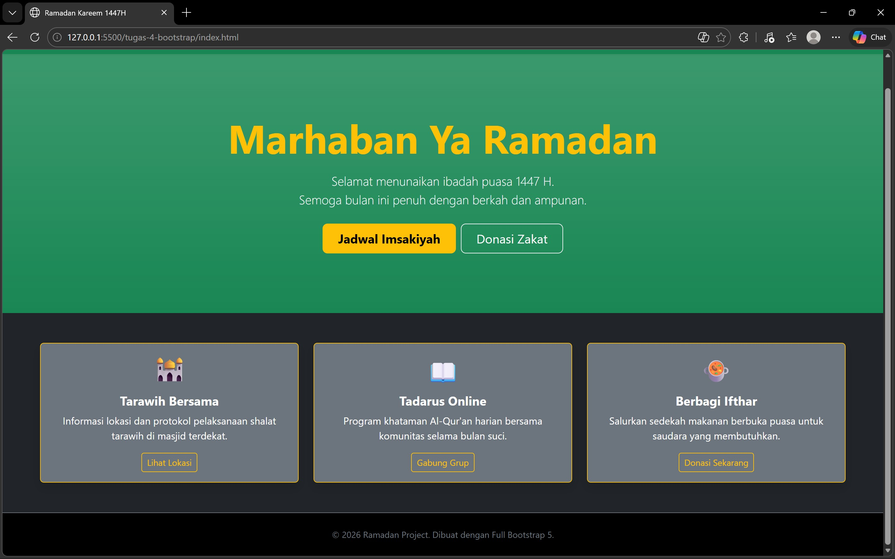

<div align="center">
  <br />
  <h1>LAPORAN PRAKTIKUM <br>APLIKASI BERBASIS PLATFORM</h1>
  <br />
  <h3>MODUL 4 <br> Bootstrap </h3>
  <br />
   
  <br />
  <br />
  <br />
  <h3>Disusun Oleh :</h3>
  <p>
    <strong>Nisrina Amalia Iffatunnisa</strong><br>
    <strong>2311102156</strong><br>
    <strong>S1 IF-11-01</strong>
  </p>
  <br />
  <h3>Dosen Pengampu :</h3>
  <p>
    <strong>Dimas Fanny Hebrasianto Permadi, S.ST., M.Kom</strong>
  </p>
  <br />
  <br />
    <h4>Asisten Praktikum :</h4>
    <strong> Apri Pandu Wicaksono </strong> <br>
    <strong>Rangga Pradarrell Fathi</strong>
  <br />
  <h3>LABORATORIUM HIGH PERFORMANCE
 <br>FAKULTAS INFORMATIKA <br>UNIVERSITAS TELKOM PURWOKERTO <br>2026</h3>
</div>

---

## Dasar Teori
#### Pengenalan Bootstrap
Bootstrap merupakan sebuah front-end framework gratis untuk pengembangan antar muka web yang lebih cepat dan lebih mudah. Dikembangkan oleh Mark Otto dan Jacom Thornton di Twitter dan dirilis sebagai produk open source pada Agustus 2011 di GitHub. Bootstrap mencakup template desain berbasis HTML dan CSS untuk tipografi, form, button, navigasi, modal, image carousells dan masih banyak lagi, serta terdapat opsional plugin JavaScript. Selain itu, Bootstrap memiliki kemampuan untuk membuat desain responsif yang secara otomatis menyesuaikan diri agar terlihat baik di segala perangkat, mulai dari perangkat ponsel hingga desktop pc.

### Pemasangan Bootstrap
Pemasangan Bootstrap dalam pengembangan antarmuka web dapat dilakukan melalui dua metode utama, yaitu:
- Metode Lokal:
Proses dilakukan dengan mengunduh kode sumber secara utuh dari situs resmi Bootstrap. File CSS dan JavaScript kemudian disimpan di direktori proyek dan dipanggil menggunakan teknik External Style Sheet. Metode ini menjamin ketergantungan aset tetap tersedia tanpa memerlukan koneksi internet.
- Metode CDN (Content Delivery Network):
Proses integrasi dilakukan dengan menyisipkan tautan (link) referensi langsung ke server penyedia pihak ketiga (seperti jsDelivr). Metode ini lebih efisien dalam hal manajemen ruang penyimpanan, namun membutuhkan koneksi internet aktif agar peramban dapat memuat aset CSS dan JavaScript terkait.

### Bootstrap Grid
Sistem grid pada Bootstrap menggunakan rangkaian container, rows dan column untuk tata letak dan keselarasan elemen atau konten. Dibangun dengan flexbox dan sangat responsif terhadap perangkat yang digunakan untuk menampilkan laman web.

### Text Style
Bootstrap menyediakan banyak class untuk mengatur style sebuah teks elemen HTML. Beberapa contohnya antara lain:
- .text-left: Mengatur teks menjadi rata kiri dalam sebuah elemen. 
- .text-center: Mengatur teks menjadi rata tengah dalam sebuah elemen. 
- .text-right: Mengatur teks menjadi rata kanan dalam sebuah elemen. 
- .text-lowercase: Mengatur seluruh teks pada elemen menjadi huruf kecil. 
- .text-uppercase: Mengatur seluruh teks pada elemen menjadi huruf besar. 
- .text-capitalize: Menjadikan huruf pertama besar untuk setiap kata pada sebuah elemen. 
- .fw-bold: Mengatur ketebalan huruf menjadi bold.
- .fw-light Mengatur ketebalah huruf menjadi light 
- .fw-normal Mengatur ketebalan huruf menjadi normal 
- .fst-italic Mengatur gaya teks menjadi miring 
- .h1 s.d .h6 Mengatur seluruh teks pada sebuah elemen sehingga memiliki tampilan selayaknya tag elemen H1 s.d H6 pada HTML.

### Bootstrap Button
Akan membuat tampilan button menjadi lebih menarik dan memberikan user experience yang baik. Class yang digunakan secara default adalah .btn namun dengan disertai class lain seperti berikut untuk memberikan perubahan warna dan ukuran button:
- .btn-primary: Membuat tampilan button dengan desain utama 
- .btn-secondary: Membuat tampilan button dengan ukuran medium (standar) dan desain “secondary” 
- .btn-danger: Membuat tampilan button dengan desain berwarna merah 
- .btn-success: Membuat tampilan button dengan desain berwarna hijau 
- .btn-warning: Membuat tampilan button dengan desain berwarna kuning 
- .btn-info: Membuat tampilan button dengan desain sebuah informasi 
- .btn-link: Membuat tampilan button dengan desain sebuah hyperlink

### Bootstrap Form
Bootstrap menyediakan perubahan elemen form pada HTML baik pada segi tata letak tampilan atau tampilan antarmuka elemen-elemen dalam form. Class `.form-control` digunakan untuk sebagian besar elemen input dalam tag `<form>` untuk memberikan styling yang konsisten. Ada beberapa cara untuk mengatur tata letak tampilan form di Bootstrap:
1. Vertical Form (Default): Ini merupakan tampilan default saat tag form tidak didefinisikan class khusus. Setiap elemen form akan ditampilkan secara vertikal. 
2. Inline Form: Untuk membuat form inline di Bootstrap, Anda dapat menggunakan utility classes tertentu pada container form. Ini akan membuat elemen-elemen form berada dalam satu baris. 
3. Horizontal Form: Untuk membuat form horizontal di Bootstrap, Anda dapat menggunakan sistem grid Bootstrap. Gunakan class .row pada container dan `.col-*` untuk mengatur lebar kolom label dan input.

##  Unguided 

### 1. Implementasi Bootstrap

```HTML
<!DOCTYPE html>
<html lang="id">
<head>
    <meta charset="UTF-8">
    <meta name="viewport" content="width=device-width, initial-scale=1.0">
    <title>Ramadan Kareem 1447H</title>
    <link href="https://cdn.jsdelivr.net/npm/bootstrap@5.3.2/dist/css/bootstrap.min.css" rel="stylesheet">
</head>

<body class="bg-dark text-light">

    <!-- Navbar -->
    <nav class="navbar navbar-expand-lg navbar-dark bg-success shadow-sm">
        <div class="container">
            <a class="navbar-brand fw-bold" href="#">🌙 RAMADAN KAREEM</a>
        </div>
    </nav>

    <!-- Hero Section -->
    <section class="py-5 text-center bg-success bg-gradient">
        <div class="container py-5">
            <h1 class="display-3 fw-bold text-warning mb-3">Marhaban Ya Ramadan</h1>
            <p class="lead mb-4">
                Selamat menunaikan ibadah puasa 1447 H. <br>
                Semoga bulan ini penuh dengan berkah dan ampunan.
            </p>

            <div class="d-grid gap-2 d-sm-flex justify-content-sm-center">
                <button type="button" class="btn btn-warning btn-lg px-4 fw-bold">
                    Jadwal Imsakiyah
                </button>
                <button type="button" class="btn btn-outline-light btn-lg px-4">
                    Donasi Zakat
                </button>
            </div>
        </div>
    </section>

    <!-- Card Section -->
    <div class="container my-5">
        <div class="row g-4">

            <div class="col-md-4">
                <div class="card h-100 bg-secondary text-white border-warning shadow">
                    <div class="card-body text-center">
                        <div class="display-6 mb-3">🕌</div>
                        <h5 class="card-title fw-bold">Tarawih Bersama</h5>
                        <p class="card-text">
                            Informasi lokasi dan protokol pelaksanaan shalat tarawih di masjid terdekat.
                        </p>
                        <a href="#" class="btn btn-sm btn-outline-warning">
                            Lihat Lokasi
                        </a>
                    </div>
                </div>
            </div>

            <div class="col-md-4">
                <div class="card h-100 bg-secondary text-white border-warning shadow">
                    <div class="card-body text-center">
                        <div class="display-6 mb-3">📖</div>
                        <h5 class="card-title fw-bold">Tadarus Online</h5>
                        <p class="card-text">
                            Program khataman Al-Qur'an harian bersama komunitas selama bulan suci.
                        </p>
                        <a href="#" class="btn btn-sm btn-outline-warning">
                            Gabung Grup
                        </a>
                    </div>
                </div>
            </div>

            <div class="col-md-4">
                <div class="card h-100 bg-secondary text-white border-warning shadow">
                    <div class="card-body text-center">
                        <div class="display-6 mb-3">🍲</div>
                        <h5 class="card-title fw-bold">Berbagi Ifthar</h5>
                        <p class="card-text">
                            Salurkan sedekah makanan berbuka puasa untuk saudara yang membutuhkan.
                        </p>
                        <a href="#" class="btn btn-sm btn-outline-warning">
                            Donasi Sekarang
                        </a>
                    </div>
                </div>
            </div>

        </div>
    </div>

    <!-- Footer -->
    <footer class="py-4 bg-black text-center border-top border-secondary">
        <div class="container">
            <p class="text-secondary mb-0 small">
                &copy; 2026 Ramadan Project. Dibuat dengan Full Bootstrap 5.
            </p>
        </div>
    </footer>

    <!-- Bootstrap JS -->
    <script src="https://cdn.jsdelivr.net/npm/bootstrap@5.3.2/dist/js/bootstrap.bundle.min.js"></script>

</body>
</html>
```
Kode tersebut merupakan halaman web bertema Ramadan yang dibangun sepenuhnya menggunakan framework Bootstrap versi 5.3 melalui CDN. Seluruh tata letak dan tampilan memanfaatkan class bawaan Bootstrap seperti container, row, dan col-md-4 untuk sistem grid, serta utility class seperti bg-dark, text-light, py-5, dan fw-bold untuk pengaturan warna, tipografi, dan spacing. Sehingga tidak diperlukan CSS tambahan karena Bootstrap sudah menyediakan komponen dan utilitas yang lengkap.

Struktur halaman terdiri dari beberapa bagian utama, yaitu navbar, hero section, card section, dan footer. Navbar menggunakan komponen navbar dengan warna bg-success, sedangkan hero section memanfaatkan text-center dan bg-gradient untuk menampilkan judul besar dan tombol aksi. Bagian konten utama menggunakan sistem grid Bootstrap untuk menampilkan tiga card yang responsif. Setiap card menggunakan class seperti card, shadow, dan border-warning untuk memberikan tampilan yang rapi dan konsisten tanpa styling manual.

## SS Tugas


## Kesimpulan
Secara keseluruhan, halaman ini telah dibuat sepenuhnya menggunakan Bootstrap. Seluruh elemen tampilan, mulai dari layout hingga warna dan efek visual, memanfaatkan class bawaan framework. Struktur kode menjadi lebih ringkas, terorganisir, dan mudah dikembangkan. Selain itu, penggunaan sistem grid Bootstrap memastikan tampilan tetap responsif di berbagai ukuran layar. Dengan demikian, ini menunjukkan pemahaman yang baik dalam memanfaatkan komponen dan utility class Bootstrap secara optimal.

## Referensi
[1] [Materi Modul 5 Praktikum Bootstrap](https://drive.google.com/file/d/1Qxsa7wNn3PNrDLYzgBKb62GZi4mPkoub/view) </br>
