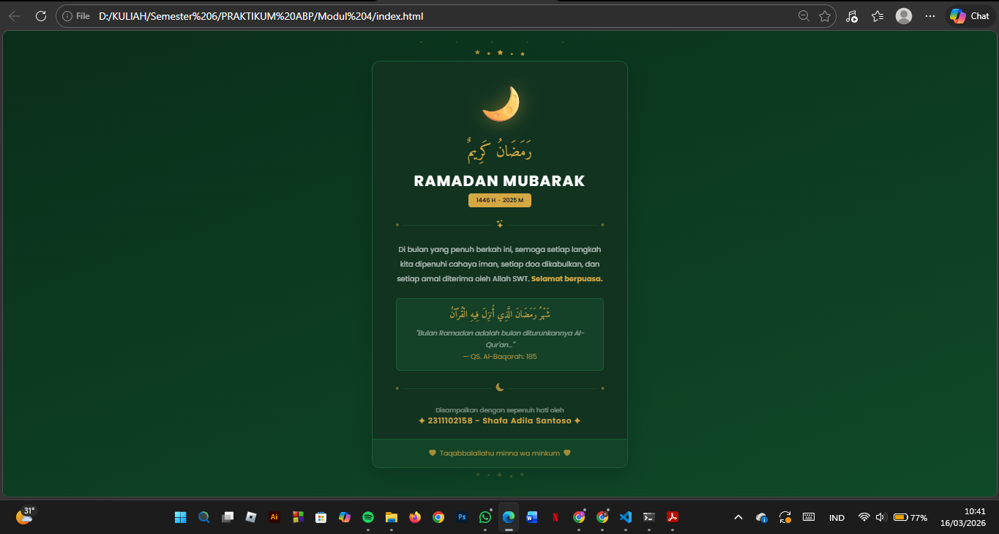

<div align="center">

# LAPORAN PRAKTIKUM  
# APLIKASI BERBASIS PLATFORM

## MODUL 4
## BOOTSTRAP


### Disusun Oleh
**Shafa Adila Santoso**  
2311102158  
S1 IF-11-REG01  

### Dosen Pengampu
**Dimas Fanny Hebrasianto Permadi, S.ST., M.Kom**

### Asisten Praktikum
Apri Pandu Wicaksono  
Rangga Pradarrell Fathi  

### LABORATORIUM HIGH PERFORMANCE  
FAKULTAS INFORMATIKA  
UNIVERSITAS TELKOM PURWOKERTO  
2026

</div>

---

<div align="justify">

# 1. Dasar Teori

Bootstrap merupakan sebuah front-end framework gratis untuk pengembangan antar muka web yang lebih cepat dan lebih mudah. Dikembangkan oleh Mark Otto dan Jacom Thornton di Twitter dan dirilis sebagai produk open source pada Agustus 2011 di GitHub. Bootstrap mencakup template desain berbasis HTML dan
CSS untuk tipografi, form, button, navigasi, modal, image carousells dan masih banyak lagi, serta terdapat opsional plugin JavaScript. Selain itu, Bootstrap memiliki kemampuan untuk membuat desain responsif yang secara otomatis menyesuaikan diri agar terlihat baik di segala perangkat, mulai dari perangkat ponsel hingga desktop pc.

## UNGUIDED

**Code :**

```html
<!DOCTYPE html>
<html lang="id">
<head>
  <meta charset="UTF-8" />
  <meta name="viewport" content="width=device-width, initial-scale=1.0" />
  <title>Ramadan Mubarak 1446 H</title>
  <link href="https://cdn.jsdelivr.net/npm/bootstrap@5.3.3/dist/css/bootstrap.min.css" rel="stylesheet" />
  <link href="https://cdn.jsdelivr.net/npm/bootstrap-icons@1.11.3/font/bootstrap-icons.css" rel="stylesheet" />
  <link href="https://fonts.googleapis.com/css2?family=Amiri:wght@400;700&family=Poppins:wght@300;400;600;700&display=swap" rel="stylesheet" />
  <style>
    :root {
      --green-dark:  #0a2e1a;
      --green-mid:   #0f4a28;
      --green-card:  #113320;
      --green-border:#1a5c33;
      --gold:        #d4a843;
    }
    body {
      font-family: 'Poppins', sans-serif;
      background: linear-gradient(160deg, var(--green-dark) 0%, var(--green-mid) 100%);
      min-height: 100vh;
    }
    .arabic { font-family: 'Amiri', serif; }

    /* Animasi */
    .star { animation: twinkle 2s infinite alternate; }
    .star:nth-child(2) { animation-delay: .4s; }
    .star:nth-child(3) { animation-delay: .8s; }
    .star:nth-child(4) { animation-delay: 1.2s; }
    .star:nth-child(5) { animation-delay: 1.6s; }
    @keyframes twinkle { from { opacity:.15; } to { opacity:1; } }

    .moon-float { animation: floatMoon 4s ease-in-out infinite; display:inline-block; }
    @keyframes floatMoon { 0%,100%{transform:translateY(0);} 50%{transform:translateY(-12px);} }

    .fade-in { animation: fadeUp .8s ease forwards; opacity:0; }
    .fade-in:nth-child(1){animation-delay:.1s;}
    .fade-in:nth-child(2){animation-delay:.3s;}
    .fade-in:nth-child(3){animation-delay:.5s;}
    .fade-in:nth-child(4){animation-delay:.7s;}
    .fade-in:nth-child(5){animation-delay:.9s;}
    .fade-in:nth-child(6){animation-delay:1.1s;}
    @keyframes fadeUp { from{opacity:0;transform:translateY(20px);} to{opacity:1;transform:translateY(0);} }

    /* Card override */
    .card-ramadan {
      background-color: var(--green-card) !important;
      border-color: var(--green-border) !important;
      border-width: 1.5px !important;
    }
    .card-footer-ramadan {
      background-color: rgba(26,92,51,0.4) !important;
      border-color: var(--green-border) !important;
    }
    .quote-box {
      background-color: rgba(26,92,51,0.35) !important;
      border-color: var(--green-border) !important;
    }
    .text-gold { color: var(--gold) !important; }
    .border-gold { border-color: var(--green-border) !important; }

    /* Scatter stars background */
    .bg-stars::before {
      content:'✦ ✧ ✦ ✧ ✦';
      position:fixed; top:16px; width:100%;
      text-align:center; letter-spacing:2rem;
      font-size:.5rem; color:rgba(212,168,67,.25);
      pointer-events:none;
    }
  </style>
</head>
<body class="d-flex align-items-center justify-content-center bg-stars">

  <div class="container py-4">
    <div class="row justify-content-center">
      <div class="col-12 col-sm-10 col-md-7 col-lg-5">

        <!-- Bintang atas -->
        <div class="d-flex justify-content-center gap-3 mb-2">
          <i class="bi bi-star-fill text-gold star" style="font-size:.55rem;"></i>
          <i class="bi bi-star-fill text-gold star" style="font-size:.35rem;margin-top:5px"></i>
          <i class="bi bi-star-fill text-gold star" style="font-size:.65rem;"></i>
          <i class="bi bi-star-fill text-gold star" style="font-size:.3rem; margin-top:7px"></i>
          <i class="bi bi-star-fill text-gold star" style="font-size:.5rem;margin-top:3px"></i>
        </div>

        <!-- Card Utama -->
        <div class="card card-ramadan rounded-4 overflow-hidden shadow-lg border">

          <div class="card-body text-center px-4 px-md-5 py-4">

            <!-- Moon -->
            <div class="moon-float mb-2 fade-in">
              <span style="font-size:5rem; filter:drop-shadow(0 0 18px #d4a84388);">🌙</span>
            </div>

            <!-- Arab besar -->
            <p class="arabic text-gold mb-1 fade-in" style="font-size:2rem; line-height:2.2;">
              رَمَضَانُ كَرِيمٌ
            </p>

            <!-- Judul -->
            <h1 class="fw-bold text-white mb-2 fade-in" style="font-size:1.9rem; letter-spacing:2px;">
              RAMADAN MUBARAK
            </h1>

            <!-- Badge tahun -->
            <div class="mb-4 fade-in">
              <span class="badge text-dark fw-semibold px-3 py-2" style="background:var(--gold);">
                1446 H &nbsp;·&nbsp; 2025 M
              </span>
            </div>

            <!-- Ornamen divider -->
            <div class="d-flex align-items-center justify-content-center gap-2 mb-4 fade-in">
              <i class="bi bi-diamond-fill text-gold opacity-50" style="font-size:.35rem;"></i>
              <div class="border-top border-gold flex-grow-1 opacity-50"></div>
              <i class="bi bi-stars text-gold"></i>
              <div class="border-top border-gold flex-grow-1 opacity-50"></div>
              <i class="bi bi-diamond-fill text-gold opacity-50" style="font-size:.35rem;"></i>
            </div>

            <!-- Ucapan -->
            <p class="lh-lg mb-4 fade-in" style="font-size:.93rem; color:rgba(255,255,255,.7);">
              Di bulan yang penuh berkah ini, semoga setiap langkah kita dipenuhi
              cahaya iman, setiap doa dikabulkan, dan setiap amal diterima
              oleh Allah SWT. <strong class="text-gold">Selamat berpuasa.</strong>
            </p>

            <!-- Quote Ayat -->
            <div class="quote-box rounded-3 border px-4 py-3 mb-4 fade-in">
              <p class="arabic text-gold mb-1" style="font-size:1.2rem; line-height:2;">
                شَهْرُ رَمَضَانَ الَّذِي أُنزِلَ فِيهِ الْقُرْآنُ
              </p>
              <small class="fst-italic" style="color:rgba(255,255,255,.5);">
                "Bulan Ramadan adalah bulan diturunkannya Al-Qur'an..."
              </small><br/>
              <small class="text-gold opacity-75">— QS. Al-Baqarah: 185</small>
            </div>

            <!-- Divider bawah -->
            <div class="d-flex align-items-center justify-content-center gap-2 mb-4">
              <i class="bi bi-diamond-fill text-gold opacity-50" style="font-size:.35rem;"></i>
              <div class="border-top border-gold flex-grow-1 opacity-50"></div>
              <i class="bi bi-moon-fill text-gold opacity-75"></i>
              <div class="border-top border-gold flex-grow-1 opacity-50"></div>
              <i class="bi bi-diamond-fill text-gold opacity-50" style="font-size:.35rem;"></i>
            </div>

            <!-- Pengirim -->
            <p class="mb-0" style="color:rgba(255,255,255,.45); font-size:.82rem;">
              Disampaikan dengan sepenuh hati oleh
            </p>
            <p class="text-gold fw-semibold mb-0" style="letter-spacing:1px;">
              ✦ 2311102040 Shafa Adila Santoso ✦
            </p>

          </div>

          <!-- Footer -->
          <div class="card-footer card-footer-ramadan border-top text-center py-3">
            <small class="text-gold opacity-75">
              <i class="bi bi-heart-fill me-1"></i>
              Taqabbalallahu minna wa minkum
              <i class="bi bi-heart-fill ms-1"></i>
            </small>
          </div>

        </div>
        <!-- /card -->

        <!-- Bintang bawah -->
        <div class="d-flex justify-content-center gap-3 mt-2 opacity-25">
          <i class="bi bi-star-fill text-gold star" style="font-size:.45rem;"></i>
          <i class="bi bi-star-fill text-gold star" style="font-size:.3rem;margin-top:4px"></i>
          <i class="bi bi-star-fill text-gold star" style="font-size:.55rem;"></i>
          <i class="bi bi-star-fill text-gold star" style="font-size:.35rem;margin-top:5px"></i>
          <i class="bi bi-star-fill text-gold star" style="font-size:.45rem;"></i>
        </div>

      </div>
    </div>
  </div>

  <script src="https://cdn.jsdelivr.net/npm/bootstrap@5.3.3/dist/js/bootstrap.bundle.min.js"></script>
</body>
</html>
```
***Bagian `<head>` (Persiapan & Stylesheet)***

  Di bagian `<head>`, pertama-tama dideklarasikan `charset="UTF-8"` agar karakter Arab bisa terbaca dengan benar, dan `viewport` agar halaman responsif di semua ukuran layar. Kemudian di-import tiga sumber eksternal, yaitu Bootstrap 5.3.3 untuk framework CSS utama, Bootstrap Icons untuk ikon-ikon dekoratif, dan Google Fonts yang memuat dua jenis font — **Amiri** khusus untuk teks Arab karena bentuknya yang elegan, dan **Poppins** untuk teks Latin yang modern dan bersih.

***CSS Custom (Variabel Warna & Animasi)***

  Di dalam tag `<style>`, didefinisikan variabel warna menggunakan `:root` sehingga warna bisa dipanggil ulang dengan mudah di seluruh file. Lima variabel dibuat yaitu `--green-dark`, `--green-mid`, `--green-card`, `--green-border`, dan `--gold` yang menjadi palet warna utama halaman. Body kemudian diberi `background: linear-gradient` menggunakan dua variabel hijau tersebut agar background terlihat gradasi dan tidak flat, ditambah `min-height: 100vh` agar warna mengisi penuh layar.
  Untuk animasi, dibuat tiga buah `@keyframes`. Pertama adalah `twinkle` yang membuat bintang-bintang berkedip dengan mengubah `opacity` dari 0.15 hingga 1 secara bolak-balik. Masing-masing bintang diberi `animation-delay` yang berbeda agar tidak berkedip bersamaan sehingga terlihat alami seperti bintang sungguhan. Kedua adalah `floatMoon` yang menggerakkan emoji bulan naik-turun dengan `translateY` menggunakan pergerakan halus `ease-in-out`. Ketiga adalah `fadeUp` yang dipakai setiap elemen di dalam card untuk muncul secara bertahap dari bawah ke atas saat halaman pertama kali dibuka, menciptakan efek loading yang elegan.
  Selain animasi, ada juga beberapa class override seperti `.card-ramadan`, `.card-footer-ramadan`, dan `.quote-box` yang digunakan untuk mengganti warna default Bootstrap dengan warna hijau sesuai tema. Karena Bootstrap memakai `!important` di beberapa propertinya, override ini juga perlu `!important` agar bisa berjalan. Class `.bg-stars::before` menggunakan pseudo-element CSS untuk menampilkan deretan simbol bintang di bagian atas halaman sebagai hiasan latar.

***Bagian `<body>` (Struktur Halaman)***

  Tag `<body>` diberi class Bootstrap `d-flex align-items-center justify-content-center` agar seluruh konten di dalamnya selalu berada di tengah layar secara vertikal maupun horizontal. Di dalam body terdapat `container` Bootstrap yang membungkus sebuah `row` dengan `justify-content-center`, lalu di dalamnya ada satu `col` dengan ukuran responsif dari `col-12` di HP hingga `col-lg-5` di layar besar — ini yang membuat card tidak terlalu lebar di desktop.
  Di luar card, di bagian atas dan bawahnya, terdapat deretan ikon `bi-star-fill` dari Bootstrap Icons. Setiap bintang diberi ukuran dan posisi yang sedikit berbeda-beda agar terlihat tidak seragam, dan semuanya memakai class `.star` yang memicu animasi kedip. Bintang di bawah card sengaja diberi `opacity-25` agar lebih redup dan tidak terlalu dominan.

***Card Utama (Konten Ucapan)***

  Card dibuat menggunakan komponen `card` dari Bootstrap dengan tambahan class custom `.card-ramadan` untuk warna hijau tua, `rounded-4` untuk sudut membulat, dan `shadow-lg` untuk bayangan. Di dalam `card-body`, semua elemen ditata secara vertikal dengan `text-center`.
 
  Elemen pertama adalah emoji bulan yang dibungkus div berclass `.moon-float` sehingga terus bergerak naik-turun. Emoji ini juga diberi `filter: drop-shadow` berwarna emas transparan agar tampak bercahaya. Setelahnya muncul tulisan Arab *"Ramadan Karim"* menggunakan class `.arabic` dengan font Amiri, lalu judul **RAMADAN MUBARAK** dalam huruf kapital dengan `letter-spacing` untuk kesan elegan. Di bawahnya ada badge tahun yang menggunakan komponen `badge` Bootstrap berwarna gold.
 
  Pemisah antar bagian (divider) dibuat kreatif menggunakan kombinasi `d-flex`, `border-top`, dan ikon `bi-stars` di tengahnya, menciptakan garis hias yang tidak membosankan. Teks ucapan ditulis dalam paragraf biasa dengan warna putih semi-transparan `rgba(255,255,255,.7)` agar tidak terlalu terang dan tetap nyaman dibaca.
  
  Box ayat Al-Qur'an menggunakan div dengan class `.quote-box` yang diberi background hijau gelap semi-transparan dan border tipis, sehingga terlihat seperti kotak kutipan yang menonjol. Di dalamnya ada teks Arab ayat Al-Baqarah 185, terjemahannya dalam huruf miring, dan sumbernya dalam warna gold.
  
  Bagian pengirim di bawah berisi teks nama dalam warna gold dengan `letter-spacing` untuk kesan formal. Terakhir, `card-footer` menampilkan doa *Taqabbalallahu minna wa minkum* diapit ikon hati, menggunakan class `.card-footer-ramadan` agar warnanya selaras dengan tema hijau keseluruhan.

**Output :**

<p align="center">

</p>

# 2. Referensi
- [Materi Modul 4](https://drive.google.com/file/d/1TW5Y0AdzkVk24ThPUf1OQNs2Mnw3XNO5/view?usp=sharing)