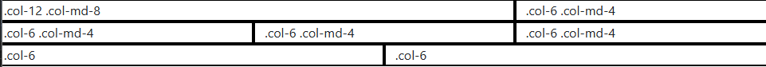
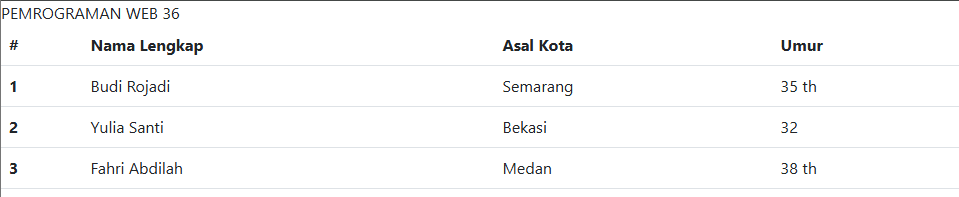
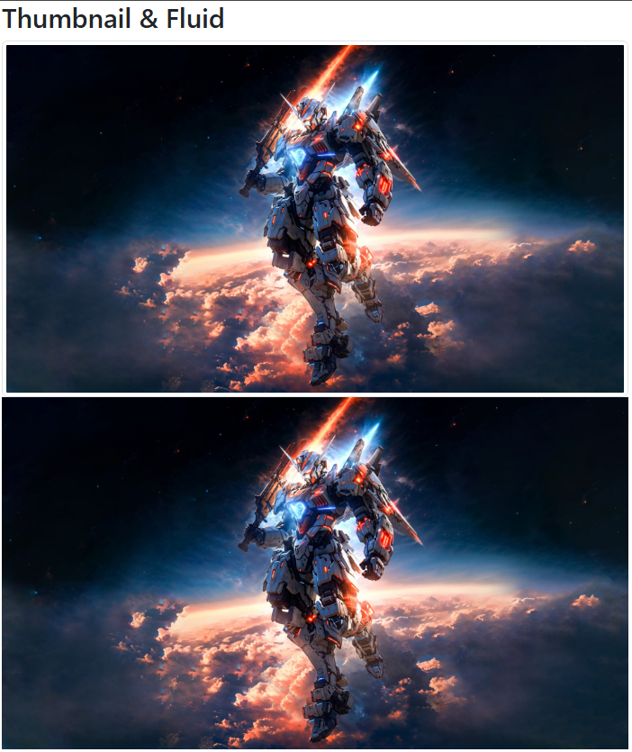
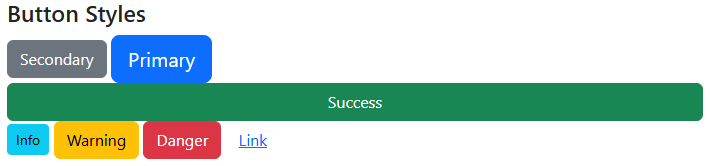
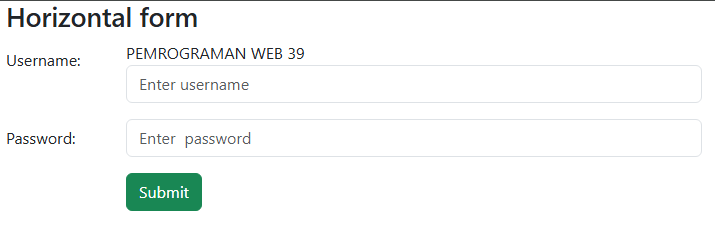
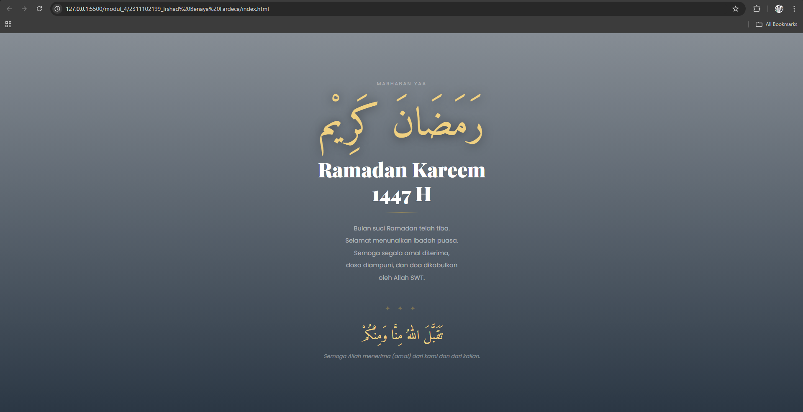

<div align="center">
  <br>

  <h1>LAPORAN PRAKTIKUM <br>
  APLIKASI BERBASIS PLATFORM
  </h1>

  <br>

  <h3>MODUL 4 <br>
  BOOTSTRAP
  </h3>

  <br>

  


  <br>
  <br>
  <br>

  <h3>Disusun Oleh :</h3>

  <p>
    <strong>Irshad Benaya Fardeca</strong><br>
    <strong>2311102199</strong><br>
    <strong>S1 IF-11-REG01</strong>
  </p>

  <br>

  <h3>Dosen Pengampu :</h3>

  <p>
    <strong>Dimas Fanny Hebrasianto Permadi, S.ST., M.Kom</strong>
  </p>
  
  <br>
  <br>
    <h4>Asisten Praktikum :</h4>
    <strong>Apri Pandu Wicaksono </strong> <br>
    <strong>Rangga Pradarrell Fathi</strong>
  <br>

  <h3>LABORATORIUM HIGH PERFORMANCE
 <br>FAKULTAS INFORMATIKA <br>UNIVERSITAS TELKOM PURWOKERTO <br>2026</h3>
</div>
<hr>

# Dasar Teori
## 5.1 Pengenalan Bootstrap
Bootstrap merupakan sebuah front-end framework gratis untuk pengembangan antar muka web yang lebih
cepat dan lebih mudah. Dikembangkan oleh Mark Otto dan Jacom Thornton di Twitter dan dirilis sebagai
produk open source pada Agustus 2011 di GitHub. Bootstrap mencakup template desain berbasis HTML dan
CSS untuk tipografi, form, button, navigasi, modal, image carousells dan masih banyak lagi, serta terdapat
opsional plugin JavaScript. Selain itu, Bootstrap memiliki kemampuan untuk membuat desain responsif
yang secara otomatis menyesuaikan diri agar terlihat baik di segala perangkat, mulai dari perangkat ponsel
hingga desktop pc.

Selector merupakan elemen HTML yang akan ditambahkan CSS kemudian diikuti dengan declaration block
yang terdiri dari property elemen yang akan dirubah beserta value dari property-nya. Setiap deklarasi
selector dapat merubah banyak nilai property sekaligus dengan dipisahkan dengan titik koma dan untuk
semua declaration block dari satu selector berada di antara kurung kurawal.

### 5.1.1 Pemasangan Bootstrap
Bootstrap merupakan produk yang mengusung konsep open source sehingga untuk pemasangannya dapat
dilakukan dengan beberapa cara sebagai berikut:
1. Unduh di http://getbootstrap.com, selanjutnya pasang pada project web kalian seperti memanggil
External Style Sheet pada CSS.
2. Memanggil Bootstrap CDN (Content Delivery Network), sehingga kita tidak perlu mengunduh dan
memasangnya pada laman website, hanya memanggil source dari Bootstrap. Cara ini membutuhkan
koneksi internet untuk menghasilkan perubahan tampilan CSS.
```
<!-- Pemanggilan Bootstrap dengan CDN -->
<!-- CSS --> 
<link href="https://cdn.jsdelivr.net/npm/bootstrap@5.3.0/dist/css/bootstrap.min.css" rel="stylesheet" integrity="sha384- 
9ndCyUaIbzAi2FUVXJi0CjmCapSmO7SnpJef0486qhLnuZ2cdeRhO02iuK6FUUVM"  crossorigin="anonymous"> 
<!-- jQuery library --> 
<script src="https://code.jquery.com/jquery-3.7.0.min.js" integrity="sha256- 2Pmvv0kuTBOenSvLm6bvfBSSHrUJ+3A7x6P5Ebd07/g=" crossorigin="anonymous"></script> 
<!-- JavaScript --> 
<script  
src="https://cdn.jsdelivr.net/npm/bootstrap@5.3.0/dist/js/bootstrap.bundle.min.js"  integrity="sha384-geWF76RCwLtnZ8qwWowPQNguL3RmwHVBC9FhGdlKrxdiJJigb/j/68SIy3Te4Bkz"  crossorigin="anonymous"></script>
```

## 5.2 Bootstrap Container
Bootstrap container adalah elemen paling dasar yang dibutuhkan dalam layouting menggunakan Bootstrap
Grid. Container berbentuk class CSS yang sisipkan pada elemen HTML <div>. Pada gambar 5-1 terdapat dua
class container pada Bootstrap yang dapat dipilih yaitu:
1. Class .container menyediakan container yang responsive dengan lebar yang tetap.
2. Class .container-fluid menyediakan container dengan lebar yang penuh mencakup seluruh area pandang.

## 5.3 Bootsrap Grid
Sistem grid pada Bootstrap menggunakan rangkaian container, rows dan column untuk tata letak dan
keselarasan elemen atau konten. Dibangun dengan flexbox dan sangat responsif terhadap perangkat yang
digunakan untuk menampilkan laman web. Struktur dasar grid pada Bootstrap sebagai berikut.
```
<div class="row"> 
 <div class="col-*-#"></div>  
 <div class="col-*-#"></div>  
</div>  
<div class="row">  
 <div class="col-*-#"></div>  
 <div class="col-*-#"></div>  
 <div class="col-*-#"></div>  
</div>
```
Pertama diawali dengan ```<div class=”container”>```. Kemudian buat sebuah baris sebelum mendeklarasikan
sebuah kolom dengan menggunakan ```<div class=”row”>```. Terakhir buat elemen div dengan mendefinisikan
class ```“col-*-#”```. Tanda * dan # mewakili jenis dan ukuran column yang akan digunakan, value yang dapat
didefinisikan dapat dilihat pada tabel 1 :
| Fitur | Extra Small (<576px) | Small (≥576px) | Medium (≥768px) | Large (≥992px) | Extra Large (≥1200px) |
| :--- | :--- | :--- | :--- | :--- | :--- |
| **Max Container Width** | None (auto) | 540px | 720px | 960px | 1140px |
| **Class Prefix** | `.col-` | `.col-sm-` | `.col-md-` | `.col-lg-` | `.col-xl-` |
| **# of Columns** | 12 | 12 | 12 | 12 | 12 |
| **Nestable** | Yes | Yes | Yes | Yes | Yes |
| **Column Ordering** | Yes | Yes | Yes | Yes | Yes |

Contoh penerapannya sebagai berikut:
```
<div class=”container”> 
 <div class="row"> 
 <div class="col-12 col-md-8">.col-12 .col-md-8</div>
 <div class="col-6 col-md-4">.col-6 .col-md-4</div> 
 </div> 
 <div class="row"> 
 <div class="col-6 col-md-4">.col-6 .col-md-4</div> 
 <div class="col-6 col-md-4">.col-6 .col-md-4</div> 
 <div class="col-6 col-md-4">.col-6 .col-md-4</div> 
 </div> 
 <div class="row"> 
 <div class="col-6">.col-6</div> 
 <div class="col-6">.col-6</div> 
 </div> 
</div> 
```


## 5.4 Text Style
Bootstrap menyediakan banyak class untuk mengatur style sebuah teks elemen HTML. Beberapa contohnya
antara lain:
| Class | Deskripsi | Hasil |
| :--- | :--- | :--- |
| `.text-start` | Mengatur teks rata kiri (sebelumnya `.text-left`) | Rata Kiri |
| `.text-center` | Mengatur teks menjadi rata tengah | Rata Tengah |
| `.text-end` | Mengatur teks rata kanan (sebelumnya `.text-right`) | Rata Kanan |
| `.text-lowercase` | Mengubah seluruh teks menjadi huruf kecil | contoh teks |
| `.text-uppercase` | Mengubah seluruh teks menjadi huruf besar | CONTOH TEKS |
| `.text-capitalize` | Huruf pertama setiap kata menjadi kapital | Contoh Teks |
| `.fw-bold` | Mengatur ketebalan huruf menjadi tebal | **Teks Tebal** |

| Class | Deskripsi | Efek Visual |
| :--- | :--- | :--- |
| `.fw-light` | Mengatur ketebalan huruf menjadi tipis | **Light Weight** |
| `.fw-normal` | Mengatur ketebalan huruf menjadi standar | **Normal Weight** |
| `.fst-italic` | Mengatur gaya teks menjadi miring | *Italic Style* |
| `.h1` s.d `.h6` | Mengubah tampilan teks biasa menyerupai heading | **Heading Style** |

## 5.5 Bootstrap Table, Image & Button
Bootstrap menyediakan class untuk pengaturan style elemen tabel, gambar dan tombol menjadi lebih
menarik.
1. Bootstrap Table
Tabel pada Bootstrap dipanggil dengan class .table secara default, namun ada beberapa class tambahan
yang dapat didefinisikan pada elemen tabel yang lain berikut
| Class | Deskripsi | Efek Visual |
| :--- | :--- | :--- |
| `.table-dark` | Latar belakang gelap | **Gelap Total** |
| `.thead-light` | Latar belakang cerah pada header | **Header Terang** |
| `.thead-dark` | Latar belakang gelap pada header | **Header Gelap** |
| `.table-striped` | Warna selang-seling pada baris (zebra-stripes) | **Baris Berbeda** |
| `.table-bordered` | Menambahkan border/garis di setiap sisi | **Border Tipis** |
| `.table-hover` | Baris berubah warna saat kursor melintas | **Efek Hover** |
| `.table-sm` | Mengurangi padding (jarak) antar teks | **Ukuran Kompak** |

Contoh penerapannya sebagai berikut: 
```
<!--Tabel Hover Style -->  
<table class="table table-hover">  
 <thead>  
 <tr>  
 <th scope="col">#</th>  
 <th scope="col">Nama Lengkap</th>  
 <th scope="col">Asal Kota</th>  
 <th scope="col">Umur</th>  
 </tr>  
 </thead>  
 <tbody>  
 <tr>  
 <th scope="row">1</th> 
PEMROGRAMAN WEB 36 
 <td>Budi Rojadi</td>  
 <td>Semarang</td>  
 <td>35 th</td>  
 </tr>  
 <tr>  
 <th scope="row">2</th>  
 <td>Yulia Santi</td>  
 <td>Bekasi</td>  
 <td>32</td>  
 </tr>  
 <tr>  
 <th scope="row">3</th>  
 <td>Fahri Abdilah</td>  
 <td>Medan</td>  
 <td>38 th</td>  
 </tr>  
 </tbody>  
</table> 
```


2. Bootstrap Image
Bootstrap dapat menangani desain gambar agar responsif pada setiap perangkat yang menampilkan
laman web. Dengan menambahkan class .img-fluid pada elemen tag  pada HTML maka gambar
yang didefinisikan pada laman web akan memiliki ukuran yang responsif menyesuaikan ukuran layar
perangkat. Class tersebut mengatur ukuran gambar dengan menyesuaikan ukuran dari parent element
sebagai wadah atau container elemen gambar. Terdapat class .thumbnail yang berguna menjadikan
gambar menjadi berukuran kecil dan sedikit memiliki border disekitarnya

```
<div class="container"> 
 <h2>Thumbnail & Fluid</h2>  
      </div> 
```
3. Bootstrap Button
Tampilan button pada elemen HTML dapat dirubah dengan menambahkan beberapa class untuk
button oleh Bootstrap. Bootstrap membuat tampilan button menjadi lebih menarik dan memberikan
user experience yang baik. Class yang digunakan secara default adalah .btn namun dengan disertai
class lain seperti berikut untuk memberikan perubahan warna dan ukuran button:

| Class Name | Deskripsi Visual | Fungsi / Peruntukan |
| :--- | :--- | :--- |
| `.btn-primary` | Biru (Utama) | Digunakan untuk aksi utama atau konfirmasi penting. |
| `.btn-secondary` | Abu-abu (Standar) | Digunakan untuk aksi opsional atau pembatalan. |
| `.btn-danger` | Merah | Digunakan untuk aksi berbahaya seperti menghapus data. |
| `.btn-success` | Hijau | Digunakan untuk menandakan aksi yang berhasil. |
| `.btn-warning` | Kuning | Digunakan untuk peringatan yang butuh perhatian user. |
| `.btn-info` | Biru Muda | Digunakan untuk memberikan informasi tambahan. |
| `.btn-link` | Hyperlink | Membuat button terlihat seperti link biasa. |

| Class | Deskripsi | Ukuran |
| :--- | :--- | :--- |
| `.btn-sm` | Membuat tampilan button berukuran kecil | **Small** |
| `.btn-lg` | Membuat tampilan button berukuran besar | **Large** |

Contoh penerapan class button:  
```
<div class="container">
 <h4>Button Styles</h4> 
 <button type="button" class="btn btn-secondary">Secondary</button>  <button type="button" class="btn btn-primary btn-lg">Primary</button>  <button type="button" class="btn btn-success w-100">Success</button>  <button type="button" class="btn btn-info btn-sm">Info</button>  <button type="button" class="btn btn-warning">Warning</button>  <button type="button" class="btn btn-danger">Danger</button>  <button type="button" class="btn btn-link">Link</button> 
</div>
```


## 5.6 Bootstrap Form
Bootstrap menyediakan perubahan elemen form pada HTML baik pada segi tata letak tampilan atau
tampilan antarmuka elemen-elemen dalam form. Class .form-control digunakan untuk sebagian besar
elemen input dalam tag <form> untuk memberikan styling yang konsisten. Ada beberapa cara untuk
mengatur tata letak tampilan form di Bootstrap:
1. Vertical Form (Default): Ini merupakan tampilan default saat tag form tidak didefinisikan class
khusus. Setiap elemen form akan ditampilkan secara vertikal.
2. Inline Form: Untuk membuat form inline di Bootstrap, Anda dapat menggunakan utility classes
tertentu pada container form. Ini akan membuat elemen-elemen form berada dalam satu baris.
3. Horizontal Form: Untuk membuat form horizontal di Bootstrap, Anda dapat menggunakan sistem
grid Bootstrap. Gunakan class .row pada container dan .col-* untuk mengatur lebar kolom label
dan input.
```
<div class="container"> 
 <h3>Horizontal form</h3> 
 <form action="/action_page.php"> 
 <div class="row mb-3"> 
 <label for="uname" class="col-sm-2 col-form-label">Username:</label>  <div class="col-sm-10">
PEMROGRAMAN WEB 39 
 <input type="text" class="form-control" id="uname" placeholder="Enter username"  name="uname"> 
 </div> 
 </div> 
 <div class="row mb-3"> 
 <label for="pwd" class="col-sm-2 col-form-label">Password:</label>  <div class="col-sm-10"> 
 <input type="password" class="form-control" id="pwd" placeholder="Enter  password" name="pwd"> 
 </div> 
 </div> 
 <div class="row"> 
 <div class="col-sm-10 offset-sm-2"> 
 <button type="submit" class="btn btn-success">Submit</button>  </div> 
 </div> 
 </form> 
</div> 
```


## Unguided 
### 1. Buat halaman ramadan dan gunakan bootstrap (sebisa mungkin tanpa meggunakan native css full bootstap)

#### Source Code
```html
<!-- Irshad Benaya Fardeca -->
<!-- 2311102199 -->
<!-- S1IF-11-01 -->

<!DOCTYPE html>
<html lang="id">
<head>
  <meta charset="UTF-8"/>
  <meta name="viewport" content="width=device-width, initial-scale=1.0"/>
  <title>Ramadan Kareem 1447 H</title>

  <link href="https://cdn.jsdelivr.net/npm/bootstrap@5.3.3/dist/css/bootstrap.min.css" rel="stylesheet"/>
  <link href="https://fonts.googleapis.com/css2?family=Playfair+Display:wght@700;900&family=Amiri:wght@400;700&family=Poppins:wght@300;400&display=swap" rel="stylesheet"/>

  <style>
    :root {
      --gold: #C9A84C;
      --gold-light: #F0D080;
      --deep: #0D1B2A;
    }

    body {
      margin: 0;
      font-family: 'Poppins', sans-serif;
    }

    .hero {
      min-height: 100vh;
      background:
        linear-gradient(to bottom, rgba(13,27,42,.5) 0%, rgba(13,27,42,.88) 100%),
        url('https://images.unsplash.com/photo-1590736969596-1d95cb2e0c5c?w=1400&q=80')
        center / cover no-repeat;
      display: flex;
      align-items: center;
      justify-content: center;
    }

    .gold-divider {
      width: 80px;
      height: 1px;
      background: linear-gradient(90deg, transparent, var(--gold), transparent);
      margin: 0 auto;
    }

    .label {
      font-size: .72rem;
      letter-spacing: .22em;
      text-transform: uppercase;
      color: rgba(255,255,255,.4);
    }

    .arabic-main {
      font-family: 'Amiri', serif;
      font-size: clamp(2.8rem, 9vw, 6rem);
      color: var(--gold-light);
      text-shadow: 0 2px 24px rgba(0,0,0,.5);
      line-height: 1.4;
    }

    .title {
      font-family: 'Playfair Display', serif;
      font-size: clamp(1.6rem, 4.5vw, 3rem);
      font-weight: 900;
      color: #fff;
    }

    .body-text {
      font-size: .92rem;
      color: rgba(255,255,255,.55);
      line-height: 2;
    }

    .arabic-doa {
      font-family: 'Amiri', serif;
      font-size: clamp(1.3rem, 3.5vw, 2rem);
      color: var(--gold-light);
      line-height: 1.9;
    }

    .doa-trans {
      font-size: .8rem;
      color: rgba(255,255,255,.4);
      font-style: italic;
    }

    .ornament {
      color: var(--gold);
      opacity: .4;
      letter-spacing: .5em;
      font-size: .9rem;
    }
  </style>
</head>
<body>

<section class="hero">
  <div class="container">
    <div class="row justify-content-center">
      <div class="col-12 col-md-7 col-lg-5 text-center py-5">

        <p class="label mb-4">Marhaban Yaa</p>

        <h1 class="arabic-main mb-2">رَمَضَانَ كَرِيْم</h1>
        <h2 class="title mb-3">Ramadan Kareem<br>1447 H</h2>

        <div class="gold-divider mb-4"></div>

        <p class="body-text mb-5">
          Bulan suci Ramadan telah tiba.<br>
          Selamat menunaikan ibadah puasa.<br>
          Semoga segala amal diterima,<br>
          dosa diampuni, dan doa dikabulkan<br>
          oleh Allah SWT.
        </p>

        <p class="ornament mb-4">✦ ✦ ✦</p>

        <p class="arabic-doa mb-2">تَقَبَّلَ اللهُ مِنَّا وَمِنْكُمْ</p>
        <p class="doa-trans">Semoga Allah menerima (amal) dari kami dan dari kalian.</p>

      </div>
    </div>
  </div>
</section>

</body>
</html>
```

#### Output:
