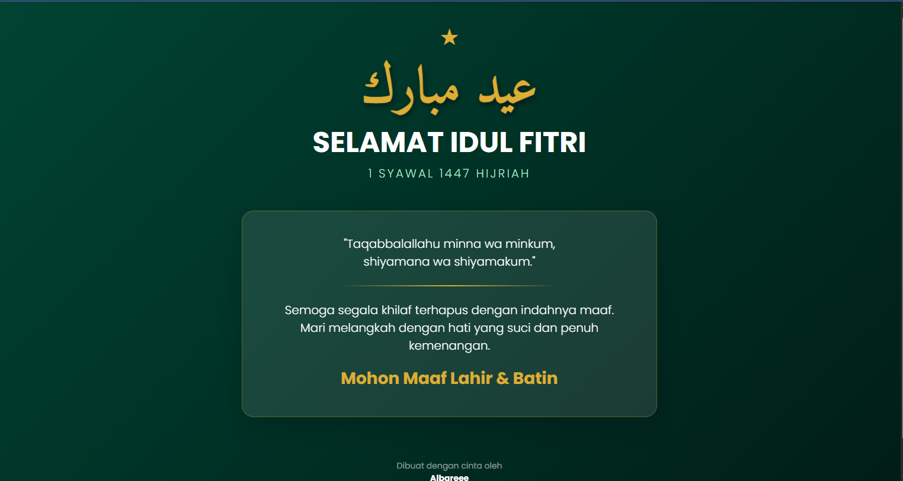

<div align="center">

# LAPORAN PRAKTIKUM  
## ALGORITMA PEMROGRAMAN

### MODUL 4  
### BOOTSTRAP


### Disusun Oleh
**M. Faleno Albar Firjatulloh**  
2311102297  
S1 IF-11-01  

### Dosen Pengampu
**Dimas Fanny Hebrasianto Permadi, S.ST., M.Kom**

### Asisten Praktikum
Apri Pandu Wicaksono  
Rangga Pradarrell Fathi  

### Laboratorium High Performance  
Fakultas Informatika  
Universitas Telkom Purwokerto  
2026

</div>

---

# 1. Dasar Teori

**Bootstrap** adalah framework front-end open-source yang digunakan untuk mempercepat proses pengembangan tampilan website atau aplikasi web. Framework ini menyediakan berbagai komponen berbasis **HTML, CSS, dan JavaScript** yang dapat langsung digunakan.

Bootstrap menyediakan berbagai elemen antarmuka seperti:

* Tipografi
* Formulir
* Tombol
* Navigasi
* Card
* Grid layout

Salah satu fitur penting dari Bootstrap adalah **Responsive Grid System**. Sistem ini menggunakan tiga komponen utama:

* **Container**
* **Row**
* **Column**

Dengan sistem tersebut, tampilan website dapat menyesuaikan ukuran layar secara otomatis, baik pada:

* Komputer
* Tablet
* Smartphone

### Kelebihan Bootstrap

Beberapa kelebihan penggunaan Bootstrap antara lain:

**1. Efisiensi Waktu**

Pengembang tidak perlu membuat CSS dari awal karena Bootstrap sudah menyediakan berbagai komponen seperti:

* Margin & padding
* Flexbox
* Card
* Button
* Layout

**2. Konsistensi Tampilan**

Bootstrap membantu menjaga tampilan website tetap konsisten pada berbagai browser.

**3. Responsif Secara Default**

Sebagian besar komponen Bootstrap dirancang menggunakan pendekatan **mobile-first**, sehingga tampilannya sudah responsif sejak awal.

Bootstrap dapat digunakan dengan dua cara:

* **Offline** (mengunduh file Bootstrap)
* **Online menggunakan CDN**

---

# 2. Penjelasan Kode (Unguided)

Berikut merupakan implementasi Bootstrap pada halaman ucapan **Idul Fitri**.

## Kode HTML (`index.html`)

```html
<!DOCTYPE html>
<html lang="id">
<head>
    <meta charset="UTF-8">
    <meta name="viewport" content="width=device-width, initial-scale=1.0">
    <title>Idul Fitri 1447 H - Bootstrap Edition</title>
    
    <link href="https://cdn.jsdelivr.net/npm/bootstrap@5.3.0/dist/css/bootstrap.min.css" rel="stylesheet">
    <link href="https://fonts.googleapis.com/css2?family=Amiri:wght@700&family=Poppins:wght@300;400;700&display=swap" rel="stylesheet">
    
    <style>
        body {
            /* Full Width & Background Hijau Gelap sesuai desain sebelumnya */
            background: linear-gradient(135deg, #1b4332 0%, #081c15 100%);
            font-family: 'Poppins', sans-serif;
            min-height: 100vh;
            color: #ffffff;
            overflow-x: hidden;
            display: flex;
            align-items: center;
        }

        .wrapper {
            width: 100%; /* Lebar 100% */
            padding: 40px 0;
        }

        .arabic-text {
            font-family: 'Amiri', serif;
            font-size: calc(3.5rem + 2vw);
            color: #d4af37;
            text-shadow: 2px 4px 10px rgba(0,0,0,0.5);
            animation: pulse 3s infinite ease-in-out;
        }

        /* Kotak Pesan Transparan (Glassmorphism) */
        .glass-card {
            background: rgba(255, 255, 255, 0.1);
            backdrop-filter: blur(12px);
            -webkit-backdrop-filter: blur(12px);
            border: 1px solid rgba(212, 175, 55, 0.3);
            border-radius: 20px;
            padding: 40px;
            box-shadow: 0 15px 35px rgba(0,0,0,0.2);
        }

        .text-gold {
            color: #d4af37 !important;
        }

        .subtitle {
            color: #b7e4c7;
            letter-spacing: 3px;
            font-weight: 300;
        }

        @keyframes pulse {
            0%, 100% { transform: scale(1); }
            50% { transform: scale(1.05); }
        }

        /* Garis pembatas elegan */
        .divider {
            height: 2px;
            background: linear-gradient(90deg, transparent, #d4af37, transparent);
            width: 60%;
            margin: 25px auto;
        }
    </style>
</head>
<body>

<div class="wrapper">
    <div class="container-fluid"> <div class="row justify-content-center px-3">
            <div class="col-12 col-md-10 col-lg-7 text-center">
                
                <div class="mb-2">
                    <span class="fs-1 text-gold">★</span>
                </div>
                <h1 class="arabic-text mb-0">عيد مبارك</h1>
                <h2 class="fw-bold mt-2 display-5 text-uppercase">Selamat Idul Fitri</h2>
                <p class="subtitle fs-5 mb-5">1 SYAWAL 1447 HIJRIAH</p>

                <div class="row justify-content-center">
                    <div class="col-12 col-xl-10">
                        <div class="glass-card shadow-lg">
                            <p class="lead mb-4 italic">
                                "Taqabbalallahu minna wa minkum, <br class="d-none d-md-block">
                                shiyamana wa shiyamakum."
                            </p>
                            
                            <div class="divider"></div>
                            
                            <p class="fs-5 fw-light">
                                Semoga segala khilaf terhapus dengan indahnya maaf. <br>
                                Mari melangkah dengan hati yang suci dan penuh kemenangan.
                            </p>
                            
                            <h3 class="text-gold fw-bold mt-4">Mohon Maaf Lahir & Batin</h3>
                        </div>
                    </div>
                </div>

                <footer class="mt-5 pt-4">
                    <p class="text-white-50 small">
                        Dibuat dengan cinta oleh <br>
                        <span class="text-white fw-bold">Albareee</span>
                    </p>
                </footer>

            </div>
        </div>
    </div>
</div>

<script src="https://cdn.jsdelivr.net/npm/bootstrap@5.3.0/dist/js/bootstrap.bundle.min.js"></script>

</body>
</html>
```

---

## Hasil Tampilan



---

# Penjelasan Kode

Versi ini merupakan pengembangan dari kode sebelumnya karena menggunakan **Bootstrap 5** untuk membuat tampilan lebih terstruktur dan responsif.

## 1. Integrasi Framework & Grid System

Kode memanfaatkan **Bootstrap Grid System** untuk mengatur tata letak halaman.

Beberapa kelas yang digunakan:

* `.container-fluid`
  Membuat container dengan **lebar penuh**.

* `.row`
  Digunakan untuk membuat baris dalam sistem grid.

* `.col-12 col-md-10 col-lg-7`
  Mengatur ukuran kolom agar responsif:

  * **HP:** lebar penuh
  * **Tablet:** sedikit lebih sempit
  * **Laptop/PC:** lebih terpusat agar tidak terlalu melebar

* `.justify-content-center`
  Digunakan untuk memposisikan konten di tengah.

---

## 2. Desain Visual (Glassmorphism)

Tampilan kartu ucapan menggunakan efek **glassmorphism**.

Class `.glass-card` memiliki beberapa properti:

* `background: rgba(...)`
  Memberikan efek transparan.

* `backdrop-filter: blur()`
  Membuat efek kaca buram.

* `box-shadow`
  Memberikan efek bayangan agar kartu terlihat **mengambang**.

Elemen tambahan lain:

* `.divider`
  Garis dekoratif dengan efek **gradient emas**.

* `.text-gold`
  Class khusus untuk menerapkan warna emas secara konsisten.

---

## 3. Tipografi Responsif

Ukuran teks dibuat responsif menggunakan fungsi:

```
calc(3.5rem + 2vw)
```

Teknik ini menggabungkan:

* **rem** → ukuran tetap
* **vw** → mengikuti lebar layar

Bootstrap juga menyediakan utility seperti:

* `display-5`
* `fs-1`
* `fw-bold`

yang mempermudah pengaturan ukuran dan ketebalan teks.

---

## 4. Animasi

Kode menggunakan animasi sederhana dengan `@keyframes`.

Animasi **pulse** membuat teks Arab sedikit membesar dan mengecil secara perlahan sehingga terlihat hidup.

```
@keyframes pulse
```

Animasi ini diterapkan pada class:

```
.arabic-text
```

---

## 5. Bootstrap JavaScript

Di bagian bawah file HTML terdapat:

```
bootstrap.bundle.min.js
```

Script ini digunakan untuk menjalankan berbagai komponen interaktif Bootstrap seperti:

* Modal
* Dropdown
* Tooltip
* Popover

Meskipun belum digunakan dalam halaman ini, script tersebut sudah disiapkan jika ingin menambahkan fitur interaktif.

---

# Referensi

* [Materi Modul 4](https://drive.google.com/file/d/1TW5Y0AdzkVk24ThPUf1OQNs2Mnw3XNO5/view)
