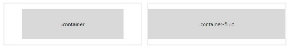
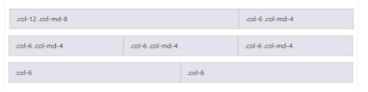
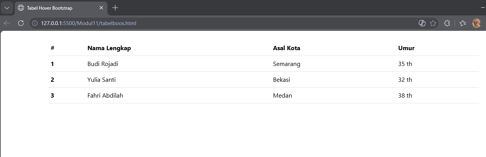
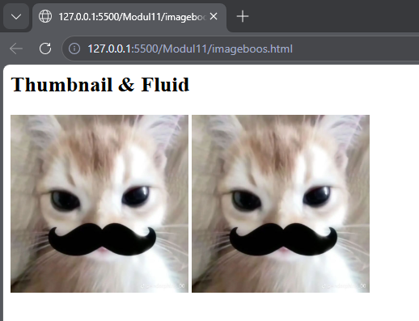
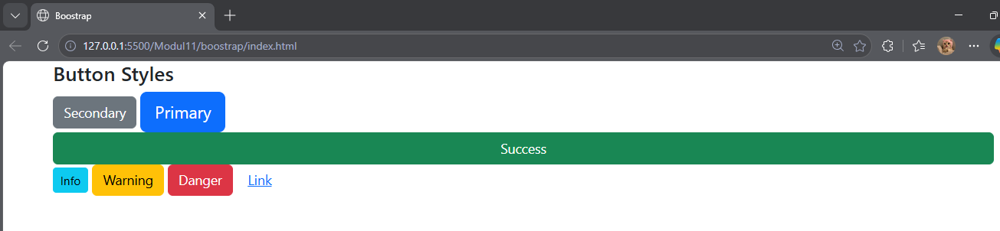
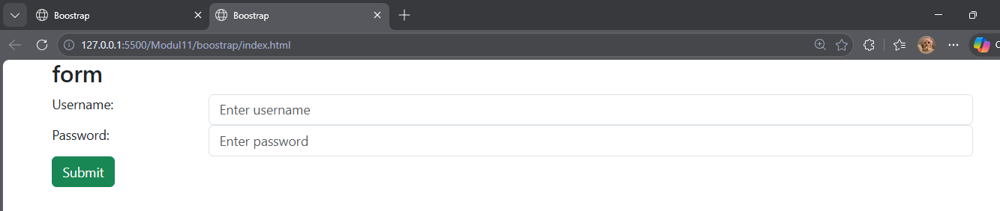
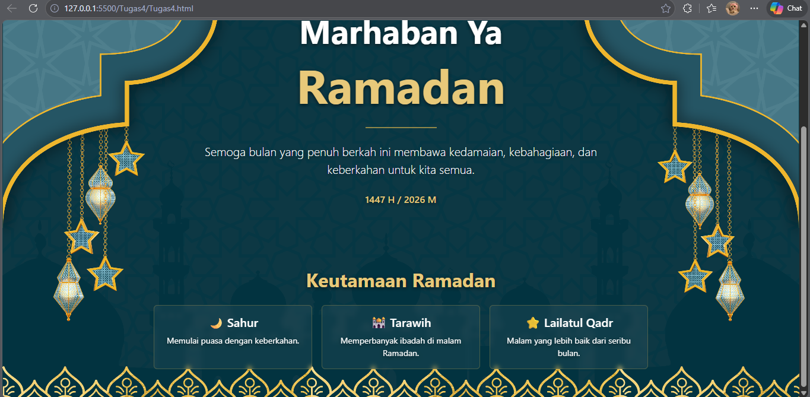

<div align="center">
  <br />

  <h1>LAPORAN PRAKTIKUM <br>
  APLIKASI BERBASIS PLATFORM
  </h1>

  <br />

  <h3>MODUL 4 <br>
  HTML
  </h3>

  <br />

  


  <br />
  <br />
  <br />

  <h3>Disusun Oleh :</h3>

  <p>
    <strong>Boutefhika Nuha Ziyadatul Khair</strong><br>
    <strong>2311102316</strong><br>
    <strong>S1 IF-11-01</strong>
  </p>

  <br />

  <h3>Dosen Pengampu :</h3>

  <p>
    <strong>Dimas Fanny Hebrasianto Permadi, S.ST., M.Kom</strong>
  </p>
  
  <br />
  <br />
    <h4>Asisten Praktikum :</h4>
    <strong>Apri Pandu Wicaksono </strong> <br>
    <strong>Rangga Pradarrell Fathi</strong>
  <br />

  <h3>LABORATORIUM HIGH PERFORMANCE
 <br>FAKULTAS INFORMATIKA <br>UNIVERSITAS TELKOM PURWOKERTO <br>2026</h3>
</div>

<hr>


# Dasar Teori

## 5.1. Pengenalan Bootstrap
Bootstrap merupakan sebuah front-end framework gratis untuk pengembangan antar muka web yang lebih cepat dan lebih mudah. Dikembangkan oleh Mark Otto dan Jacom Thornton di Twitter dan dirilis sebagai produk open source pada Agustus 2011 di GitHub. Bootstrap mencakup template desain berbasis HTML dan CSS untuk tipografi, form, button, navigasi, modal, image carousells dan masih banyak lagi, serta terdapat opsional plugin JavaScript. Selain itu, Bootstrap memiliki kemampuan untuk membuat desain responsif yang secara otomatis menyesuaikan diri agar terlihat baik di segala perangkat, mulai dari perangkat ponsel hingga desktop pc.

### 5.1.1. Pemasangan Bootstrap
Bootstrap merupakan produk yang mengusung konsep open source sehingga untuk pemasangannya dapat
dilakukan dengan beberapa cara sebagai berikut:
a. Unduh di http://getbootstrap.com, selanjutnya pasang pada project web kalian seperti memanggil
External Style Sheet pada CSS.
b. Memanggil Bootstrap CDN (Content Delivery Network), sehingga kita tidak perlu mengunduh dan
memasangnya pada laman website, hanya memanggil source dari Bootstrap. Cara ini membutuhkan
koneksi internet untuk menghasilkan perubahan tampilan CSS.
```
<!-- Pemanggilan Bootstrap dengan CDN -->

<!-- CSS -->

<link href="https://cdn.jsdelivr.net/npm/bootstrap@5.3.0/dist/css/bootstrap.min.css"
rel="stylesheet" integrity="sha384-
9ndCyUaIbzAi2FUVXJi0CjmCapSmO7SnpJef0486qhLnuZ2cdeRhO02iuK6FUUVM"
crossorigin="anonymous">

<!-- jQuery library -->

<script src="https://code.jquery.com/jquery-3.7.0.min.js" integrity="sha256-
2Pmvv0kuTBOenSvLm6bvfBSSHrUJ+3A7x6P5Ebd07/g=" crossorigin="anonymous"></script>

<!-- JavaScript -->

<script
src="https://cdn.jsdelivr.net/npm/bootstrap@5.3.0/dist/js/bootstrap.bundle.min.js"
integrity="sha384-geWF76RCwLtnZ8qwWowPQNguL3RmwHVBC9FhGdlKrxdiJJigb/j/68SIy3Te4Bkz"
crossorigin="anonymous"></script>
```


## 5.2. Bootstrap Container
Bootstrap container adalah elemen paling dasar yang dibutuhkan dalam layouting menggunakan Bootstrap Grid. Container berbentuk class CSS yang sisipkan pada elemen HTML <div>. Pada gambar 5-1 terdapat dua class container pada Bootstrap yang dapat dipilih yaitu:
a. Class .container menyediakan container yang responsive dengan lebar yang tetap.
b. Class .container-fluid menyediakan container dengan lebar yang penuh mencakup seluruh area pandang.


## 5.3. Bootstrap Grid
Sistem grid pada Bootstrap menggunakan rangkaian container, rows dan column untuk tata letak dan
keselarasan elemen atau konten. Dibangun dengan flexbox dan sangat responsif terhadap perangkat yang digunakan untuk menampilkan laman web. Struktur dasar grid pada Bootstrap sebagai berikut.
```
<div class="row">
  <div class="col-*-#"></div>
  <div class="col-*-#"></div>
</div>
<div class="row">
  <div class="col-*-#"></div>
  <div class="col-*-#"></div>
  <div class="col-*-#"></div>
</div>
```
Pertama diawali dengan <div class=”container”>. Kemudian buat sebuah baris sebelum mendeklarasikan sebuah kolom dengan menggunakan <div class=”row”>. Terakhir buat elemen div dengan mendefinisikan class “col-*-#”. Tanda * dan # mewakili jenis dan ukuran column yang akan digunakan, value yang dapat didefinisikan dapat dilihat pada tabel 1 :

| Feature / Size        | Extra Small | Small | Medium | Large | Extra Large |
|-----------------------|-------------|-------|--------|-------|-------------|
| Max container width   | None (auto) | 540px | 720px  | 960px | 1140px      |
| Class prefix          | .col-       | .col-sm- | .col-md- | .col-lg- | .col-xl- |
| # of columns          | 12          | 12    | 12     | 12    | 12          |
| Nestable              | Yes         | Yes   | Yes    | Yes   | Yes         |
| Column Ordering       | Yes         | Yes   | Yes    | Yes   | Yes         |

Contoh penerapannya sebagai berikut:
```
<div class=”container”>
  <div class="row">
    <div class="col-12 col-md-8">.col-12 .col-md-8</div>
    <div class="col-6 col-md-4">.col-6 .col-md-4</div>
  </div>
  <div class="row">
    <div class="col-6 col-md-4">.col-6 .col-md-4</div>
    <div class="col-6 col-md-4">.col-6 .col-md-4</div>
    <div class="col-6 col-md-4">.col-6 .col-md-4</div>
  </div>
    <div class="row">
    <div class="col-6">.col-6</div>
    <div class="col-6">.col-6</div>
  </div>
</div>
```


## 5.4. Text Style
Bootstrap menyediakan banyak class untuk mengatur style sebuah teks elemen HTML. Beberapa contohnya antara lain:
| Class | Keterangan |
|------|------------|
| `.text-left` | Mengatur teks menjadi rata kiri dalam sebuah elemen. |
| `.text-center` | Mengatur teks menjadi rata tengah dalam sebuah elemen. |
| `.text-right` | Mengatur teks menjadi rata kanan dalam sebuah elemen. |
| `.text-lowercase` | Mengatur seluruh teks pada elemen menjadi huruf kecil. |
| `.text-uppercase` | Mengatur seluruh teks pada elemen menjadi huruf besar. |
| `.text-capitalize` | Menjadikan huruf pertama besar untuk setiap kata pada sebuah elemen. |
| `.fw-bold` | Mengatur ketebalan huruf menjadi **bold**. |
| `.fw-light` | Mengatur ketebalan huruf menjadi **light**. |
| `.fw-normal` | Mengatur ketebalan huruf menjadi **normal**. |
| `.fst-italic` | Mengatur gaya teks menjadi miring (*italic*). |
| `.h1 s.d .h6` | Mengatur teks pada sebuah elemen agar tampil seperti tag **H1 sampai H6** pada HTML. |

## 5.5. Bootstrap Table, Image & Button
Bootstrap menyediakan class untuk pengaturan style elemen tabel, gambar dan tombol menjadi lebih
menarik.
a. Bootstrap Table
Tabel pada Bootstrap dipanggil dengan class .table secara default, namun ada beberapa class tambahan yang dapat didefinisikan pada elemen tabel yang lain berikut dapat dilihat pada Tabel:

| Class | Keterangan |
|------|------------|
| `.table-dark` | Membuat tampilan tabel memiliki latar belakang gelap. |
| `.thead-light` | Membuat elemen `<thead>` pada tabel memiliki latar belakang cerah. |
| `.thead-dark` | Membuat elemen `<thead>` pada tabel memiliki latar belakang gelap. |
| `.table-striped` | Membuat tampilan tabel memiliki latar belakang setiap row yang berbeda. |
| `.table-bordered` | Membuat tampilan tabel sederhana dengan border tipis. |
| `.table-hover` | Membuat tampilan tabel yang akan berubah warna latar belakang row saat didekati kursor. |
| `.table-sm` | Membuat tampilan tabel sederhana dengan ukuran padding yang minim. |

Contoh penerapannya sebagai berikut:
```
<!--Tabel Hover Style -->
<table class="table table-hover">
    <thead>
        <tr>
            <th scope="col">#</th>
            <th scope="col">Nama Lengkap</th>
            <th scope="col">Asal Kota</th>
            <th scope="col">Umur</th>
        </tr>
    </thead>
    <tbody>
        <tr>
            <th scope="row">1</th>
            <td>Budi Rojadi</td>
            <td>Semarang</td>
            <td>35 th</td>
        </tr>
        <tr>
            <th scope="row">2</th>
            <td>Yulia Santi</td>
            <td>Bekasi</td>
            <td>32</td>
        </tr>
        <tr>
            <th scope="row">3</th>
            <td>Fahri Abdilah</td>
            <td>Medan</td>
            <td>38 th</td>
        </tr>
    </tbody>
</table>
```


b. Bootstrap Image
Bootstrap dapat menangani desain gambar agar responsif pada setiap perangkat yang menampilkan
laman web. Dengan menambahkan class .img-fluid pada elemen tag  pada HTML maka gambar
yang didefinisikan pada laman web akan memiliki ukuran yang responsif menyesuaikan ukuran layar
perangkat. Class tersebut mengatur ukuran gambar dengan menyesuaikan ukuran dari parent element
sebagai wadah atau container elemen gambar. Terdapat class .thumbnail yang berguna menjadikan
gambar menjadi berukuran kecil dan sedikit memiliki border disekitarnya dapat dilihat pada gambar:



```
<div class="container">
  <h2>Thumbnail & Fluid</h2>
  
  
</div>
```
c. Bootstrap Button
Tampilan button pada elemen HTML dapat dirubah dengan menambahkan beberapa class untuk
button oleh Bootstrap. Bootstrap membuat tampilan button menjadi lebih menarik dan memberikan
user experience yang baik. Class yang digunakan secara default adalah .btn namun dengan disertai
class lain seperti berikut untuk memberikan perubahan warna dan ukuran button:

| Class | Keterangan |
|------|------------|
| `.btn-primary` | Membuat tampilan button dengan desain utama (primary). |
| `.btn-secondary` | Membuat tampilan button dengan desain secondary. |
| `.btn-danger` | Membuat tampilan button dengan desain berwarna merah. |
| `.btn-success` | Membuat tampilan button dengan desain berwarna hijau. |
| `.btn-warning` | Membuat tampilan button dengan desain berwarna kuning. |
| `.btn-info` | Membuat tampilan button dengan desain sebuah informasi. |
| `.btn-link` | Membuat tampilan button dengan desain seperti hyperlink. |
| `.btn-sm` | Membuat tampilan button berukuran small (kecil). |
| `.btn-lg` | Membuat tampilan button berukuran besar (large). |

Contoh penerapan class button:
```
<div class="container">
  <h4>Button Styles</h4>
  <button type="button" class="btn btn-secondary">Secondary</button>
  <button type="button" class="btn btn-primary btn-lg">Primary</button>
  <button type="button" class="btn btn-success w-100">Success</button>
  <button type="button" class="btn btn-info btn-sm">Info</button>
  <button type="button" class="btn btn-warning">Warning</button>
  <button type="button" class="btn btn-danger">Danger</button>
  <button type="button" class="btn btn-link">Link</button>
</div>
```



## 5.6. Bootstrap Form
Bootstrap menyediakan perubahan elemen form pada HTML baik pada segi tata letak tampilan atau
tampilan antarmuka elemen-elemen dalam form. Class .form-control digunakan untuk sebagian besar
elemen input dalam tag <form> untuk memberikan styling yang konsisten. Ada beberapa cara untuk
mengatur tata letak tampilan form di Bootstrap:
1. Vertical Form (Default): Ini merupakan tampilan default saat tag form tidak didefinisikan class khusus. Setiap elemen form akan ditampilkan secara vertikal.
2. Inline Form: Untuk membuat form inline di Bootstrap, Anda dapat menggunakan utility classes
tertentu pada container form. Ini akan membuat elemen-elemen form berada dalam satu baris.
3. Horizontal Form: Untuk membuat form horizontal di Bootstrap, Anda dapat menggunakan sistem
grid Bootstrap. Gunakan class .row pada container dan .col-* untuk mengatur lebar kolom label
dan input.
```
<div class="container">
    <h3>Horizontal form</h3>
    <form action="/action_page.php">
        <div class="row mb-3">
            <label for="uname" class="col-sm-2 col-form-label">Username:</label>
            <div class="col-sm-10">
                <input type="text" class="form-control" id="uname" placeholder="Enter username" name="uname">
            </div>
        </div>
        <div class="row mb-3">
            <label for="pwd" class="col-sm-2 col-form-label">Password:</label>
            <div class="col-sm-10">
                <input type="password" class="form-control" id="pwd" placeholder="Enter
password" name="pwd">
            </div>
        </div>
        <div class="row">
            <div class="col-sm-10 offset-sm-2">
                <button type="submit" class="btn btn-success">Submit</button>
            </div>
        </div>
    </form>
</div>
```



# UNGUIDED 
Buat halaman ramadan dan gunakan bootstrap (sebisa mungkin tanpa meggunakan native css full bootstap).
```
//2311102316
//Boutefhika Nuha Ziyadatul Khair

<!DOCTYPE html>
<html lang="id">
<head>
<meta charset="UTF-8">
<meta name="viewport" content="width=device-width, initial-scale=1">

<title>Marhaban Ya Ramadan</title>

<link href="https://cdn.jsdelivr.net/npm/bootstrap@5.3.6/dist/css/bootstrap.min.css" rel="stylesheet">

<style>

:root{
--teal:#0d3d3a;
--gold:#c9a84c;
--gold-light:#e8c97a;
}

body{
background-image:url("ramadhan.png");
background-size:cover;
background-position:center;
background-repeat:no-repeat;
background-attachment:fixed;
color:white;
font-family:system-ui;
}

/* hero */

.hero{
min-height:100vh;
display:flex;
align-items:center;
justify-content:center;
text-align:center;
}

h1,h2,p{
text-shadow:0 2px 6px rgba(0,0,0,0.6);
}

/* moon */

.moon{
width:90px;
height:90px;
border-radius:50%;
background:var(--gold-light);
position:relative;
box-shadow:0 0 40px rgba(201,168,76,.6);
}

.moon::after{
content:"";
position:absolute;
width:80px;
height:80px;
border-radius:50%;
background:var(--teal);
top:-5px;
left:18px;
}

/* gold text */

.text-gold{
color:var(--gold-light);
}

/* divider */

.divider{
width:120px;
height:2px;
background:var(--gold);
margin:auto;
opacity:.7;
}

/* cards */

.card-ramadan{
background:rgba(255,255,255,.05);
border:1px solid rgba(201,168,76,.3);
backdrop-filter:blur(4px);
}

/* tombol thr */

.btn-thr{
background:var(--gold);
color:white;
font-weight:600;
padding:10px 30px;
border-radius:30px;
border:none;
}

.btn-thr:hover{
background:var(--gold-light);
}

/* modal */

.modal-content{
background:#0d3d3a;
color:white;
border:1px solid var(--gold);
}

</style>
</head>

<body>

<!-- HERO -->
<section class="hero">

<div class="container">

<div class="row justify-content-center">

<div class="col-lg-8">

<div class="d-flex justify-content-center mb-4">
<div class="moon"></div>
</div>

<p class="text-uppercase text-light mb-2">
Selamat Menyambut
</p>

<h2 class="fw-bold display-4">
Marhaban Ya
</h2>

<h1 class="display-1 fw-bold text-gold">
Ramadan
</h1>

<div class="divider my-4"></div>

<p class="lead mb-4">
Semoga bulan yang penuh berkah ini membawa
kedamaian, kebahagiaan, dan keberkahan
untuk kita semua.
</p>

<p class="text-gold fw-semibold">
1447 H / 2026 M
</p>

</div>
</div>

</div>

</section>


<!-- SECTION KEUTAMAAN -->
<section class="pt-3 pb-5">

<div class="container">

<div class="text-center mb-4">
<h2 class="fw-bold text-gold">
Keutamaan Ramadan
</h2>
</div>

<div class="row justify-content-center g-3 text-center">

<div class="col-md-3">
<div class="card card-ramadan p-3 h-100 text-white">
<h5>🌙 Sahur</h5>
<p class="small mb-0">
Memulai puasa dengan keberkahan.
</p>
</div>
</div>

<div class="col-md-3">
<div class="card card-ramadan p-3 h-100 text-white">
<h5>🕌 Tarawih</h5>
<p class="small mb-0">
Memperbanyak ibadah di malam Ramadan.
</p>
</div>
</div>

<div class="col-md-3">
<div class="card card-ramadan p-3 h-100 text-white">
<h5>⭐ Lailatul Qadr</h5>
<p class="small mb-0">
Malam yang lebih baik dari seribu bulan.
</p>
</div>
</div>

</div>

</div>

</section>

</body>
</html>
```
Output:


Daeskripsi Program:
Program ini merupakan halaman web bertema Marhaban Ya Ramadan yang dibuat menggunakan HTML, CSS, dan framework Bootstrap. HTML digunakan untuk membangun struktur halaman seperti bagian hero, judul ucapan Ramadan, teks doa, serta section yang menampilkan keutamaan Ramadan. CSS digunakan untuk mengatur tampilan visual halaman seperti warna, background gambar, efek bayangan teks, serta pembuatan elemen dekoratif seperti bulan sabit menggunakan pseudo-element. Selain itu, program juga memanfaatkan CSS Variable (:root) untuk pengaturan warna tema, Flexbox untuk penataan posisi elemen, dan komponen Bootstrap seperti container, row, col, dan card untuk membuat layout yang rapi dan responsif. Halaman ini dirancang agar menampilkan ucapan Ramadan dengan tampilan yang menarik, modern, dan mudah dibaca.
